### 우리의 목표는 코딩을 잘하는 것입니다. 근데 코딩이 뭘까요?

코딩이란 컴퓨터가 이해 가능한 명령서를 작성하는 과정입니다.
여기서 중요한 점은, “우리”가 이해 가능한 명령서가 아니라, “컴퓨터”가 이해 가능한 명령서라는 점입니다.
그러니 이해가 안되는게 당연합니다. 어떤 때에는 이해보다 암기를 요구할 수도 있습니다.
이걸 받아들이고 시작하는 것이 중요합니다.
많고 다양한 명령서들을 읽어보고 돌아와서 봐야 이해되는 경우도 정말 많습니다.

### 코딩에는 또 다른 난관이 있습니다.

아래와 같은 명령서(코드)를 컴퓨터에게 전달한다고 해봅시다.
“마트에 가서 우유 2개를 사와라. 달걀이 있으면, 4개만 사와라.”
이 명령서를 받은 컴퓨터가 어떻게 동작할지 고민해봅시다.

→ 사람은 “달걀이 있으면, 4개만 사와라.”를 전체적으로 이해할 수 있어서 달걀 4개를 사옵니다.
그러나 컴퓨터는 “달걀이 있으면”과 “4개만 사와라.”를 전혀 관련 없는 두 개의 문장으로 인식합니다.
즉, “4개만 사와라.”라는 명령의 목적어가 없어서 컴퓨터가 멈춰버립니다.
이처럼 컴퓨터를 위한 명령서 작성에는 섬세함이 필요합니다.
대충 작성하고 적게 연습하면 위와 같은 상황들이 계속 발생하면서 중도 포기해버릴 수도 있습니다.

### 위 두 가지 내용을 참고하면서 “명령서”가 무엇인지부터 배워봅시다.

아무것도 없는 백지에서부터 천천히 하나씩 쌓아나가면서 배울 예정입니다.
중간 중간마다 명령서를 작성하는 좋은 습관들을 소개할 예정이니, 잘 따라주시면 좋겠습니다.

### 명령서(코드)는 어떤 언어로 작성되어야 할까요?

당연히 컴퓨터가 해석 할 수 있어야 하기 때문에 컴퓨터가 이해할 수 있는 언어로 작성되어야 합니다.
또한 컴퓨터는 반도체로 이루어져 있습니다.
반도체는 켜진 상태(1)와 꺼진 상태(0), 2가지 상태로 모든걸 표현합니다.
즉, 컴퓨터는 2진법만 이해할 수 있다는 이야기입니다. 
결국에 명령서는 2진법으로 작성되어야합니다.

### 기계어(Low-Level Language, Machine Language)

아래와 같이 작성되어서 컴퓨터(기계)가 바로 이해할 수 있는 언어.

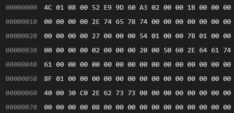


![이번 단원에서 배우는 Hello, World! 예제의 이진패턴 파일(.o)
다만 위 그림은 16진법으로 표시되고 있습니다.
2진법으로 표시하면 너무 길어져서, 16진법으로 보여주는 것 뿐 차이 없습니다.]

### 그럼 사람도 기계어로 코드를 작성해야 할까요?

옛날 사람들은 그랬습니다. 종이 카드에 구멍을 내서…
그러다가 사람들이 좀 더 편하게 작성 할 수 있는 어셈블리어가 나왔습니다.

### 어셈블리어(Assembly Language)

숫자가 아닌 문자이기에 사람에 좀 더 친숙한 언어.
이진 패턴의 특정 부분을 문자로 치환합니다.
그래서 기계어와 어셈블리어는 일대일 대응 관계를 가집니다.
양은 비교적 줄지 않았습니다. 모양만 예뻐진 언어라고 비유할 수 있습니다.

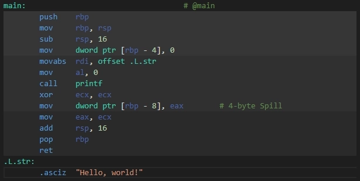


### 고급 언어(High-Level Language)

우리가 배울 C언어 혹은 C++, Java, Python과 같은 언어들.
어셈블리어에서 모양은 물론, 양까지 만족스럽게 줄어듭니다.
사람에 가깝다는 의미에서 High-Level Language라고 부릅니다.


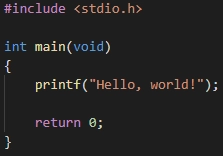

위 세 사진은 모두 같은 코드

### 소스코드(Source Code)

프로그래머가 고급 언어로 작성한 코드(명령서)를 소스코드라고 합니다.

### 그러나 너무 멀리 와버림.

결국 컴퓨터가 이해 할 수 있는건 기계어 뿐입니다.
사람이 고급 언어로 명령서(코드)를 작성하면 누군가는 “번역”해서
컴퓨터가 읽기 쉬운 기계어로 바꿔줘야합니다.
이런 “번역가”를 컴파일러라고 합니다.

### 빌드 프로세스(Build Process)

사람이 읽기 쉬운 고급 언어로 작성된 소스코드(명령서)를
컴퓨터가 읽기 쉬운 기계어로 변환하는 일련의 과정입니다.

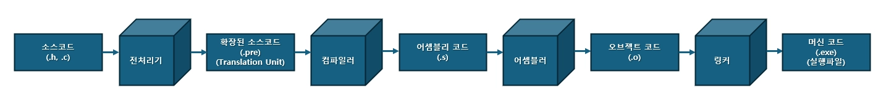


### 컴파일과 빌드

컴파일은 두 가지 의미를 가지고 있습니다.
상황에 따라 적절하게 두 가지 의미 중 하나를 생각하면 됩니다.

<aside>
1️⃣ 확장된 소스코드가 어셈블리 코드로 변환되는 과정.
</aside>


<aside>
2️⃣ 소스코드부터 오브젝트 코드까지의 과정.
</aside>

<aside>
📌 빌드(Build)

빌드는 아래 그림 전체 과정을 빌드라고 부릅니다. 빌드 == (컴파일 + 링킹).
</aside>

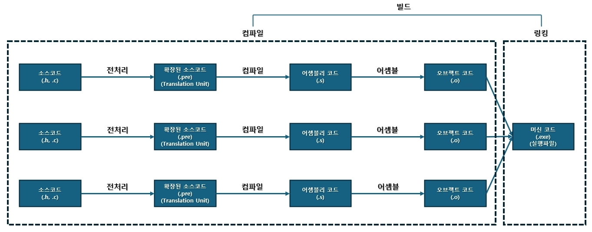

### 컴파일러

컴파일러도 컴파일과 똑같이 두 가지 의미를 가지고 있습니다.

<aside>
1️⃣확장된 소스코드를 어셈블리 코드로 변환해주는 프로그램.
</aside>

<aside>
2️⃣소스코드로 실행파일까지 만들어 주는 프로그램.
</aside>

대부분의 경우엔 2번을 의미합니다. 우리도 2번 의미의 컴파일러를 다운 받아서 실습 환경 구축해보겠습니다.

### Visual Studio 설치

Visual Studio는 내부에 Visual Studio 컴파일러가 동봉되어 있습니다.
[[**여기**](https://visualstudio.microsoft.com/ko/vs/community/)]를 클릭해서 Visual Studio Community 버전을 다운로드 받습니다.
이때, 아래 사진을 참고하여 다운 받아야 합니다.
여기서 Visual Studio는 소스코드 에디터 중 하나입니다. 이외에도 다양한 소스코드 에디터가 있습니다.

### 솔루션 - 프로젝트 - 소스코드

소스코드를 작성하려면 비주얼 스튜디오를 켜고 솔루션이라는 것을 먼저 만들어야 합니다.
솔루션 안에는 프로젝트라는 것이 들어있고, 이 프로젝트 안에 소스코드가 들어있습니다.

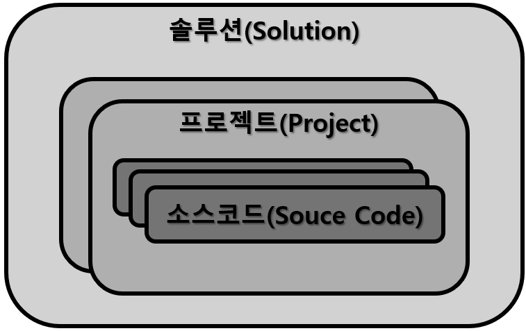

### Ex010301)새 솔루션 만들기

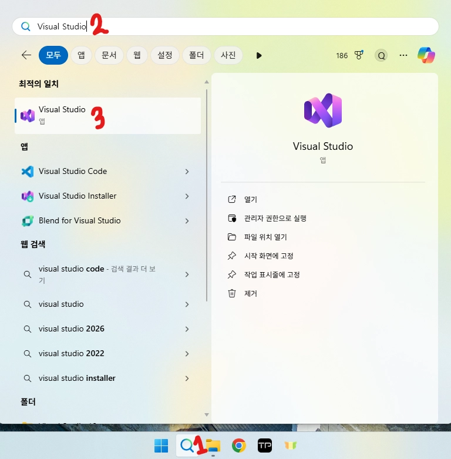

작업표시줄 > 검색 클릭 > “Visual Studio” 검색 후 실행합니다.

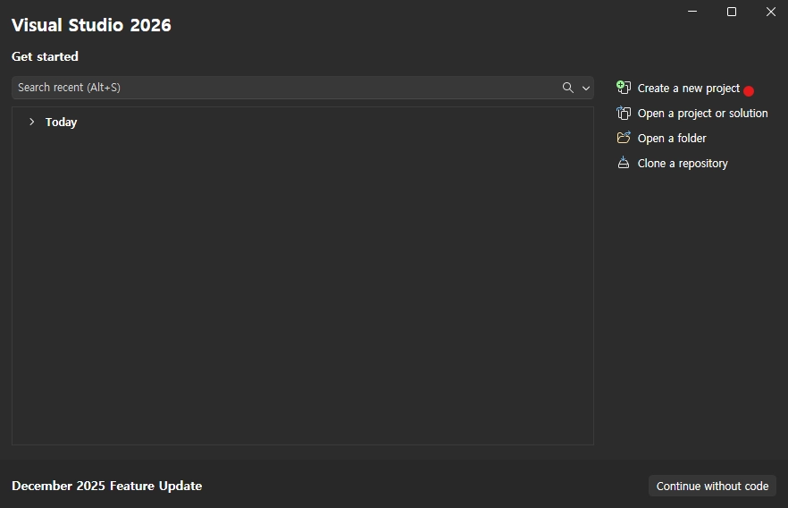

Create a new project 클릭.

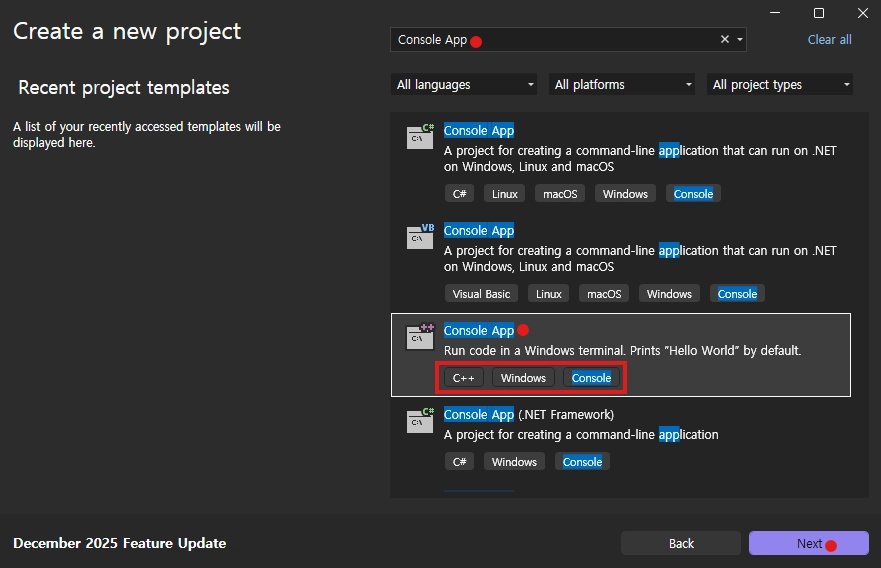

검색창에 “Console App” 검색.
C++, Windows, Console이 달려있는 걸로 선택 후 Next.


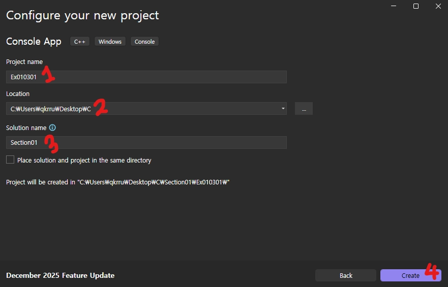

1. Project name에는 항상 현재 예제 번호를 작성할 예정입니다. 
2. Location에는 바탕화면의 C 폴더를 새로 만들어서 지정합니다.
3. Solution name은 항상 현재 섹션 이름을 작성 할 예정입니다.
    C 프로젝트는 솔루션-프로젝트-소스코드의 구조로 관리됩니다.
4. Create 선택합니다.

### Ex010302) 비주얼 스튜디오 소스코드 에디터 레이아웃

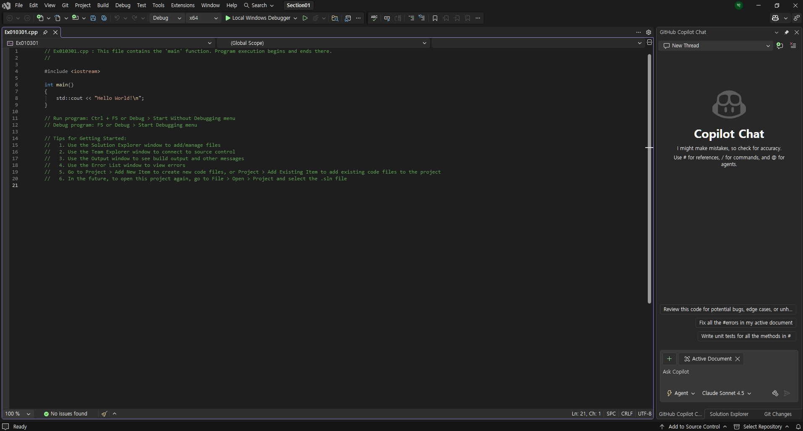

처음 비주얼 스튜디오를 켰을 때 화면입니다.

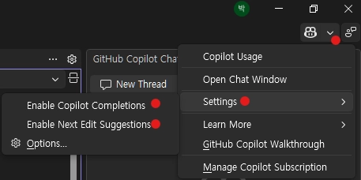

우선 코파일럿이라는 자동완성 툴을 꺼보도록 하겠습니다.
우상단 위치에 있는 버튼 > Settings에서 
Enable Copilot Completions와 Enable Next Edit Suggestions을 체크 해제.

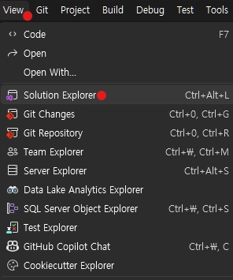

Toolbar > View > Solution Explorer 클릭해서
솔루션 익스플로러 창을 켜줍니다.

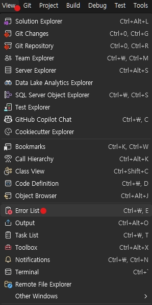

Toolbar > View > Error List 클릭해서
에러 리스트 창을 켜줍니다.

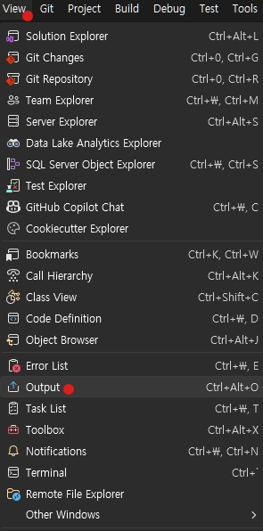

Toolbar > View > Output 클릭해서
아웃풋 창을 켜줍니다.

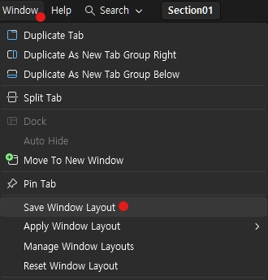

현재 소스코드 에디터의 레이아웃 상태를 저장해둡시다.
후에 실수로 마우스 드래그 하다가 레이아웃이 
망가질 때가 많습니다.

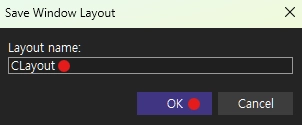

“CLayout”이라고 이름 짓고, OK 버튼을 클릭.

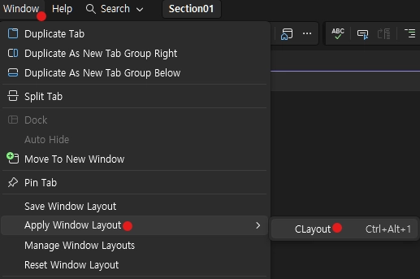

실수로 레이아웃을 망쳤다면, Toolbar > Window > Apply Window Layout에서 
방금 만든 레이아웃을 클릭하시면 초기화됩니다.

### Ex010303) 비주얼 스튜디오 소스코드 에디터 살펴보기

아래 네 가지 부분들이 여러분들께서 가장 자주 보시게 될 부분들입니다. 외워두시면 좋습니다.


툴바(Tool Bar)

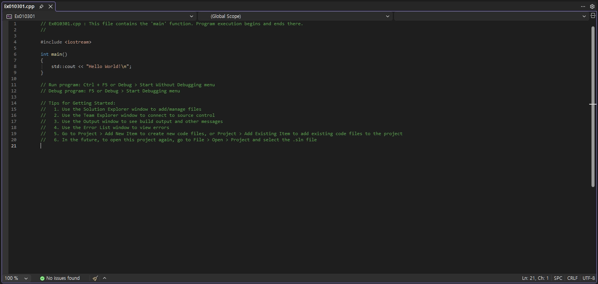

소스코드 에디터 창(Source Code Editor Window)

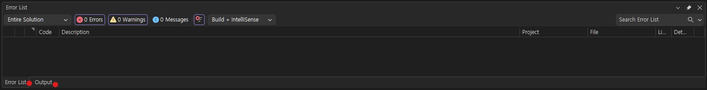

에러 리스트 창(Error List)과 아웃풋 창(Output)

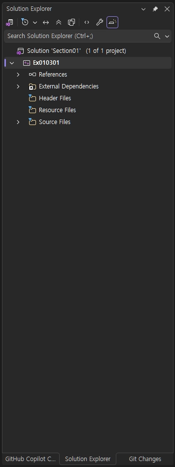

솔루션 익스플로러 창(Solution Explorer)

### Ex010401) 이전 작업 여는 방법

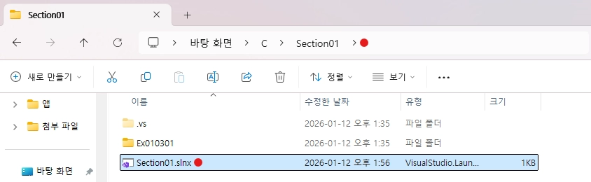

저장해둔 폴더로 가서 .slnx 파일(솔루션 파일)을 더블클릭해서 실행합니다.

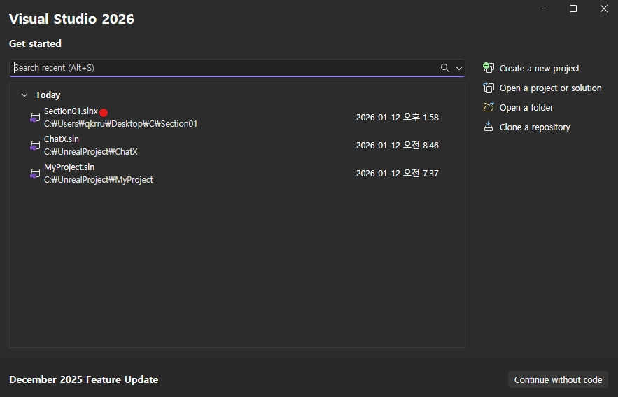

혹은 검색 > Visual Studio > 최근 프로젝트에서 실행해도 됩니다.

### Ex010402) 새 프로젝트 추가하는 방법

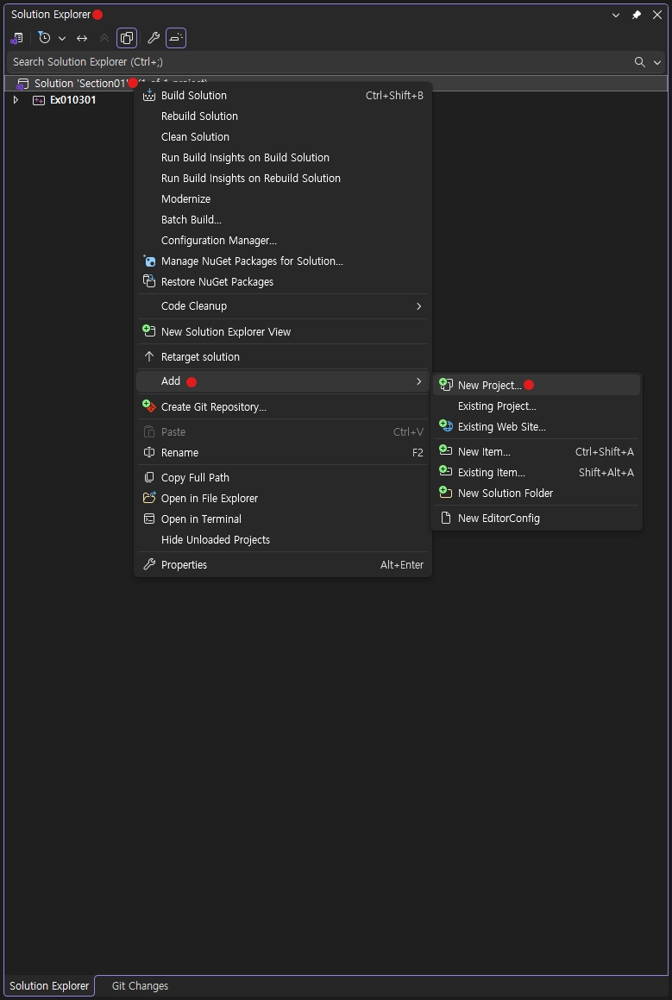

Solution Explorer > Solution 우클릭 > Add > New Project 클릭합니다.

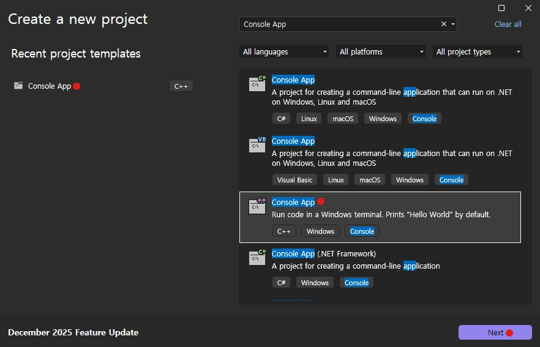

최근 프로젝트 템플릿에서 Console App C++을 선택하거나, Console App을 검색해서 선택하고 Next 클릭.

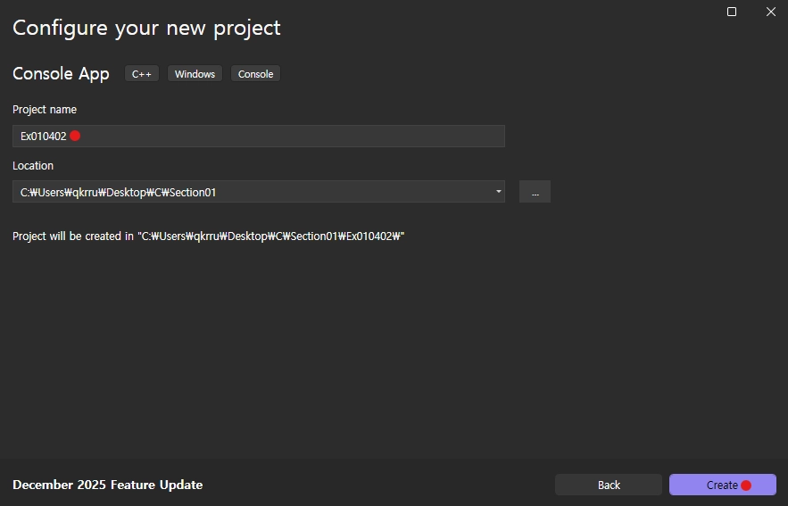

Project Name에는 항상 예제 이름 작성하고 Create 클릭합니다.

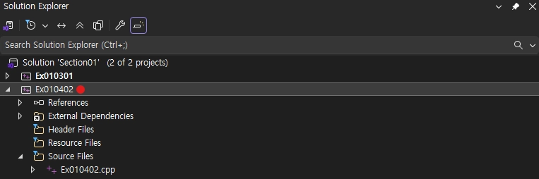

새 프로젝트 Ex010402가 생성된 모습.
근데 Ex010301이 좀 더 굵고 하얗다?

### (개인 중요)시작 프로젝트

소스코드 에디터를 빌드하면 하나의 프로젝트만 시작 프로젝트로 설정하고 빌드 할 수 있습니다.
같은 하늘 아래 두 태양이 없듯, 시작 프로젝트는 하나.

### Ex010403**)** 시작 프로젝트 설정하는 방법

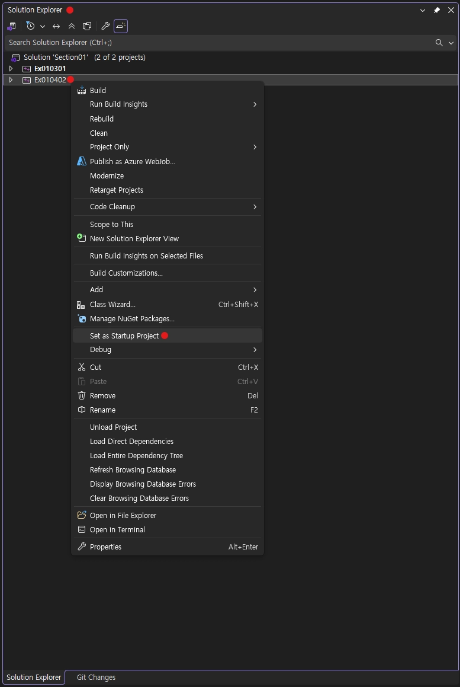

Solution Explorer > 원하는 프로젝트 우클릭 > Set as Startup Project 클릭합니다.

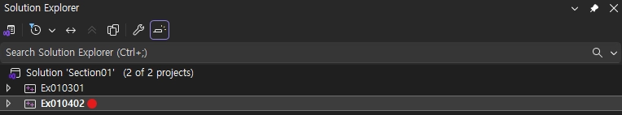

시작 프로젝트로 설정된 뒤 모습. 좀 더 굵고 하얗게 됩니다.

### Ex010404) 소스코드(명령서) 삭제하기

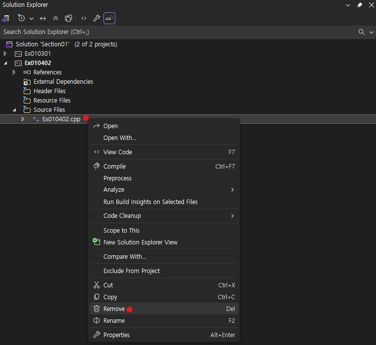

Solution Explorer > 원하는 소스코드 우클릭 > Remove 클릭합니다.
혹은 Solution Explorer > 원하는 소스코드 클릭 > Delete 키.

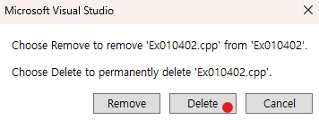

우리가 생각하는 삭제는 Delete임. Delete 클릭.
Remove는 Solution Explorer에서만 안보이게 될 뿐이지,
디스크에는 남아있습니다.

### Ex010405) 소스코드(명령서) 만들기

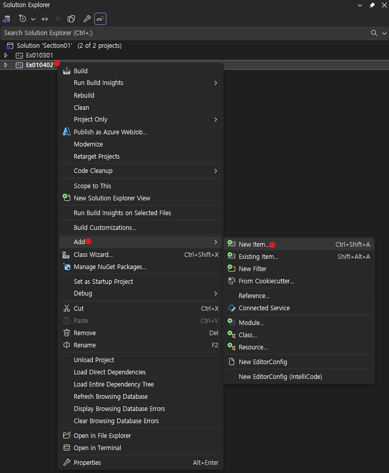

Solution Explorer > 원하는 프로젝트 우클릭 > Add > New Item 클릭합니다.
혹은 단축키 “Ctrl + Shift + A”. 그럼 시작프로젝트에 New Item이 됩니다.

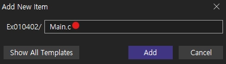

우리는 C언어 학습 중이므로 Main.c 파일 생성합니다.

### Ex010406) 백지부터 시작해보자.

```cpp
// Main.c

```

### 빌드하는 방법

<aside>
📌

**F5**

현재 시작 프로젝트의 소스코드가 빌드 및 실행됩니다.

가장 많이 쓰이는 단축키입니다.

</aside>

<aside>
📌

**Ctrl + B**

빌드만 수행됩니다.

</aside>

### Ex010407) Error List와 Output 보는 방법

빈 소스코드를 빌드 및 실행하니 아래와 같은 박스가 뜹니다.

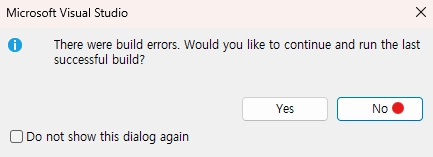

에러가 났는데, 이전에 성공 한 적 있는 빌드로 계속할건지 묻는 박스.
No를 누르는 것이 좋습니다. 
체크하고 Yes를 누르면, 초보는 에러 났음을 모를수도 있습니다.

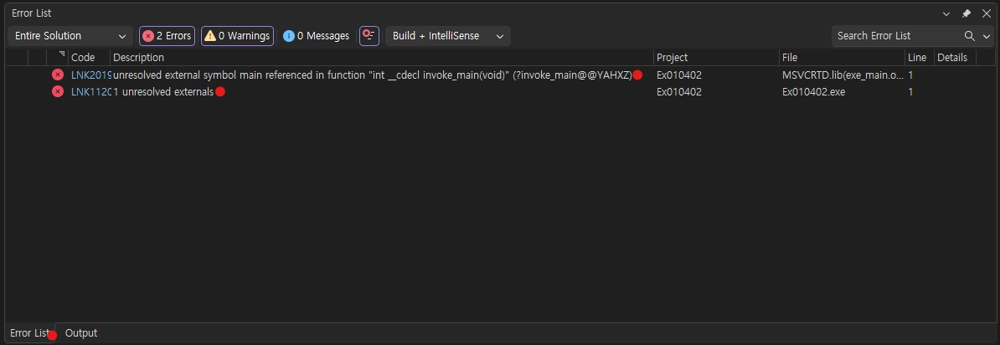

하단의 에러 리스트에서 두 가지 에러가 떴습니다. 영어지만, 한 글자씩 천천히 읽어보길 바랍니다.

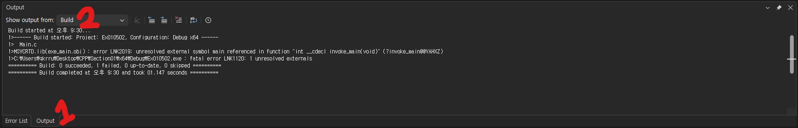

1번. Error List 옆에 Output 클릭합니다.
2번. Show output from에 Build를 지정합니다. 그럼 경고와 에러 관련 내용을 볼 수 있습니다.

### 프로그램의 시작점(Entry Point)

main() 함수는 프로그램의 시작점입니다.
즉, 모든 프로그램에게는 main() 함수가 있어야 합니다.

### Ex010501) main() 함수 [**중요 샘플 코드**]

```cpp
// Main.c

int main(void)
{

	return 0;
}

```

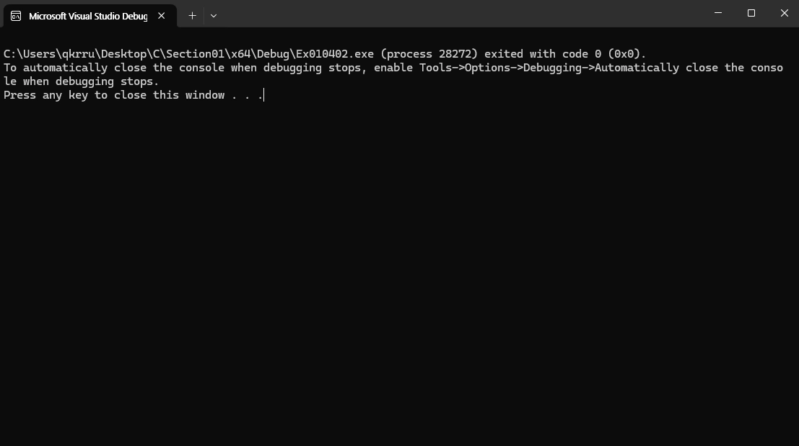

실행 결과 화면. 콘솔(Console) 화면이라고도 부릅니다. 밑에 글은 무시해도 됩니다.

### 예제코드 설명

```cpp
// Main.c

int main(void)  // main() 함수의 시작.
{

	return 0;     // main() 함수의 종료이자, 한 줄의 명령어 종료(세미콜론).
}

```

### 콘솔 화면에 글자를 출력해보고 싶다면?

지금까지는 아무런 내용이 없는 빈 백지부터,
프로그램의 시작점인 main() 함수까지 작성해보았습니다.
이번에는 콘솔 화면에 글자를 띄워보고 싶다면 어떻게 해야할까요?

### Ex010502) printf() 함수 [**중요 샘플 코드**]

```cpp
// Main.c

#include <stdio.h>

int main(void)
{
	printf("Hello, world!");

	return 0;
}

```

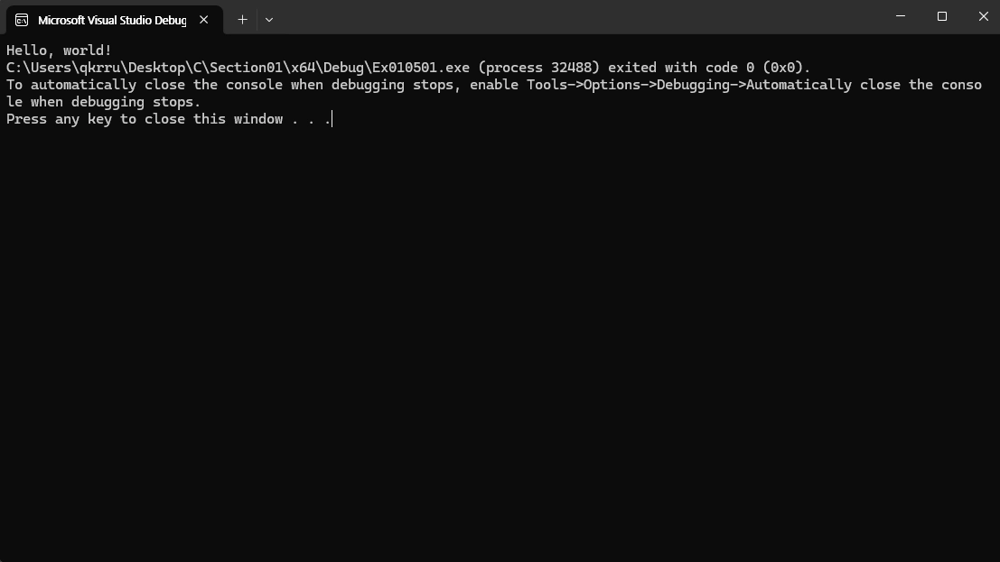

콘솔 화면.

### 예제코드 설명

```cpp
// Main.c

#include <stdio.h>         // stdio는 공구통 이름. #include는 공구통을 포함시키라는 명령어.

int main(void)
{
	printf("Hello, world!"); // stdio라는 공구통 안에 든 printf()라는 망치를 사용하는 예시.

	return 0;
}

```

### printf() 함수

print formatted의 약자입니다. “양식에 맞게 출력하다”라는 뜻입니다.
그래서 탈출 문자열 혹은 서식 지정자와 함께 쓰입니다. 

### 탈출 문자열(Escape Sequence)

탈출 문자 ’\’와 함께 작성된 문자열.
C언어에서 문자열은 시작 큰 따옴표와 끝 큰 따옴표로 감싸져 있습니다.
이 문자열 도중에 다른 의미를 가지는 문자열을 넣어서 사용합니다. 즉, 잠시 문자열을 “탈출”합니다.

|  | 출력 |
| --- | --- |
| \n | 개행(New line) |
| \t | 탭(Tap) |
| \’ | 따옴표 출력 |
| \” | 쌍따옴표 출력 |
| \\ | 역슬래시 출력 |
| %% | % 출력 |

### Ex010503) 개행하기

```jsx
// Main.c

#include <stdio.h>

int main(void)
{
	printf("Hello\nworld!");

	return 0;
}

```

### Ex010504) 탈출 문자열

```jsx
// Main.c

#include <stdio.h>

int main(void)
{
    printf("She said, \"We alright!\"\n");
    printf("And I thought, \'Um, that's not a big deal.\'\n");
    printf("Our 1/4 quater profit rose by 10%% and earned \\1,000,000,000\n");
    printf("..\\Desktop\\C\\Section01\\printf()\n");

	return 0;
}

```

### 서식 지정자(Format Specifier)

printf() 함수 혹은 scanf() 함수와 같은 입출력 함수들과 함께 쓰여서

양식에 맞게 입출력 할 수 있게끔 도와주는 지정자.

문자열의 원하는 위치에 서식 지정자를 넣어서 사용합니다.

### 서식 지정자의 종류

<aside>
1️⃣

**%d**: decimal의 약자. 10진수로 대체됩니다.

</aside>

<aside>
2️⃣

**%o**: octal의 약자. 8진수로 대체됩니다. ex) 9(10) <-> 11(8)

</aside>

<aside>
3️⃣

**%x**: hexadecimal의 약자. x는 소문자, X는 대문자로 대체됩니다. ex) 17(10) <-> 11(16)

</aside>

<aside>
4️⃣

**%u**: unsigned의 약자. 양수로 대체됩니다.

</aside>

<aside>
5️⃣

**%c**: character의 약자. 문자로 대체됩니다.

</aside>

<aside>
6️⃣

**%s**: string의 약자. 문자열로 대체됩니다.

</aside>

<aside>
7️⃣

**%f**: floating point의 약자. single precision.  

</aside>

<aside>
8️⃣

**%lf**: double precision floating point.

</aside>

### 서식 지정자는 왜 필요할까요?

3245라는 숫자를 문자열에 편입시키기 위해서 printf(“Result: %d”, 3245)라고 적을 수 있습니다.
또한 서식 지정자를 활용하면 계산 결과도 얻어 낼 수 있습니다.
3245 * 2342의 계산 결과를 화면에 출력시키기 위해 
printf(”Result: %d”, 3245 * 2342)라고도 적을 수 있습니다.
즉, 복잡한 수식을 빠른 시간안에 계산하고 그 결과를 원하는 형식으로 보기 위함입니다.
복잡한 소스코드를 작성할 때 디버깅 용도로 요긴하게 사용되기도 합니다.

### Ex010601) 서식시정자

```jsx
#include <stdio.h>

int main(void)
{
    printf("%d", 3245 * 2342);
    printf("%f", 3245 * 2342);

    return 0;
}
```

### printf() 함수 코드를 정확하고 쉽게 이해하는 방법

뒤에서부터 해석하면 훨씬 쉬워집니다. 결국 영어로 작성하기에, 어순이 우리나라와 다릅니다.
printf(”%d”, 3245 * 2342); 라는 코드는 “3245 * 2342를 %d 형식으로 printf해라”라고 해석합니다.
후에 배울 scanf()도 동일하게 뒤에서부터 해석하는게 편합니다. 

### Ex010602) 정수 서식지정자

```jsx
#include <stdio.h>

int main(void)
{
    printf("[%d]\n", 65536);
    printf("[%2d]\n", 65536);
    printf("[%5d]\n", 65536);
    printf("[%7d]\n", 65536);
    printf("[%-7d]\n", 65536);
    printf("[%07d]\n", 65536);
    printf("[%+7d]\n", 65536);

    return 0;
}
```

### Ex010603) 실수 서식지정자

```jsx
#include <stdio.h>

int main(void)
{
    printf("[%f]\n", 3.141592);
    printf("[%.2f]\n", 3.141592);
    printf("[%.10f]\n", 3.141592);
    printf("[%5.2f]\n", 3.141592);
    printf("[%5.10f]\n", 3.141592);
    printf("[%+20.10f]\n", 3.141592);
    printf("[%-20.10f]\n", 3.141592);

    return 0;
}
```

### 리터럴(Literal)

소스코드에 적힌 값 그 자체를 뜻합니다.
앞으로 저자가 “값”이라고 칭하는 것들은 “리터럴”의 의미를 지닌다고 생각하면 됩니다. 

### Ex010701) 리터럴

```jsx
// Main.c

#include <stdio.h>

int main(void)
{
    65536;           // 정수 리터럴. 
    65536LL;         // 정수 리터럴. 
    65536u;          // 정수 리터럴. 
    3.141592;        // 실수 리터럴.
    3.141592f;       // 실수 리터럴.
    'd';             // 문자 리터럴. ''는 문자 리터럴 기호.
    "Hello, world!"; // 문자열 리터럴. ""는 문자열 리터럴 기호.

    return 0;
}
```

### 예제 Ex010701은 경고가 뜬다.

경고(Warning)는 에러(Error)와 다릅니다.
에러가 뜨면 빌드 실패되지만, 경고는 빌드 시켜줍니다.
다만, 경고도 되도록 모두 잡고 가는 것이 국룰입니다.

### Ex010702) 리터럴 출력

```jsx
// Main.c

#include <stdio.h>

int main(void)
{
    printf("%d + %d = %d\n", 54232, 36629, 54232 + 36629);
    printf("%d\n", 14);
    printf("%o\n", 016);
    printf("%x\n", 0xe);
    printf("%X\n", 0XE);
    printf("%c\n", 'd');
    printf("%s\n", "Hello, world!");

    printf("%f", 3.141592f);

    return 0;
}
```

### 자료형의 필요성

컴퓨터는 아주 단순히 말해서, 계산하고 저장하는 기계.
우리가 입력한 모든 값은 결국 0과 1로 저장됩니다.
하지만 컴퓨터는 그 0과 1의 묶음들이 무엇을 의미하는지 전혀 알 수 없습니다.
어디서부터 어디까지(크기)를 어떻게 해석해야하는지 알려줘야합니다.
이 역할을 하는 것이 자료형입니다.

### 컴퓨터 공학에서의 크기 단위

컴퓨터 공학에서 가장 작은 크기 단위는 1 bit입니다.
이진법의 한 자리에 해당하는 크기입니다.

컴퓨터 상식적으로 8 bits를 1 byte라고 부릅니다.

다시 1024 bytes를 1 mb라고 부릅니다.

### 자료형(Type)

저장될 데이터의 크기와 해석 방법에 대한 정보.

| 자료형 | 크기 == 표현 가능한 수 | 서식 지정자 | 
| --- | --- | --- |
| char | **1 byte**. -(2^7) ~ (2^7) - 1[-128 ~ 127] | %c or %hhd |
| short int | **2 byte**. -(2^15) ~ (2^15) - 1[-32768 ~ 32767] | %hd |
| int[기본 정수 자료형] | **4 byte**. -(2^31) ~ (2^31) - 1[-2147483648 ~ 2147483647] | %d or %i |
| long | **4 byte** or **8 byte**. | %ld |
| long long | **8 byte**. -(2^63) ~ (2^63) - 1 | %lld |
| float | **4 byte**. 유효 자리수 6~7자리.[부호: 1bit, 지수: 8bit, 가수: 23bit] | %f |
| double[기본 실수 자료형] | **8 byte**. 유효 자리수 15~16자리.[부호: 1bit, 지수: 11bit, 가수: 52bit] | %lf |
| long double | **8 byte 이상**. | %Lf |

### Ex010801) 리터럴과 자료형

```jsx
#include <stdio.h>

int main(void)
{
    65536;           // int 자료형의 리터럴. 즉, int는 "기본 정수 자료형".
    65536LL;         // LL은 long long의 약자. 즉, long long 자료형의 리터럴 기호. l은 1과 헷갈리기 때문에 잘 안씁니다.
    65536u;          // u는 unsigned의 약자. unsigned의 리터럴 기호.
    3.141592;        // double 자료형의 리터럴. 즉, double은 "기본 실수 자료형".
    3.141592f;       // float 자료형의 리터럴 기호 f.
    'd';             // char 자료형의 리터럴. ''는 char 자료형의 리터럴 기호.
    "Hello, world!"; // 문자열 리터럴. ""는 문자열 리터럴 기호. const char[] 자료형 리터럴 기호.

    return 0;
}
```

### 변수(Variable) <-> 상수(Constant) [증요 샘플 코드]

변할 수 있는 수. 아래와 같은 형식으로 선언하게 됩니다.

```cpp
자료형 변수명 = 값;
```

### Ex010901) 자료형 변수명 = 값; [중요 샘플 코드]

```jsx
// Main.c

#include <stdio.h>

int main(void)
{
	// 자료형 변수명 = 값;
	int Num = 2147483647; // 선언과 동시에 초기화
	double PI;            // 선언

	printf("Num = %d\n", Num);

	PI = 3.141592;
	printf("PI = %lf\n", PI);

	return 0;
}
```

### unsigned 키워드와 signed 키워드

부호 없는 Vs. 부호 있는.
unsigned를 자료형 앞에 붙히면 음수는 표현 불가능. 대신 양수 부분이 2배 늘어납니다.
서식 지정자로는 %u를 쓰면 됩니다.
모든 자료형은 사실 앞에 signed 키워드가 생략되어 있습니다.

### Ex010902) 오버플로우

```jsx
// Main.c

#include <stdio.h>

int main(void)
{
	char CharNum = -128;
	signed char SignedCharNum = -128;
	unsigned char UnsignedCharNum = 255;
	unsigned char UnsignedCharNumWithOverflow = -1;

	short ShortNum = -32768;
	signed short SignedShortNum = -32768;
	unsigned short UnsignedShortNum = 65535;
	unsigned short UnsignedShortNumWithOverflow = -1;

	printf("CharNum: %hhd\n", CharNum);
	printf("SignedCharNum: %hhd\n", SignedCharNum);
	printf("UnsignedCharNum: %hhu\n", UnsignedCharNum);
	printf("UnsignedCharNumWithOverflow: %hhu\n", UnsignedCharNumWithOverflow);

	printf("ShortNum: %hd\n", ShortNum);
	printf("SignedShortNum: %hd\n", SignedShortNum);
	printf("UnsignedShortNum: %hu\n", UnsignedShortNum);
	printf("UnsignedShortNumWithOverflow: %hu\n", UnsignedShortNumWithOverflow);

	return 0;
}
```

### 오버플로우(Overflow)

자료형이 표현 가능한 수를 넘어서는 경우.
그릇에 물을 너무 많이 따르면 넘쳐 흐르는 것과 같습니다.

- 도식화
    
    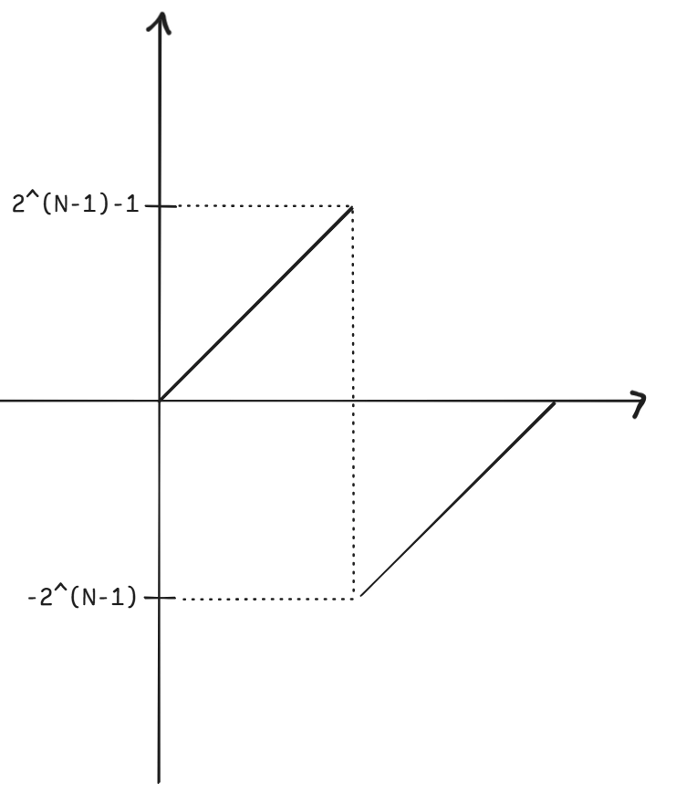
    
    N은 각 자료형의 크기. char는 8, int는 32를 대입.
    
    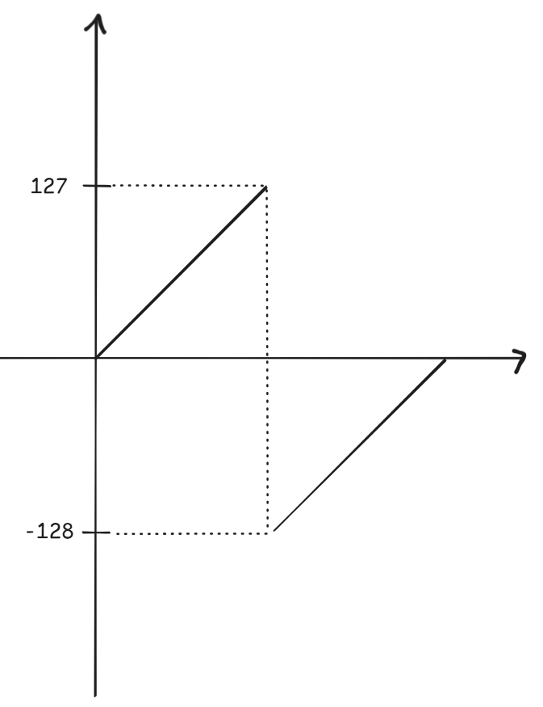
    
    char 자료형의 오버플로우 도식화.
    

### 컴퓨터는 문자를 이해할 수 없음.

누군가는 “어, char 자료형의 변수에 문자 저장 가능한데요?” 라고 반문할 수 있습니다. Nope!!!
프로그래머는 문자로 작성된 소스코드를 컴퓨터가 그대로 이해할 수 없기에
컴파일러를 통해 이진패턴으로 만들었다는 걸 기억해야 합니다. 이 과정을 빌드 프로세스라고 불렀습니다.
즉, char 자료형의 변수에 문자를 그대로 저장할 수 없다는 뜻입니다. 뭔가 처리가 필요합니다.

### 인코딩(Encoding) Vs. 디코딩(Decoding)

형태 A에서 형태 B로 변환하는 것을 인코딩이라 합니다.
반대로 형태 B에서 형태 A로 변환하는 것을 디코딩이라 합니다.

### ASCII(American Standarded Code for Information Interchange)

문자 형태의 데이터와 숫자 형태의 데이터 사이의 인코딩 규약 중 하나.
여러 인코딩 규약이 있으나, 그 중 가장 쉽고 대표적인 규약.
규칙 표는 [[***여기***](https://en.cppreference.com/w/cpp/language/ascii)]를 참고하시면 됩니다.
어쨋든 컴퓨터에 값이 저장되기 위해서는 숫자 형태여야 한다는 점을 기억합시다.

### Ex011001) ASCII

```jsx
// Main.c

#include <stdio.h>

int main(void)
{
	char ch1 = 'A';
	char ch2 = '1';

	printf("ch1 = %c\n", ch1);
	printf("ch1 = %d\n", ch1);
	printf("ch1 + 2 = %c\n", ch1 + 2);
	printf("ch1 + 2 = %d\n", ch1 + 2);

	printf("ch2 = %c\n", ch2);
	printf("ch2 = %d\n", ch2);
	printf("ch2 + 2 = %c\n", ch2 + 2);
	printf("ch2 + 2 = %d\n", ch2 + 2);

	printf("'A' + 24 = %c\n", 'A' + 24);
	printf("'A' + 24 = %d\n", 'A' + 24);

	return 0;
}
```

### [참고] 지역별 문자 인코딩과 유니코드

과거에는 ASCII, EUC-KR 등등 각 나라마다 다른 문자 인코딩들이 존재했습니다. 이는 서로 호환되지 않아 다국어 지원에 문제가 생겼습니다.

그래서 전세계 모든 문자를 표현 및 처리하기 위해 만들어진 문자 인코딩이 유니코드(Unicode)입니다.

유니코드에는 UTF-8, UTF-16, UTF-32가 있습니다.

### scanf()

키보드로부터 데이터를 입력 받을 수 있게끔 해주는 함수.

### Ex011101**)** scanf() 함수 [중요 샘플 코드]

```jsx
// Main.c

#define _CRT_SECURE_NO_WARNINGS 
	// scanf() 함수를 쓸때는 이걸 정의해줘야 합니다.
	// 다만 scanf() 함수는 stdio.h에 정의되어 있으므로, stdio.h 파일 인클루드 전에 정의해야 합니다.
	
#include <stdio.h>

int main(void)
{
	int Num;

	scanf("%d", &Num); // "Num에다가(&) %d 형식으로 입력받아라."

	printf("%d", Num); // "Num을 %d 형식으로 출력해라."

	return 0;
}
```
# End