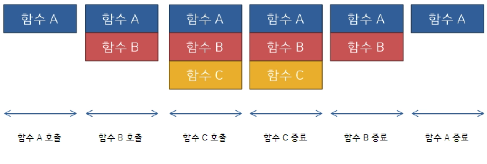
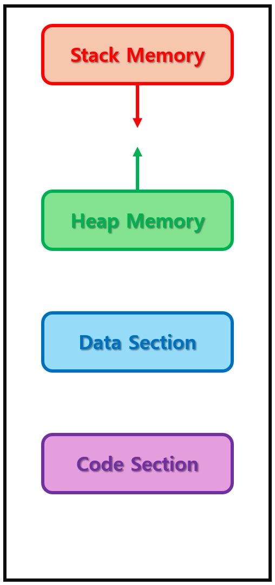

### 함수(Function)

프로그래밍 언어에서 함수란, 코드 뭉치.
반복되는 코드 뭉치가 있다면 해당 코드 뭉치를 함수로 만들어서 재사용성을 높힐 수 있습니다.
입력 혹은 출력이 있는 경우 대부분 다 함수라고 봐도됩니다.

### printf()도 함수, main()도 함수

입력으로 문자열을 받아서 화면에 출력해주는 printf()도 함수입니다. 
프로그램의 시작점 역할을 하는 main()도 함수였습니다.

### 함수의 필요성

우리는 printf() 함수를 자주 사용해왔습니다. 만약 함수를 몰랐다면 어떻게 되었을까요?
printf()를 쓸 때마다, printf() 함수 내부 코드를 적어줬어야 합니다. 
소스코드가 얼마나 복잡할지는 안봐도 비디오입니다.
소스코드는 불필요하게 길어지므로, 해석에 어려움을 줍니다.

- printf() 함수의 구현 코드
    
    ```cpp
    // 아래 내용은 수도코드(가짜코드)입니다.
    
    int myprintf(const char* format, ...)
    {
    	va_list args;
    	va_start(args, format);
    	int written = 0;
    
    	const char* ptr = format;
    	while (*ptr != '\0')
    	{
    		if (*ptr == '%')
    		{
    			ptr++;
    
    			if (*ptr == 'd')
    			{
    				int num = va_arg(args, int);
    				char buffer[20];
    				int len = snprintf(buffer, sizeof(buffer), "%d", num);
    				write(1, buffer, len);
    				written += len;
    			}
    			else if (*ptr == 'c')
    			{
    				char c = (char)va_arg(args, int);
    				write(1, &c, 1);
    				written++;
    			}
    			else if (*ptr == 's')
    			{
    				char* str = va_arg(args, char*);
    				while (*str)
    				{
    					write(1, str, 1);
    					str++;
    					written++;
    				}
    			}
    			else
    			{
    				// TODO
    			}
    		}
    		else
    		{
    			write(1, ptr, 1);
    			written++;
    		}
    		ptr++;
    	}
    
    	va_end(args);
    	return written;
    }
    
    int main()
    {
    	myprintf("Hello, Your score is %d.\n", "World", 95);
    	myprintf("Hello, Your score is %d.\n", "World", 100);
    	myprintf("Hello, Your score is %d.\n", "World", 72);
    	myprintf("Hello, Your score is %d.\n", "World", 63);
    	myprintf("Hello, Your score is %d.\n", "World", 97);
    	myprintf("Hello, Your score is %d.\n", "World", 55);
    	
    	return 0;
    }
    
    ```
    

### 함수 작성 방법 [중요 샘플 코드]

아래 내용을 주석 포함해서 빡지 써봅시다. 암기해서 어느 순간에도 툭치면 나올 정도로 써봅시다.

```c
반환자료형 함수명(매개변수자료형 매개변수명) // 함수 선언(Declaration)이자, 정의(Definition)
{

	return 반환값;
}

int main(void)
{
	int num = 10;  // 자료형 변수명 = 값;

	함수명(인자값); // 함수 호출(Call)

	return 0;
}
```

### Ex060101) main() 함수

암기 후에 main() 함수를 보면, 함수 암기 내용과 동일하다는 것을 알 수 있습니다.
main() 함수의 반환자료형, 함수명, 매개자료형 매개변수명, 반환값이 뭔지 짚어봅시다.

### Ex060102) PrintOneStar() 함수

별 하나를 출력하는 함수 PrintOneStar()를 선언 및 정의하고 호출하는 소스코드를 작성해보자.
실행 결과도 확인해보자.

### Ex060103) Add() 함수 1

두 수를 전달 받아서 그 합을 출력하는 함수 Add()를 선언 및 정의하고 호출하는 소스코드를 작성.
실행 결과도 확인해보자.

### Ex060104) Add() 함수 2

두 수를 전달 받아서 그 합을 반환하는 함수 Add()를 선언 및 정의하고 호출하는 코드를 작성.
main() 함수에서는 반환 받은 값을 int형 변수에 저장했다가 출력하는 소스코드를 작성해보자.
실행 결과도 확인해보자.

### 여기까지 암기하면 함수 기초문법은 완성입니다.

그러나, 제대로 공부하려면 함수가 호출 될 때 어떤 일이 벌어지는지까지 깊숙이 알아야 합니다.
처음엔 당연히 어려우니 여기까지만 암기합시다. 힘을 풀고 듣는걸 추천합니다. 회독하면서 이해해야 합니다.

## [심화]
### 함수는 몇 회나 호출될 수 있을까요?

함수의 호출 횟수는 제한 할 수 없습니다.
심지어 게임의 중추가 되는 어떤 함수(Tick() 함수 같은)는 1초에 수천번씩 호출될 수도 있습니다.
롤과 같은 게임을 하면 FPS 값을 알 수 있습니다.
60 프레임이라면, 어떤 함수는 1초에 60번 호출되고 있는 것입니다.
그렇기에 함수의 호출 비용은 최대한 적어야 합니다.

### 함수의 호출 비용을 최대한 줄이려면.

함수는 결국 코드 뭉치라고 했습니다.
함수 A에서 함수 B를 호출하면 함수 A 코드 뭉치에 함수 B 코드 뭉치를 쌓아 올렸다가, 
종료되면 함수 B 코드 뭉치를 없애면 됩니다. 이걸 빠르고 호출 비용이 저렴하게 처리해야 합니다.
이를 1초에 수만번씩해도 빠르게 처리 해주는 자료구조가 스택입니다.
군필자라면 탄알집을 생각하시면 됩니다. 나중에 넣은 탄알이 먼저 나오는 자료구조입니다.
수건함 같은 느낌. 굳이 맨 밑 수건을 꺼내면 엄마한테 혼납니다. 
가장 위에 있는 수건이 가장 먼저 나오는 구조입니다.



### 스택 메모리(Stack Memory)

컴퓨터의 메모리 레이아웃은 크게 스택 메모리, 힙 메모리, 코드 섹션, 데이터 섹션으로 나뉩니다.
그 중에서 스택 메모리는 함수 호출에 할당될 메모리입니다. 결국 지역변수들이 저장되는 공간입니다.
스택 메모리는 스택 포인터와 베이스 포인터, 스택 프레임들로 구성되어 있습니다.

- 메모리 레이아웃
    
    
    
    컴퓨터의 메모리 레이아웃.
    

### 스택 프레임(Stack Frame)

함수가 호출되면 해당 함수가 사용할 메모리 크기만큼 공간이 확보됩니다.
해당 함수를 위해 확보된 메모리 공간을 스택프레임이라고 합니다.
나중에 함수가 모두 수행된 뒤에 해당 스택프레임은 다시 반환됩니다.

### Ex060201) [**참고**] 스택프레임의 동작

**[참고] 스택 포인터(Extended Stack Pointer, ESP)**

현재 스택 프레임의 Top을 가르킵니다.
push 명령어나 pop 명령어의 피연산자. 

**[참고] 베이스 포인터(Extended Base Pointer, EBP)**

현재 스택 프레임의 시작 주소를 가르킵니다.아래 소스코드를 어셈블리 코드로 만들어봅시다. [[**여기**](https://godbolt.org/)]
해당 어셈블리 코드를 통해 스택프레임의 생성 및 파괴 과정을 천천히 살펴봅시다.

```c
// Main.c

#include <stdio.h>

int add(int a, int b)
{
	return a + b;
}

int main(void)
{
	int res;

	res = add(2, 5);

	return 0;
}
```

```nasm
# 보기 좋게 정리한 어셈블리 코드입니다. 정확하지 않을 수도 있습니다.
# 스택프레임이 어떻게 생성되고 지워지는지만 확인해보세요!

_main:                   # @main
    pushl %ebp           # esp -= 4하고 [esp] = ebp
    movl %esp, %ebp      # ebp = esp
    subl $16, %esp       # esp -= 16 (로컬 변수 공간 확보)
    ...
    call _add            # add() 함수 호출
    ...
    addl $16, %esp       # esp += 16 (스택 정리)
    popl %ebp            # ebp = [esp]하고 esp += 4
    ret

_add:                    # @add
    pushl %ebp           # esp -= 4, [esp] = ebp
    movl %esp, %ebp      # ebp = esp
    subl $36, %esp       # esp -= 36
    ...
    addl $36, %esp       # esp += 36
    popl %ebp            # ebp = [esp]하고 esp += 4
    ret
```


main() 함수의 스택프레임 할당


add() 함수의 스택프레임 할당과 해제


main() 함수의 스택프레임 해제


### 스택프레임 개념은 아주 중요합니다.

프로그래밍을 계속 하게 된다면, 스택프레임 관련된 내용은 계속해서 나옵니다.
사람들이 어렵다고 생각하는 개념들 거의 대부분이 스택프레임과 관련있기도 합니다.
프로그래밍을 처음해본다면, 일단은 넘어가도 좋습니다.

## 심화 끝

### 스코프(Scope)

변수나 함수 이름을 사용할 수 있는 범위를 뜻합니다.

### 스코프의 종류

1. 블럭 스코프(Block Scope)
2. 파일 스코프(File Scope)

### 블럭 스코프(Block Scope)

중괄호 내부에 선언된 변수는 해당 중괄호 내부에서만 사용할 수 있습니다.

조건문, 반복문 같은 문(statement)에 사용되는 중괄호 범위도 블럭 스코프라고 합니다.
블럭 스코프 안에 또 다른 블럭 스코프가 들어갈 수도 있습니다.
바깥쪽 블럭 스코프에서 안쪽 블럭 스코프에 선언된 지역 변수에 접근 불가능합니다.
반대로 바깥쪽 블럭 스코프에 선언된 지역 변수를 안쪽 블럭 스코프에서는 접근 가능합니다.

### Ex060301) 블럭 스코프

아래 소스코드의 출력결과를 예측해보고 예측한 결과와 실행 결과를 비교해봅시다.

```c
// Main.c

#include <stdio.h>

int main(void)
{
	int Num1 = 10;

	printf("Num1: %d\n", Num1);

	{
		int Num2 = 100;
		int Result = Num1 + Num2;

		printf("Result: %d\n", Result);
		printf("Num1: %d\n", Num1);
	}

	/* 만약, block scope가 없었다면..? */

	/*
	block scope 내부에 선언된 변수들은 접근 불가능.
	printf("Num2: %d\n", Num2);
	printf("Result: %d\n", Result);
	*/

	return 0;
}
```

### 변수 가리기(Variable Shadowing) 금지

블럭 스코프가 다르면, 같은 변수명을 가진 변수들을 선언할 수 있습니다.
그러나 이런 코드를 절대 작성하지 맙시다.

```c
// Main.c

#include <stdio.h>

int main(void)
{
	int MyScore = 87;

	{
		int MyScore = 95;    /* Bad. */

		printf("MyScore: %d\n", MyScore);
	}

	printf("MyScore: %d\n", MyScore);

	return 0;
}
```

### 파일 스코프(File Scope)

```jsx
// Main.c

#include <stdio.h>

int FileScopeVariable = 0; // 파일 스코프에 선언된 변수. -> 전역변수

int ReturnZero(void)       // 파일 스코프에 선언 및 정의된 함수. -> 전역함수
{
	return 0;
}

int main(void)
{

	return 0;
}
```

### 전방 선언(Forward Declaration)

함수의 원형(머리부분)만 따서 파일 스코프 상단에 두고
함수의 정의는 파일 스코프의 하단에 위치 시키는 방법입니다.

### Ex060401) 전방 선언

다음의 소스코드를 명령어 순서 파악으로 출력 결과를 예측해봅시다.
예측 결과와 실행 결과와 비교해봅시다.

```c
// Main.c

#include <stdio.h>

int add(int a, int b); /* forward declaration. */

int main(void)
{
	printf("add(2, 5) == %d", add(2, 5));

	return 0;
}

int add(int a, int b) /* function definition. */
{
	return a + b;
}
```

### 전방선언을 하는 이유.

지금은 큰 이유가 없습니다. 이후에 나오는 분할 컴파일을 위해서입니다.
분할 컴파일 단원에서 다시 제대로 배워 볼 예정입니다.

### 변수의 종류

변수에는 지역 변수/전역 변수가 있습니다.
여기에 static이나 const, extern 같은 키워드가 붙어서 조금씩 뉘앙스가 달라집니다.

### 지역 변수(Local Variable)

블럭 스코프 내에 선언된 변수. 따라서 스택 메모리에 저장됩니다.
함수가 종료되면 스택 프레임이 반환되면서 더이상 접근 불가능합니다

### 지역 변수와 함수 마을

함수를 하나의 마을이라고 생각해봅시다.
main() 마을에서는 Add() 마을에서 선언된 지역 변수 A를 접근할 수 없습니다.
그리고 Add() 함수가 종료되면, 지역 변수 A도 사라진다고 이해합시다.

### Ex060501) 지역변수

다음의 소스코드를 명령어 순서 파악으로 출력 결과를 예측해봅시다.
예측 결과와 실행 결과와 비교해봅시다.

```c
// Main.c

#include <stdio.h>

int add(int A, int B);

int main(void)
{
	int A = 2, B = 5;
	int Result;
	Result = add(A, B); // 변수 A, B가 전달되는 걸까요?
	printf("add(A, B) == %d", Result);

	return 0;
}

int add(int A, int B) 
{
	// int A와 int B는 지역 변수일까요?
	int Result = A + B;
	return Result;
}

```

### 정적 지역 변수

지역 변수 앞에 static 키워드가 붙으면 데이터 섹션에 저장됩니다.
즉, 함수 종료시 접근 불가한 스택메모리에 저장되는게 아닙니다. 
함수가 종료되어도 값이 유지가 됩니다
이런 변수를 정적 지역 변수라고 부릅니다.

### 전역 변수(Global Variable)

파일 스코프에 선언된 변수. 데이터 섹션에 저장됩니다.

### Ex060502) 전역 변수

다음의 소스코드를 명령어 순서 파악으로 출력 결과를 예측해봅시다.
예측 결과와 실행 결과와 비교해봅시다.

```c
// Main.c

#include <stdio.h>

int GResult;

void StoreSum(int A, int B);

int main(void)
{
    int A = 2, B = 5;
    StoreSum(A, B);
    printf("GResult == %d", GResult);

    return 0;
}

void StoreSum(int A, int B)
{
    GResult = A + B;
    return;
}
```

### Ex060503) 정적 지역 변수와 전역 변수

다음의 소스코드를 명령어 순서 파악으로 출력 결과를 예측해봅시다.
예측 결과와 실행 결과와 비교해봅시다.

```c
// Main.c

#include <stdio.h>

int GCokeCount = 0;

void MakeCoke(void);

int main(void)
{
	MakeCoke();
	MakeCoke();
	MakeCoke();

	return 0;
}

void MakeCoke(void)
{
	static int SCokeCount = 0;
	int CokeCount = 0;

	printf("GCokeCount: %d\n", GCokeCount);
	printf("SCokeCount: %d\n", SCokeCount);
	printf("CokeCount: %d\n\n", CokeCount);

	++GCokeCount;
	++SCokeCount;
	++CokeCount;
}

```


### 정적 전역 변수

만약 전역 변수 앞에 static 키워드가 붙는다면, 해당 변수는 해당 파일 내에서만 접근 가능합니다.

```cpp
// Main.c

#include <stdio.h>

static int A;

int main(void)
{

	return 0;
}

```

```cpp
// MyMath.c

#include "Main.c"

void PrintA(void)
{
	printf("%d", A); // 다른 파일에 정적 전역 변수로 선언된 A이므로, 접근 불가.

	return;
}
```

### const 변수

const 키워드가 붙은 변수. 초기화 이후에 값을 변경할 수 없습니다. 초기화가 강제됩니다.

### const 키워드의 필요성

```jsx
// Main.c

#include <stdio.h>

int main(void)
{
	double PI = 3.141592;
	
	// ... 200만줄의 유인우주선 개발 코드 ...
	
	PI = 3.15; // 절대 하면 안됩니다. 그래서 const 키워드가 필요한 것입니다.
	
	// ... 200만줄의 유인우주선 개발 코드 ...

	return 0;
}

```

### Ex060504) const 키워드

다음의 소스코드를 명령어 순서 파악으로 출력 결과를 예측해봅시다.
예측 결과와 실행 결과와 비교해봅시다. 각 변수들이 메모리 레이아웃 어디에 저장될지도 생각해봅시다.
문제가 생긴다면 어디서 왜 발생하는지 생각해봅시다.

# END