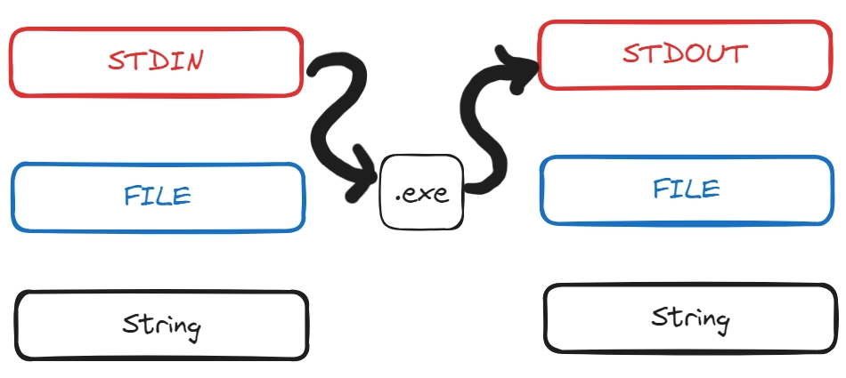
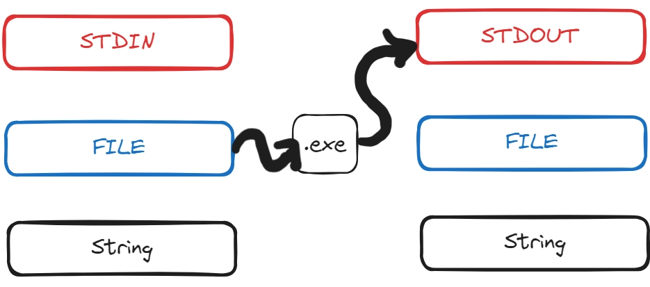
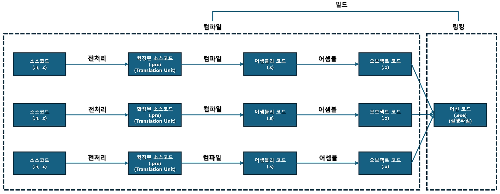
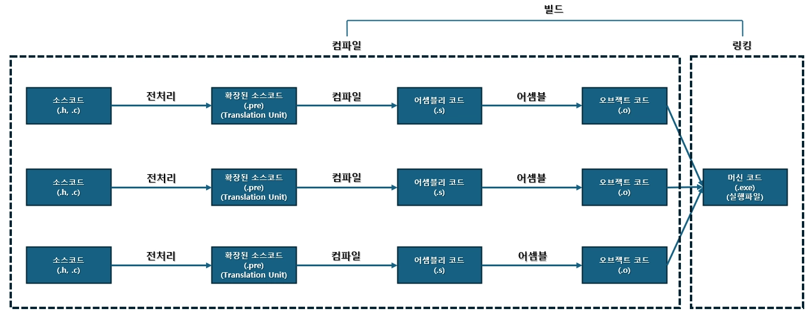

# [심화] 

### 스트림(Stream)

즉, 데이터가 흘러들어오는 물줄기라고 생각합시다.

이런 물줄기는 여러 개입니다.
내가 물(데이터)을 싱크대에서 받아올 수도 있지만, 정수기에서 받아올 수도 있습니다.
받아온 물을 처리 후 싱크대로 보낼 수도 있지만, 정수기에도 보낼 수 있습니다.

### 데이터 스트림의 종류

<aside>
📌

**stdin 스트림**

키보드를 통한 입력 데이터 스트림.

</aside>

<aside>
📌

**stdout 스트림**

콘솔을 통한 출력스트림.

</aside>

<aside>
📌

**File 스트림**

입출력이 가능한 파일스트림.

</aside>

<aside>
📌

**String 스트림**

입출력이 가능한 문자열 스트림.

</aside>



### 우리는 지금까지 stdin과 stdout만 사용해왔습니다.

stdin을 통해서 데이터를 받아서 stdout으로 데이터를 출력하는 것만 해봤습니다.
이번 단원에서는 File 스트림에 대해 배워 볼 예정입니다.

### int fscanf(FILE* stream, const char* format)

scanf()는 stdin으로 스트림이 결정되어 있습니다.
fscanf()는 스트림을 인자로 전달 가능합니다. stdin을 인자로 전달하면 scanf()와 동일합니다.

### Ex100101) fscanf()와 stdin 스트림

아래 코드를 따라서 작성해봅시다.
따라 작성한 소스코드의 실행 결과를 예측해보고, 예측 결과와 실행 결과를 비교해봅시다.

```c
// Main.c

#define _CRT_SECURE_NO_WARNINGS

#include <stdio.h>

int main(void)
{
	int Num;

	printf("[scanf()]Enter a number: ");
	scanf("%d", &Num);
	printf("Num: %d\n", Num);

	printf("[fscanf()]Enter a number: ");
	fscanf(stdin, "%d", &Num);
	printf("Num: %d\n", Num);

	return 0;
}
```

### 파일 접근 모드

외울 필요까진 없습니다. 그냥 이런게 있구나 정도로 이해하고 넘어갑시다. [[출처](https://docs.microsoft.com/ko-kr/cpp/c-runtime-library/reference/fopen-wfopen?view=msvc-170)]

| mode |  |
| --- | --- |
| “r” | 읽기 모드. 파일이 없거나 찾을 수 없는 경우 실패. |
| “w” | 쓰기 모드. 빈파일이 새로 열림. 파일이 이미 있다면 해당 파일의 내용은 삭제됨. |
| “a” | 새 데이터를 파일에 쓰기 전에 EOF 표식을 제거하지 않고 파일의 끝에 쓰기. 파일이 없는 경우 파일을 새로 만듦. |
| “r+” | 읽고 쓰기 모드. 파일이 있어야함. |
| “w+” | 읽고 쓰기 위해 빈 파일이 열림. 파일이 이미 있으면 기존 파일의 내용은 삭제됨. |
| “a+” | 읽고 추가하기 위해 파일이 열림. |

### Ex100102) fopen() 함수와 fclose() 함수

아래 코드를 따라서 작성해봅시다.
따라 작성한 소스코드의 실행 결과를 예측해보고, 예측 결과와 실행 결과를 비교해봅시다.
문제가 생긴다면 어디서 왜 생기는지 생각해봅시다.

```c
// Main.c

#define _CRT_SECURE_NO_WARNINGS

#include <stdio.h>

int main(void)
{
	FILE* InputText = fopen("Input.txt", "r");

	fclose(InputText);
	InputText = NULL;

	return 0;
}
```

### Ex100103) file stream에서 입력받고, stdout stream으로 출력하기

아래 코드를 따라서 작성해봅시다.
따라 작성한 소스코드의 실행 결과를 예측해보고, 예측 결과와 실행 결과를 비교해봅시다.
일단 한번 실행해보고, 아무것도 안나온다면
Ex110103 폴더에 Input.txt를 생성하여 숫자를 적어보고 다시 실행해봅시다.

```c
// Main.c

#define _CRT_SECURE_NO_WARNINGS

#include <stdio.h>

int main(void)
{
	int Number = 0;
	FILE* InputText = fopen("Input.txt", "r");

	fscanf(InputText, "%d", &Number);
	printf("%d", Number);

	fclose(InputText);
	InputText = NULL;

	return 0;
}

```



### Ex100104) file stream에서 입력받고, file stream으로 출력하기

File 스트림으로부터 읽어서 File 스트림으로 작성해봅시다.
w 모드로하면 해당 파일이 없을 경우 자동으로 생성해줍니다.

아래 코드를 따라서 작성해봅시다.
따라 작성한 소스코드의 실행 결과를 예측해보고, 예측 결과와 실행 결과를 비교해봅시다.

```c
// Main.c

#define _CRT_SECURE_NO_WARNINGS

#include <stdio.h>

int main(void)
{
	int Number1 = 0, Number2 = 0;
	FILE* InputText = fopen("Input.txt", "r");
	FILE* OutputText = fopen("Output.txt", "w");

	fscanf(InputText, "%d %d", &Number1, &Number2);
	fprintf(OutputText, "%d", Number1 + Number2);

	fclose(InputText);
	InputText = NULL;
	fclose(OutputText);
	OutputText = NULL;

	return 0;
}

```

### 전처리기(Preprocessor)

우리가 작성한 .c 파일을 가지고 전처리기가 아래와 같은 작업을 진행합니다.

<aside>
1️⃣

주석을 날려버림.

</aside>

<aside>
2️⃣

매크로가 확장(복붙)

</aside>

<aside>
3️⃣

include 되어 있는 .h 헤더파일 확장.

</aside>

위와 같은 작업을 통해 만들어진 파일이 트렌슬레이션 유닛(확장된 소스파일)입니다.
트렌슬레이션 유닛 파일은 컴파일러가 들고가서 다음 작업을 이어갑니다.

### 전처리기 지시자 #

전처리기 지시자가 붙으면 전처리기 지시문이라고 부릅니다.
ex) #include, #define, #ifndef, #endif, …
이번 단원에서 자세히 살펴볼 예정입니다.

### 전처리기 지시문을 통해 할 수 있는 작업

<aside>
1️⃣

다른 소스파일을 인클루드.
#include 구문으로 가능합니다.

</aside>

<aside>
2️⃣

매크로 문법을 통해 텍스트 대체.
#define 구문이 대표적입니다. 소스코드 상의 특정 텍스트를 대체할 수 있습니다.

</aside>

<aside>
3️⃣

소스 파일의 일부를 조건부로 컴파일.
#if, #ifdef, #ifndef, #else, #elif, #endif 구문으로 가능합니다.

</aside>

### #define {식별자} {값}

전처리기가 {식별자}를 보면 모두 {값}으로 대체합니다.
마치 사람이 π 기호를 보면 3.141592라는 값으로 바꿔 생각하는 것과 같습니다.

```cpp
#define FALSE (0)
#define TRUE (1)
```

### C 표준에 미리 정의되어 있는 #define 구문들

__FILE__: 현재 파일명을 문자열로 표시
__LINE__: 현재 소스코드의 줄 번호를 정수형으로 표시

위 두 매크로는 오류 출력시 자주 사용합니다.

```cpp
printf(“error: %s, line %d.\n”, __FILE__, __LINE__);
```

### Ex100201) 매크로 변수

아래 코드를 따라서 작성해봅시다.
따라 작성한 소스코드의 실행 결과를 예측해보고, 예측 결과와 실행 결과를 비교해봅시다.

```cpp
// Main.c

#include <stdio.h>

#define TRUE (1)

int main(void)
{
	if (TRUE)
	{
		printf("FileName: %s, LineNumber: %d", __FILE__, __LINE__);
	}

	return 0;
}

```

### const Vs. enum Vs. 매크로 변수

위 세 가지 문법은 변경 불가능한 값을 저장하고자 할때 쓸 수 있는 문법들입니다.

```cpp
const int MaxSize = 1024;
enum { MaxSize = 1024 };
#define MaxSize (1024)
```

const int는 메모리를 잡아 먹는다는 단점이 있으나, 지역 변수로 선언하면 필요한 스코프 내에서 안전하게 쓸 수 있습니다.

enum은 메모리를 잡아먹지도 않고, C++에서 클래스를 배우면 스코프 내에서 안전하게 쓸 수도 있습니다.

매크로 변수는 메모리를 잡아먹지도 않지만, 스코프를 제한 할 수 없습니다. 
이름 충돌이 생기거나, 다른 팀원도 사용할 수 있기에 문제가 생길 수 있습니다.

### 분할 컴파일의 필요성 - 1

```jsx
// Main.c

int Add(int A, int B)
{
	// ... 대충 100만줄 있다는 뜻 ...

	// 12만 4732번째 줄
	float PI = 3.17f;
		// 이렇게 실수 해버렸다. 나때문에 200만줄의 코드를 다시 컴파일해야한다. 컴파일 시간이 엄청나게 걸린다..
		// 또한, 같은 파일(Main.c)을 여러 명이 작업하다보니 버전 관리에서도 계속 충돌난다.
		// 나는 사무실 막내라서 충돌나면 내꺼만 계속 지우다가 어떤 날엔 아무일도 못하고 집에간다.

	return A + B;
}

int main(void)
{
	// ... 대충 100만줄 있다는 뜻 ...

	int Result = Add(10, 12);

	return 0;
}
```

### 분할 컴파일의 필요성 - 2

```jsx
// MyMath.c

int Add(int A, int B)
{
	// ... 대충 100만줄 있다는 뜻 ...

	// 12만 4732번째 줄
	float PI = 3.17f;
		// 이런 실수 해도 그나마 괜찮습니다. 100만줄의 코드만 다시 컴파일하면 됩니다.
		// 또한, MyMath.c 파일만 수정했기에 버전 관리에서 충돌도 덜합니다.
		// 지금은 Add() 함수 하나지만, 앞으로 더 늘어나고 그 종류도 다양해질 예정입니다.
		// 엄청난 수의 함수와 엄청나게 다양한 함수들을 여러 파일로 쪼개둬야 합니다.
		// 그래야 컴파일 시간도 줄일 수 있고, 버전관리 시에 충돌도 덜 발생합니다.

	return A + B;
}
```

```cpp
// Main.c

int main(void)
{
	// ... 대충 100만줄 있다는 뜻 ...

	int Result = Add(10, 12);
		// 근데 Add() 함수의 존재를 Main.c에서는 알 수 없습니다. 컴파일은 파일 별로 따로 평행선처럼 진행되기 때문입니다.
		// 한 파일은 다른 파일들의 존재를 모릅니다.
		// 그래서 컴파일러에게 "일단 Add를 빈칸으로 둬봐. 나중에 링커에서 다른 파일과 합치면서 채워줄게."라고 해야합니다.
		// 이게 바로 함수 전방 선언입니다.

	return 0;
}
```



### 분할 컴파일에서 함수 전방 선언의 필요성

```jsx
// MyMath.c

int Add(int A, int B)
{
	// ... 대충 100만줄 있다는 뜻 ...

	// 12만 4732번째 줄
	float PI = 3.14f;

	return A + B;
}
```

```cpp
// Main.c

int Add(int A, int B);

int main(void)
{
	// ... 대충 100만줄 있다는 뜻 ...

	int Result = Add(10, 12);
		// 함수 전방 선언이 있어서, 컴파일러는 징징대지 않습니다. 
		// Add() 함수가 다른 파일에 정의 되어 있을거라고 믿어주고 컴파일 성공시켜줍니다.
		// 실제로 링커에서 Add() 함수 부분을 채워주게 됩니다.
		// 근데 링커가 봤더니 Add() 함수가 아니고 Edd() 였다거나(오타),
		// Add(const char*) 함수 밖에 없다거나 하면 링커 에러 발생합니다.

	return 0;
}
```

### Ex100301) 분할 컴파일

아래 코드를 따라서 작성해봅시다.
따라 작성한 소스코드의 실행 결과를 예측해보고, 예측 결과와 실행 결과를 비교해봅시다.

```cpp
// MyMath.h

int Add(int A, int B); // 함수의 대가리(전방선언)만 모아놓은 파일 -> 헤더파일.
                       // 이거만 있어도 main() 함수는 아-무 문제 없습니다.
```

```cpp
// MyMath.c

int Add(int A, int B)
{
    return A + B;
}
```

```cpp
// Main.c

#include "MyMath.h" 
	// 관련된 소스코드끼리 묶어서 .h 파일과 .c 파일로 나눕니다.
	// .h 파일에는 함수의 전방 선언들이 작성되어 있고, .c 파일에는 해당 함수들의 정의가 작성되어 있습니다.
	// .c 파일은 컴파일 결과인 .o 파일들로 변환되며, 이 파일들이 한데 묶어서 링킹 하는 방식입니다.

int main(void)
{
    int Result = Add(10, 12);

    return 0;
}
```

### 함수의 선언과 정의 모두를 헤더파일에 적어버리면 어떻게 될까요?

해당 헤더파일을 인클루드한 다른 파일에도 똑같은 함수가 중복 정의됩니다.

```cpp
// MyMath.h

int Add(int A, int B)
{
	return A + B;
}
```

```cpp
// main.c

#include "MyMath.h" // 전처리기에 의해 이 줄은 아래 주석처럼 치환됩니다.
/*

int Add(int A, int B)
{
	return A + B;
}

*/
// 즉, Main.c에도 Add() 함수가 정의되고, MyMath.h 파일을 인클루드 하는 모든 .c 파일에도 중복 정의됩니다.
```

### Ex100302) 헤더파일에 전역 변수 선언하기

아래 코드를 따라서 작성해봅시다.
따라 작성한 소스코드의 실행 결과를 예측해보고, 예측 결과와 실행 결과를 비교해봅시다.
문제가 생긴다면 어디서 왜 생기는지 생각해봅시다.

```cpp
// MyMath.h

const float PI = 3.14f; 
	// PI가 팔방미인이라 cpp 파일보다는 헤더 파일에 두고 다른 파일들에서도 쓸 수 있게 하고 싶다면 어떻게 해야될까요.
	// 근데 위와 같이 적어버리면 PI라는 이름의 변수가 Main.cpp와 MyMath.cpp 두 곳 모두에 정의됩니다. 즉, 2개 중복.

int Add(int A, int B);

float CalculateCircleArea(float InRadius);
```

```cpp
// MyMath.c

#include "MyMath.h"

int Add(int A, int B)
{
    return A + B;
}

float CalculateCircleArea(float InRadius)
{
    return PI * InRadius * InRadius;
}
```

```cpp
// Main.c

#include "MyMath.h" 

int main(void)
{
    int Result = Add(10, 12);
    float Area = CalculateCircleArea(3.f);
    float Circumference = 2 * PI * 3.f;

    return 0;
}
```

### Ex100303) extern 키워드

아래 코드를 따라서 작성해봅시다.
따라 작성한 소스코드의 실행 결과를 예측해보고, 예측 결과와 실행 결과를 비교해봅시다.

```cpp
// MyMath.h

extern const float PI; // 1. 야 컴파일러. PI 변수는 다른 파일에 정의된 애니까 징징 거리지마.

int Add(int A, int B);

float CalculateCircleArea(float InRadius);
```

```cpp
// MyMath.c

#include "MyMath.h"

const float PI = 3.14f; // 2. 진짜로 정의하는 곳.

int Add(int A, int B)
{
    return A + B;
}

float CalculateCircleArea(float InRadius)
{
    return PI * InRadius * InRadius;
}
```

```cpp
// Main.c

#include "MyMath.h"

int main(void)
{
    int Result = Add(10, 12);
    float Area = CalculateCircleArea(3);
    float Circumference = 2 * PI * 3.f;

    return 0;
}
```

### Ex100304) 링커 에러

아래 코드를 따라서 작성해봅시다.
따라 작성한 소스코드의 실행 결과를 예측해보고, 예측 결과와 실행 결과를 비교해봅시다.
문제가 생긴다면 어디서 왜 생기는지 생각해봅시다.

```c
// MyMath.h

int Edd(int A, int B);
```

```c
// MyMath.c

#include "MyMath.h"

int Edd(int A, int B)
{
    return A + B;
}
```

```c
// main.c

#include <stdio.h>

#include "MyMath.h"

int main(void)
{
    int Res;

    Res = Add(2, 5);

    printf("%d", Res);

    return 0;
}

```

### 결국 링커가 하는 일은 무엇인가요?

컴파일 과정까지는 각 .cpp 파일마다 따로 진행됩니다. 
링커 과정에서는 컴파일된 .cpp 파일들을 모두 모아서 각 .cpp 파일에 있는 심볼들을 연결해주는 역할을 합니다.

쉽게 말하면, 컴파일 단계에서는 Door.cpp, Wall.cpp, Stair.cpp가 따로따로 컴파일됩니다.
이때 Door.cpp에서는 이쯤에 벽이 있을것이다~하고 상상하며 문을 배치합니다.
링커 단계에서 비로소 문, 벽, 계단이 합쳐지면서 빈 부분(심볼)들이 채워지게 됩니다. 즉, 하나의 건물이 완성됩니다.



# End