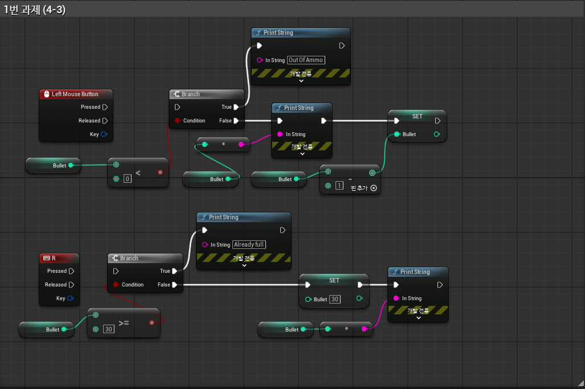
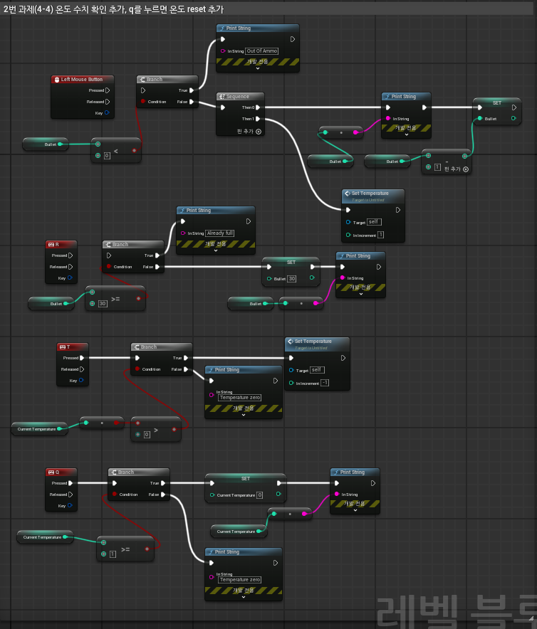
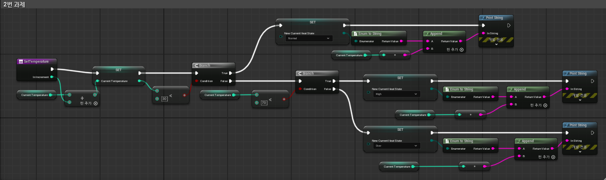
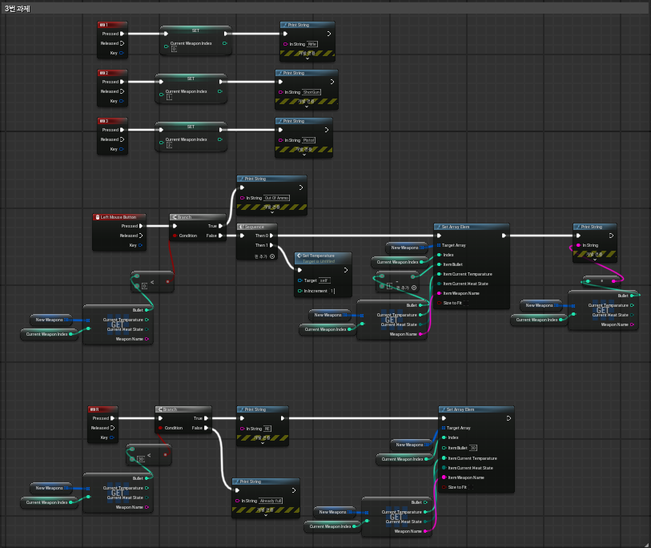
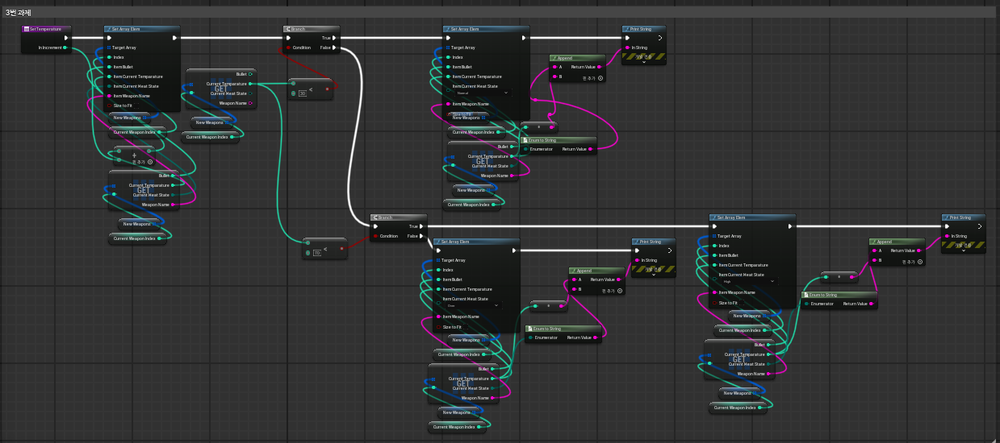

# 3일차 과제

1. 1번 과제 (강의 자료 4-3)

지금까지 구현한 텍스트 슈팅 게임에는 버그가 존재 하는데 그 중 가장 중요한 버그 두 가지를 고쳐 봐요.

30발 이상 격발 할 수 있는 버그
총알이 가득 차 있는 경우에도 재장전 되는 버그

2. 2번 과제 (강의 자료 4-4)

총알을 발사하고 장전만 하는 게임은 너무 지루하기에 두 가지 추가 기능을 구현 해봐요.

과열 상태 추가
온도 수치 상태 확인 추가
쿨다운 기능 (t를 누르면 1씩 감소, q를 누르면 전부 감소)

3. 3번 과제 (강의 자료 5-4)

라이플, 샷건, 피스톨 무기를 추가하고 무기교체를 구현 해봐요.

무기 추가하기
1,2,3 번을 누르면 변경됨

