# <strong style="font-size: 50px; color: rgb(255, 255, 255);">2026.03.04.수</strong>

## <strong style="font-size: 36px; color: rgb(255, 255, 255);">1. 학습 키워드</strong>
    레벨 디자인, 에셋, 플레이어 캐릭터, 
    Enhanced Input System, 캐릭터 애니메이션, overlap,
    기계어, 어셈블리어, 고급언어, 
    소스코드, 빌드 프로세스, 컴파일, 빌드, 컴파일러, 
    Visual Studio,솔루션 - 프로젝트 - 소스코드, 시작 프로젝트, 
    main() 함수, printf()함수, 
    탈출 문자열,서식지정자,
    리터럴, 경고, 에러, 
    자료형, 변수, 오버플로우,
     ASCII, scanf(),연산자, 피연산자, 
     연산자 우선순위( Operator Priority) 와 결합법칙,Feed-back, 
     증감 연산자, 논리 연산자, 관계 연산자, 
     형변환 연산자, 삼항 연산자, sizeof,
     천천히 읽기, 조건문, 단순 if문, if-else문, 
     if-else if-else문, if ifelse문,중첩 if문, 
     switch-case문, while문,  for문, do-while문,
     무한 반복문, break, continue, 이중 반복문
     c++ 변수

# <strong style="font-size: 36px; color: rgb(255, 255, 255);">2. 학습 내용</strong>
## 레벨 디자인 
    : 게임 속에서 플레이어가 탐험하고 상호작용하는 공간을 설계하는 일
      단순한 배경 배치가 아닌, 플레이어의 동선, 몰입감, 도전까지 디자인하는 작업
    -> 무엇을 보고 어디로 가고, 어떤 감정을 느낄지, 이 모든 경험을 결정짓는 것
    ex) 자동차의 경우 프로그래머는 엔진, 아티스트는 외관, 레벨 디자이너는 드라이브의 경험을 제공

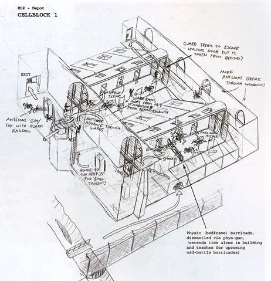


## 에셋
    : 게임의 분위기와 몰입감을 만드는 중요한 요소 중 하나

## 플레이어 캐릭터
    게임에서 사용자가 조종하는 핵심 오브젝트.

## Enhanced Input System
    UE5에서 새롭게 제공되는 입력시스템.
    키보드, 마우스, 게임패드 등을 더 유연하게 지원
    복잡한 컨트롤 매핑도 쉽게 설정할 수 있게 도와줌

## 캐릭터 애니메이션
    움직이기만 하는 캐릭터에게 생동감을 불어넣어준다

## 애니메이션 블루프린트
     애니메이션을 추가해주기 위해서 애니메이션 블루프린트를 생성

##  Overlap 이벤트
    overlap 이벤트라는 것은 ‘겹쳐졌을 때 발생’하는 이벤트
    Overlap 이벤트를 위해서는 TriggerVolume 트리거볼륨이 필요

## 기계어(Low-Level Language, Machine Language)
    기계가 바로 이해하는 언어
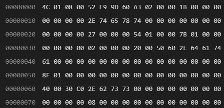


## 어셈블리어(Assembly Language)
    이진 패턴의 특정 부분을 문자로 치환
    가계어와 어셈블리어는 일대일 대응 관계
    모양만 예뻐진 언어
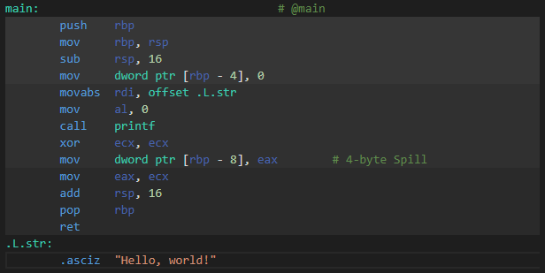


## 고급 언어(High-Level Language)
    C, C++,Java,Python 과 같은 언어
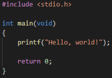


## 소스코드
    프로그래머가 고급 언어로 작성한 코드

## 빌드 프로세스
    소스코드를 컴퓨터가 읽기 쉬운 기계어로 변환하는 과정
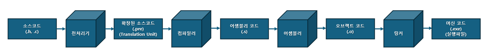


## 컴파일 & 빌드
    컴파일은 2가지 의미를 가지고 있다. 상황에 따라 적절하게 생각
    1️⃣확장된 소스코드가 어셈블리 코드로 변환되는 과정
    2️⃣소스코드부터 오브젝트 코드까지의 과정 

    빌드(Build)
    : 아래 그림 전체 과정. 빌드 ==(컴파일+링킹)
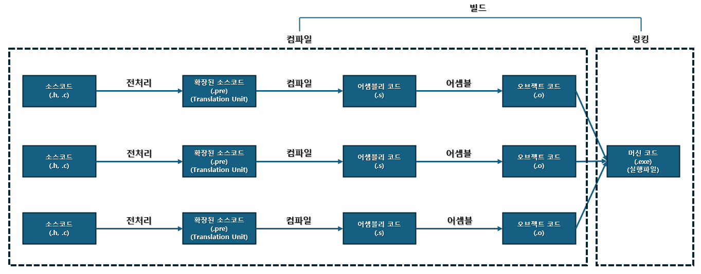


## 컴파일러 
    컴파일러도 2가지 의미를 가진다
    1️⃣확장된 소스코드가 어셈블리 코드로 변환되는 과정
    2️⃣소스코드로 실행파일까지 만들어 주는 프로그램
    -> 대부분 2번의 경우를 의미한다.

## Visual Studio
    Visual Studio는 내부에 Visual Studio 컴파일러가 동봉되어 있다.

## 솔루션 - 프로젝트 - 소스코드
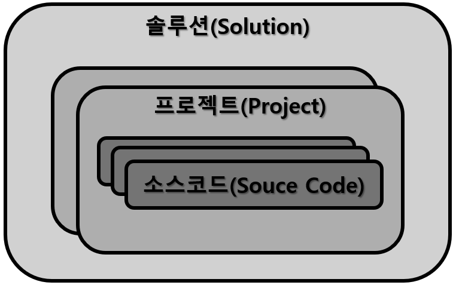

## 시작 프로젝트
    소스코드 에디터를 빌드하면 하나의 프로젝트만 시작 프로젝트로 설정하고 빌드 가능하다.
    
### 빌드하는 방법
    F5 -> 현재 시작 프로젝트의 소스코드가 빌드 및 실행
    Ctrl + B -> 빌드만 수행

## 프로그램의 시작점(Entry Point)
    main() 함수는 프로그램의 시작점
    모든 프로그램에게는 main() 함수가 존재해야 한다.

### 2가지 좋은 습관
    1️⃣시작이 있으면 끝을 맺어줘야 한다.
    2️⃣들여 쓰기 생활화.

## 글자 출력
    printf() : print formatted의 약자.
    "양식에 맞게 출력하다'를 의미한다
    탈출 문자열 혹은 서식 지정자와 함께 사용된다.

### printf() 함수는 뒤에서부터 해석하면 훨씬 쉬워진다. scanf()도 동일

## 탈출 문자열(Escape Sequence)
    탈출 문자 ’\’와 함께 작성된 문자열

    \n개행(New line)

    \t	탭(Tap)

    \’	따옴표 출력

    \”	쌍따옴표 출력

    \\	역슬래시 출력

    %%	% 출력

## 서식 지정자(Format Specifier)
    pritnf() 함수 또는 scanf() 함수 같은 입출력 함수들과 함꼐 쓰여서 양식에 맞게 입출력 할 수 있게끔 도와주는 지정자

###  서식 지정자의 종류

1️⃣ %d: decimal의 약자. 10진수로 대체됩니다.

2️⃣%o: octal의 약자. 8진수로 대체됩니다. ex) 9(10) <-> 11(8)

3️⃣%x: hexadecimal의 약자. x는 소문자, X는 대문자로 대체됩니다. ex) 17(10) <-> 11(16)

4️⃣%u: unsigned의 약자. 양수로 대체됩니다.

5️⃣%c: character의 약자. 문자로 대체됩니다.

6️⃣%s: string의 약자. 문자열로 대체됩니다.

7️⃣%f: floating point의 약자. single precision.  

8️⃣%lf: double precision floating point.

### 서식 지정자의 필요 이유
    복잡한 수식을 빠른 시간 안에 계산하고 그 결과를 원하는 형식으로 보기 위함
    복잡한 소스코드를 작성할 때 디버깅 용도로 요긴하게 사용되기도 함

## 리터럴
    소스코드에 적힌 값 그 자체
    앞으로 '값'이라고 칭하는 것들은 "리터럴"의 의미를 지닌다

## 경고 vs 에러
    에러가 뜨면 빌드 실패
    경고가 뜨면 빌드는 시켜준다

## 자료형의 필요성
    컴퓨터는 0과 1의 묶음들이 무엇을 의미하는지 전혀 알 수 없기 때문에
    어디서부터 어디까지(크기)를 어떻게 해석해야하는지 알려줘야한다
    그 역할을 하는 것이 자료형이다

## 컴퓨터 공학에서의 크기 단위
    컴퓨터 공학에서 가장 작은 크기 단위는 1bit
    이진번의 한 자리에 해당하는 크기
    8bit = 1byte
    다시 1024bytes를 1mb

## 자료형(Type)
    저장될 데이터의 크기와 해석 방법에 대한 정보

| 자료형 | 크기 | 표현 가능한 수(범위/특징) | 서식 지정자 |
|---|---|---|---|
| `char` | 1 byte | \-(2^7) ~ (2^7) - 1<br>\[-128 ~ 127] | `%c` or `%hhd` |
| `short int` | 2 byte | \-(2^15) ~ (2^15) - 1<br>\[-32768 ~ 32767] | `%hd` |
| `int` (기본 정수 자료형) | 4 byte | \-(2^31) ~ (2^31) - 1<br>\[-2147483648 ~ 2147483647] | `%d` or `%i` |
| `long` | 4 byte or 8 byte | (플랫폼에 따라 다름) | `%ld` |
| `long long` | 8 byte | \-(2^63) ~ (2^63) - 1 | `%lld` |
| `float` | 4 byte | 유효 자리수 6~7자리<br>\[부호: 1bit, 지수: 8bit, 가수: 23bit] | `%f` |
| `double` (기본 실수 자료형) | 8 byte | 유효 자리수 15~16자리<br>\[부호: 1bit, 지수: 11bit, 가수: 52bit] | `%lf` |
| `long double` | 8 byte 이상 | (플랫폼/컴파일러에 따라 다름) | `%Lf` |

## 변수(Variable) <-> 상수(Constant)[중요]
    // 변할 수 있는 수
    
    자료형 변수명 = 값;
### unsigned 키워드와 signed 키워드
    부호 없는 Vs. 부호 있는.
    unsigned를 자료형 앞에 붙히면 음수는 표현 불가능. 양수 부분이 2배 늘어납니다.
    서식 지정자로는 %u
    모든 자료형은 사실 앞에 signed 키워드가 생략되어 있다

## 오버플로우
    자료형이 표현 가능한 수를 넘어서는 경우

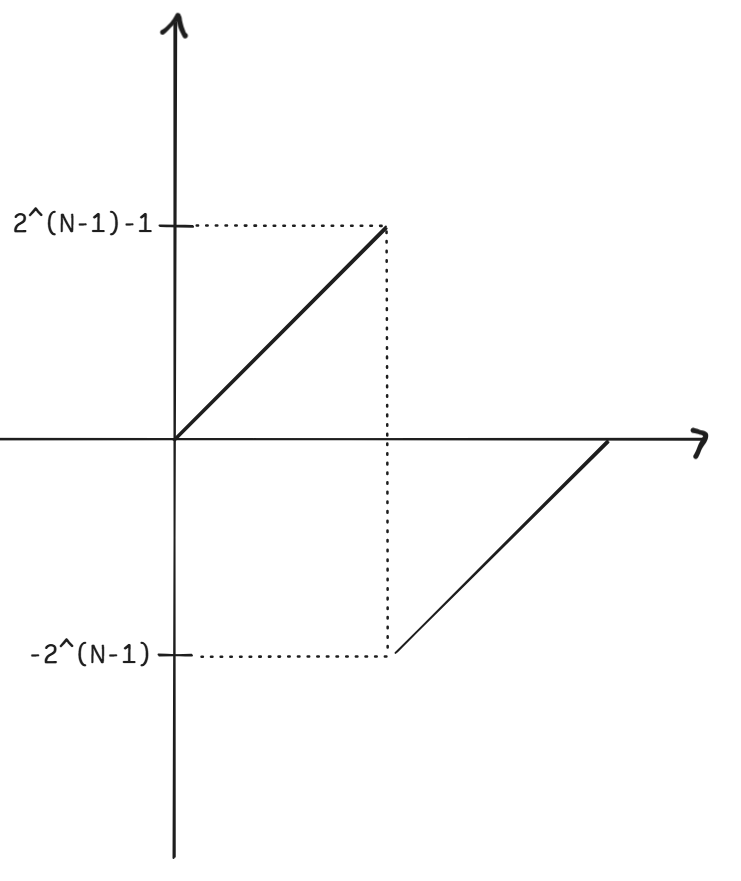

N은 각 자료형의 크기. char는 8, int는 32를 대입.

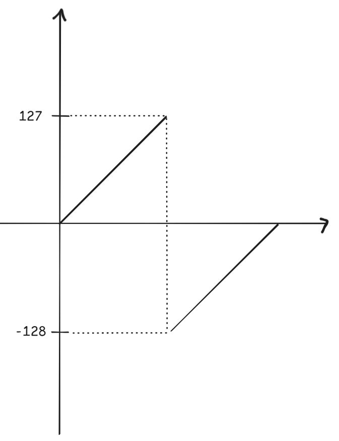

char 자료형의 오버플로우 도식화.

## 컴퓨터는 문자 이해 못함

## 인코딩(Encoding) Vs. 디코딩(Decoding)
    인코딩 :형태 A에서 형태 B로 변환하는 것
    디코딩: 반대로 형태 B에서 형태 A로 변환하는 것

## ASCII(American Standarded Code for Information Interchange)
    문자 형태의 데이터와 숫자 형태의 데이터 사이의 인코딩 규약 중 하나
    가장 쉽고 대표적인 규약
    컴퓨터에 값이 저장되기 위해서는 숫자 형태여야 한다는 점
https://en.cppreference.com/w/cpp/language/ascii.html

### [참고] 지역별 문자 인코딩과 유니코드 
    전세계 모든 문자를 표현 및 처리하기 위해 만들어진 문자 인코딩이 유니코드(Unicode)
    유니코드에는 UTF-8, UTF-16, UTF-32

## scanf()
    키보드로부터 데이터를 입력 받을 수 있게 해주는 함수
    #define _CRT_SECURE_NO_WARNINGS 정의해줘야 사용 가능

## 연산자(Operator) vs 피연산자(Operand)
    ex) 5 + 2
        연산자 : +
        피연산자 : 5,2

## 연산자 우선순위( Operator Priority) 와 결합법칙
    덧셈과 곱셈이 뒤섞여 있는 식에서 우리는 묵시적으로 곱셈을 먼저 계산
    이처럼 연산자들 간에는 우선순위가 존재한다
    만약 덧셈만 있는 식에서는 좌에서 우로 계산한다는 결합법칙도 있다
https://learn.microsoft.com/en-us/cpp/c-language/precedence-and-order-of-evaluation?view=msvc-170

## 산술 연산자의 종류
    덧셈, 뺄셈, 곱셈, 나눗셈 , 나머지(%)
    나눗셈은 몫을 구하는 연산자
    나머지(%)는 말 그대로 나눗셈의 나머지를 구한다

## 정수 피연산자와 실수 피연산자
    int 자료형끼리의 나눗셈은 그 결과도 int 
    float 자료형끼리의 나눗셈은 그 결과도 float
    또, c언어에서는 float 자료향의 나머지 연산은 불가능

### 복합 대입 연산자
    산술 연산과 대입 연산이 함께 계산되는 연산자
    ex) 복합 대입 연산자 *=은 곱셈 연산 후 대입
    
    mul *= 3; // 동작자체는 mul = mul * 3; 코드와 똑같습니다.
    
## 값(Value), 식(Expression), 문(Statement)
    값 : 리터럴
    식 : 피연산자와 연산자로 이루어져 값으로 귀결되는 것들
    문: 컴퓨터가 수행할 명령어

## Feed-back
    현재 변수 = 이전 변수값 + x;

## 증감 연산자
    증가/감소의 줄임말
    단항의 피연산자를 가지는게 특징
    증감연산자는 1. 전치 증감 연산자 2. 후치 증감 연산자
    각 피연산자의 앞 또는 뒤에 붙는다
### 전치/ 후치 의미
    전치는 지금 당장, 후치는 다음줄에 연산
    ex) ++i 이면 지금 당장 i를 1 증가
        i++ 이면 다음 줄에 i를 1 증가

## 논리 연산자
    피연산자를 참 혹은 거짓으로 평가한 후에 논리 연산을 수행
    계산된 결과값도 참 또는 거짓. 즉 불대수(boolean)연산자
    ex)  7 && 0, !7 ---
### 논리 연산자의 종류
    1️⃣ 논리 곱 연산자(&&)
    2️⃣ 논리 합 연산자(||)
    3️⃣ 논리 반전 연산자(!)
### 논리 연산자 꿀팁
    "논리"라는 단어에 집중하기 보다 "곱" 또는 "합" 단어에 집중

## 관계 연산자
    피연산자 간의 관계(대소, 대등, 등) 판단하는 연산자
    주의할 점 : 대등 연산자가 수학과 다르게 2개
    등호도 두 개를 작성해야 대등 연산자(==)
    다르다는 !=

### ### Short-Circuit
    && 연산자에서 앞 쪽 피연산자가 false라면 뒤 쪽은 평가하지 않고 곧바로 false로 귀결됩니다.
    || 연산자에서 앞 쪽 피연산자가 true라면 뒤 쪽은 평가하지 않고 곧바로 true로 귀결됩니다.
    &&는 곱셈입니다. 앞이 0이면 뒤는 뭐가 와도 그 결과가 false입니다. 그래서 뒤쪽은 평가하지도 않고 0입니다.
    || 연산도 덧셈이니, 앞이 1이면 뒤는 무슨 수가 와도 그 결과가 true

## 형변환 연산자(Type-cast Operator)
    자료형 A에서 자료형 B로 변환 시켜주는 연산자.
    명시적 형변환

## 삼항 연산자(Ternary Operator)
    피연산자로 세 개의 항을 갖는 연산자.
    이후에 배우겠지만, 조건문 if-else의 대용으로 가능

## sizeof
    단항 피연산자를 가지며, 피연산자의 자료형 크기를 바이트 단위로 반환
    sizeof(char) // == 1;

    char ch; 
    sizeof(ch)   // == 1;

## 천천히 읽기
    앞으로는 명령어 하나하나의 실행에 신경써야합니다.
    마치 컴퓨터가 되었다고 생각하고 실습하는 것이 중요합니다.
    이는 소스코드라는 글을 “정독”하는 방법을 익히고자 하는 것입니다.
    정독이 되어야 속독이 가능해집니다. 섣부른 암산은 폐사 지름길입니다. 절대 금지.

## “천천히 읽기” 방법
    1️⃣프로그램의 시작점은 main() 함수. main() 함수의 첫 줄부터 읽는다
    2️⃣위->아래, 좌->우
    3️⃣단위는 하나의 문, 명령어 단위로 읽는다

## 천천히 읽기 예시

    // Main.c

    #include <stdio.h>

    int main(void)
    {
	int i = 1;

	while (i < 5)
	{
		printf("%d ", i);

		++i;
	}

	return 0;
    }
#
    1. 변수 i를 선언하고 1을 대입
    2. while 문의 조건식 계산 
    3. i는 1이므로 조건식 참
    4. i를 %d 형식으로 출력
    5. ++i해서 i는 2.

    6. while 문의 조건식 계산 
    7. i는 2이므로 조건식 참
    8. i를 %d 형식으로 출력
    9. ++i해서 i는 3.

    10. while 문의 조건식 계산 
    11. i는 3이므로 조건식 참
    12. i를 %d 형식으로 출력
    13. ++i해서 i는 4.

    14. while 문의 조건식 계산 
    15. i는 4이므로 조건식 참
    16. i를 %d 형식으로 출력
    17. ++i해서 i는 5.

    18. while 문의 조건식 계산 
    19. i는 5이므로 조건식 거짓
    20. while 문 중괄호 다음으로 쫒겨남
    21. return 0 명령어를 통해 main() 함수 종료
#
    // Main.c

    #include <stdio.h>

    int main(void)
    {
	int i;

	for (i = 1; i < 5; ++i)
	{
		printf("%d ", i);
	}

	return 0;
    }
#
    1. i 변수 선언.
    2. for문 초기식. i에 1을 대입
    3. 조건식 계산. 1 < 5. true
    4. for문 중괄호 안 명령어 실행. printf. "i를 %d 형식으로 출력해라."
    5. for문 중괄호 끝. 증감식. ++i해서 i에 2대입.

    6. 조건식 계산. 2 < 5. true
    7. for문 중괄호 안 명령어 실행. printf. "i를 %d 형식으로 출력해라."
    8. for문 중괄호 끝. 증감식. ++i해서 i에 3대입.

    9. 조건식 계산. 3 < 5. true
    10. for문 중괄호 안 명령어 실행. printf. "i를 %d 형식으로 출력해라."
    11. for문 중괄호 끝. 증감식. ++i해서 i에 4대입.

    12. 조건식 계산. 4 < 5. true
    13. for문 중괄호 안 명령어 실행. printf. "i를 %d 형식으로 출력해라."
    14. for문 중괄호 끝. 증감식. ++i해서 i에 5대입.

    15. 조건식 계산. 5 < 5. false
    16. for문 중괄호 끝 뒤로 쫒겨남.
    17. return 0 명령어를 통해 main() 함수 종료

## 단순 if문
    if (조건식)
    {
	명령어1;
	명령어2;
	...
    }

## if-else문
    조건식이 참 혹은 거짓, 모든 경우를 처리 가능
    else에는 조건식이 안 붙는다!

### if-else문과 삼항연산자
    간단한 if-else문은 삼항연산자로 대체 가능

## if-else if-else문
```
    if (조건식1)
    {
	명령어1; // 조건식1이 참이라면 명령어1부터 수행.
	...
    }
    else if (조건식2) // 조건식1이 거짓이라면 조건식2 검사.
    {
	명령어2; // 조건식2가 참이라면 명령어2부터 수행.
	...
    }
    else
    {
	명령어3; // 조건식1도 거짓이고, 조건식2도 거짓이라면 명령어3 수행.
	...
    }
```
### if-else if-else문 Vs. 단순 if문
    if문 안에 같이 되냐
    각자 따로 되나

### if ifelse문 
    if , if else 따로 됨

## 중첩 if문(Nested-if statement)
```
    if (조건식1)
    {
    명령어1;
    ...

    if (조건식2)
    {
        명령어2;
        ...
    }
    else
    {
        명령어3;
        ...
    }
    }
```
## [좋은 습관] 
    조건문의 스코프 속 명령어가 한 줄이어도 스코프는 꼭 적는다

## [조건문 꿀팁] 
    조건문에는 조건식이 나온다
    조건식은 보통 부등식으로 표현되어서 머리속에 수평선을 그려서 해석하면 쉽다

## switch-case문
```
switch (Num)
    {
    case 값1:
	명령어1; // "Num == 값1"인 경우엔 명령어1
	...
	break;

    case 값2:
	명령어2; // "Num == 값2"인 경우엔 명령어2
	...
	break;

    default:
	명령어3; // "Num이 값1도 값2도 아닌 경우"(Num이 어떤 케이스에도 속하지 않는 경우)엔 명령어3
	...
	break;
    }
```

### switch-case문은 if-else if-else문으로 치환 가능하다
    그럼에도 switch-case문을 사용하는 이유는 가독성 때문입니다.
    반대로 if-else if-else문은 switch-case문으로 치환 불가능할 때가 있습니다. 
    특히 if-else if-else문의 조건식이 범위를 다루는 경우 불가능

### Intentional-Fallthrough
    고의적으로 case 내부에 break 구문을 적지 않은 경우
    아래와 같이 코드를 작성한다면 Num이 값1과 같으면, case 값2 부분까지도 수행하게 됩니다.

```c
switch (Num)
{
case 값1:
    명령어1;
		/*Intentional-Fallthrough*/
case 값2:
    명령어2; // Num == 값1인 경우엔 명령어1과 명령어2 모두 실행
    ...
    break;

default:
    명령어3;
    ...
    break;    
}
```

### 만약 case 내에서 변수를 선언하려면 아래와 같이 중괄호를 쳐주면 된다
```
switch (Num)
{
case 값1:
    명령어1;
    ...      
    break;

case 값2:
    {
        int Var = 10;
        printf("%d", Var);
    }
    break;

default:
    작은 명령어3
    ...
    break;
}

```

## while문
```
while (조건식)
{
	명령어1;
	...
}
```
```
[중요 샘플 코드]
#include <stdio.h>

int main(void)
{
    int i = 1;

    while(i<5)
    {
        printf("%d, i)';

        ++i;
    }

    return 0;
}
```
```
// 누적합

#define _CRT_SECURE_NO_WARNINGS
#include <stdio.h>

int main(void)
{
	int Sum = 0;
	int Num;
	int i = 0;

	while (i < 5)
	{
		scanf("%d", &Num);
		Sum = Sum + Num;
		++i;
	}
	printf("%d", Sum);

	return 0;
}
```
```
//누적곱
// Main.c

#define _CRT_SECURE_NO_WARNINGS
#include <stdio.h>

int main(void)
{
	int Sum = 1;
	int Num;
	int i = 0;

	while (i < 5)
	{
		scanf("%d", &Num);
		Sum = Sum * Num;
		++i;
	}
	printf("%d", Sum);

	re
```
```
//최대값
// Main.c

#define _CRT_SECURE_NO_WARNINGS
#include <stdio.h>

int main(void)
{
	int Max = -2147483647;
	int Num;
	int i = 0;

	while (i < 5)
	{
		scanf("%d", &Num);
		if (Max < Num)
		{
			Max = Num;
		}
		++i;
	}

	printf("%d", Max);

	return 0;
}
```
```
//최소값
// Main.c

#define _CRT_SECURE_NO_WARNINGS
#include <stdio.h>

int main(void)
{
	int Min = 2147483647;
	int Num;
	int i = 0;

	while (i < 5)
	{
		scanf("%d", &Num);
		if (Min > Num)
		{
			Min = Num;
		}
		++i;
	}

	printf("%d", Min);

	return 0;
}
```
## 반복문의 순회 변수로는 i를 자주 사용한다

## for문
```
for (초기식; 조건식; 증감식)
{
	명령어1;
	...
}
```
```
[중요 샘플 코드]
// Main.c

#include <stdio.h>

int main()
{
	int i;

	for (i = 1; i < 5; ++i)
	{
		printf("%d ", i);
	}

	return 0;
}
```
```
누적합
// Main.c

#define _CRT_SECURE_NO_WARNINGS
#include <stdio.h>

int main()
{
	int Sum = 0;
	int Num;
	int i;

	for (i = 0; i < 5; ++i)
	{
		scanf("%d", &Num);
		Sum = Sum + Num;

	}

	printf("%d", Sum);

	return 0;
}
```
```
누적곱
// Main.c

#define _CRT_SECURE_NO_WARNINGS
#include <stdio.h>

int main()
{
	int Sum = 1;
	int Num;
	int i;

	for (i = 0; i < 5; ++i)
	{
		scanf("%d", &Num);
		Sum = Sum * Num;

	}

	printf("%d", Sum);

	return 0;
}
```
```
최대값
// Main.c

#define _CRT_SECURE_NO_WARNINGS
#include <stdio.h>

int main()
{
	int Max = -2147483647;
	int Num;
	int i;

	for (i = 0; i < 5; ++i)
	{
		scanf("%d", &Num);
		if (Max < Num)
		{
			Max = Num;
		}

	}

	printf("%d", Max);

	return 0;
}
```
```
최소값
// Main.c

#define _CRT_SECURE_NO_WARNINGS
#include <stdio.h>

int main()
{
	int Min = 2147483647;
	int Num;
	int i;

	for (i = 0; i < 5; ++i)
	{
		scanf("%d", &Num);
		if (Min > Num)
		{
			Min = Num;
		}

	}

	printf("%d", Min);

	return 0;
}
```

## do-while문
    일단 조건식 검사 없이 1회 순회(do) 후에 조건식 검사 후 다음 순회 진행
```
do
{
	명령어1;
	...
} while (조건식)
```
### do-while문 필요 이유
    아주 가끔 요긴하게 쓰일때가 있습니다. ex) 자료구조 구현할 때, …
    대부분의 경우에는 for문, 순회하는 변수가 필요 없는 경우엔 while을 쓴다
    거의 안 쓴다

## 무한 반복문
    무한 반복문은 for문보다는 while문으로 구현하는 경우가 많다.
```
while (1) // 1은 true일까 false일까요?
{
	명령어1;
	...
}
```
```
int i;
for (i = 1; 1; ++i) // 조건식을 1이 아닌 그냥 비워두어도 참으로 간주됩니다.
{
	명령어1;
	...
}
```

## 무엇이든지 무한하게 도는 것은 아주 위험
    막연하게 무한히 돈다는 것은 다시는 그 장치를 쓸 수 없다는 뜻과 같다.
    멈추는 코드가 없기 때문 그렇기 때문에 break 구문이 필요

## break
    반복문이나 switch-case문에서 탈출 할 때 break 구문을 사용
    해당 스코프에서만 탈출 다중 반복문 전체를 다 탈출하는게 아님에 주의
```
while (1)
{
	while (2)
	{
		break; // while (2) 반복문만 탈출됨.
	}
}
```
## continue
    반복문에서 continue 구문을 만나면 해당 회차는 건너뛰고 다음 회차 진행
    반복문을 아에 탈출하는 게 아닌 특정 순회 번째만 무시
    특정 순회에서는 아무 일도 안하고 다음 순회로 가고 싶을 수 있기 때문

## 이중 반복문
    순회 변수로 i, j, k, … 순으로 작성
```
int i, j;

for (i 초기식; i 조건식 ; i 증감식)
{
    for (j 초기식; j 조건식 ; j 증감식)
    {
        명령어;
        ...
    }
}
```
### 이중 반복문 꿀팁
     1️⃣줄의 개수를 파악하고 줄 번호 매기기.
     2️⃣각 줄의 칸 개수를 파악하고 칸 번호 매기기.
     3️⃣각 칸의 출력을 적기.

### 이중 반복문의 응용
    조금 다른 형태의 이중 반복문. 반복문 안에 반복문이 여러 개 들어가 있는 경우

```
int i, j, k;

for (i 초기식; i 조건식 ; i 증감식)
{
    for (j 초기식; j 조건식 ; j 증감식)
    {
        작은 명령어1
        ...
    }
    for (k 초기식; k 조건식 ; k 증감식)
    {
        작은 명령어2
        ...
    }
}
```

## C++
    #include <iostream> 이미 많은 기능이 라이브러리로 구현되어 있다. 이걸 사용하기 위해서 구현된 헤더 파일을 코드에 포함
        <iostream>은 C++ 표준 라이브러리의 입출력 기능을 제공하는 헤더 파일
        #include를 사용하면 해당 헤더 파일의 정의된 기능(예를 들어 cout, cin 등)을 사용 가능하다
    int main()
        main 함수는 C++ 프로그램이 실행될 때 가장 먼저 호출되는 함수
        모든 프로그램은 반드시 main() 함수가 있어야 한다
    cout <<”Hello, World!” << endl;
        프로그램을 실행시켰을 때 나오는 화면을 콘솔(console)    
        cout은 이 콘솔에 무언가 출력할 수 있게 해주는 명령어
        cout을 통해 콘솔에 “Hello, World!”를 출력하는 명령어
        endl은 개행
    return 0;
    프로그램이 정상적으로 종료되었음을 운영체제에 알리는 역할

## C++ 변수 문법
    C++에서는 사용 편의성을 위해 메모리에 이름을 붙여서 관리할 수 있게 제공하는 것이 "변수" 다
    1️⃣변수는 타입과 이름을 갖는다. 
        정수형 데이터는  int, 문자형 데이터는 char
    2️⃣변수의 타입에 따라 차지하는 메모리의 킄기가 다르다
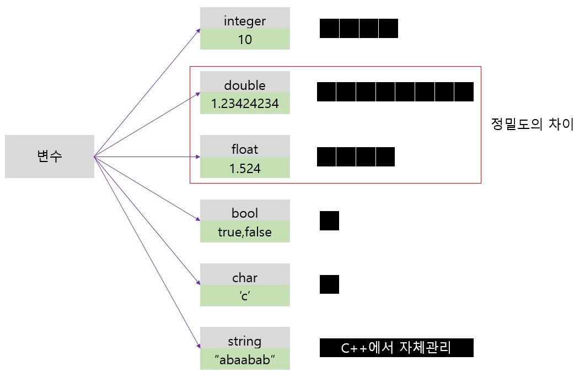

    3️⃣변수는 초기 선언과 동시에 값을 가질 수 있으며, 추후에 대입 연산자를 통해 값을 가질 수 있다
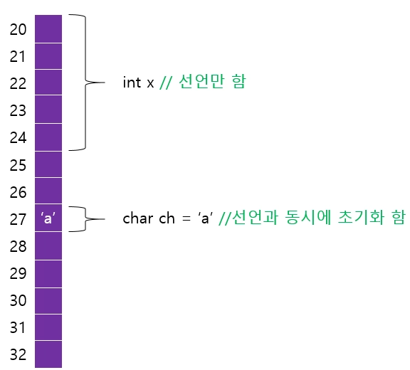

    4️⃣ cin : 변수로 할당한 공간에 입력을 받을 때 사용
       cout : 변수에 저장된 값을 콘솔에 출력할 때 사용
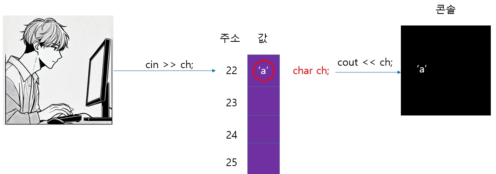

    5️⃣변수의 크기는 sizeof 연산자를 활용해 구할 수 있다
        ex) int val과 같이 변수 선언한 경우 sizeof(val)하면 해당 변수의 크기를 구할 수 있다

    6️⃣기본적인 대입(=), 사칙연산(+, -, *, /) 그리고 대소비교( >, <, >=, <=, !=, == )가 가능  
        주의해야할 점은 대입은 = 이고, 비교는 == 라는 점 
```
**일반 연산**

| 연산자 | 간단 코드 예제 | 설명 |
| --- | --- | --- |
| + | `int sum = 3 + 5;` | 덧셈 (Addition) |
| - | `int diff = 10 - 4;` | 뺄셈 (Subtraction) |
| * | `int product = 6 * 7;` | 곱셈 (Multiplication) |
| / | `int quotient = 10 / 2;` | 나눗셈 (정수 나눗셈 시 몫 반환) |
| % | `int mod = 10 % 3;` | 나머지 연산 (Modulo) |

**비교 연산자**

| 연산자 | 간단 코드 예제 | 설명 |
| --- | --- | --- |
| == | `bool isEqual = (5 == 5);` | 같음 (Equal to) |
| != | `bool isNotEqual = (5 != 3);` | 다름 (Not equal to) |
| > | `bool isGreater = (10 > 3);` | 초과 (Greater than) |
| < | `bool isLess = (2 < 5);` | 미만 (Less than) |
| >= | `bool isGreaterOrEqual = (4 >= 4);` | 이상 (Greater than or equal to) |
| <= | `bool isLessOrEqual = (3 <= 7);` | 이하 (Less than or equal to) |

**대입 연산자**

| 연산자 | 간단 코드 예제 | 설명 |
| --- | --- | --- |
| = | `int a = 10;` | 값 할당 (Assignment) |
| += | `a += 5;` -> `a = a + 5;` | 덧셈 후 대입 |
| -= | `a -= 3;` -> `a = a - 3;` | 뺄셈 후 대입 |
| *= | `a *= 2;` -> `a = a * 2;` | 곱셈 후 대입 |
| /= | `a /= 4;` -> `a = a / 4;` | 나눗셈 후 대입 |
| %= | `a %= 2;` -> `a = a % 2;` | 나머지 후 대입 |

<aside>
```
```
7️⃣전위연산과 후위연산이 있다.
    int b = a++를 할 경우 a 값을 b에 대입후 a 값을 증가시키고, int b = ++a는 a 값을 증가시키고 해당 값을 b에 대입
```
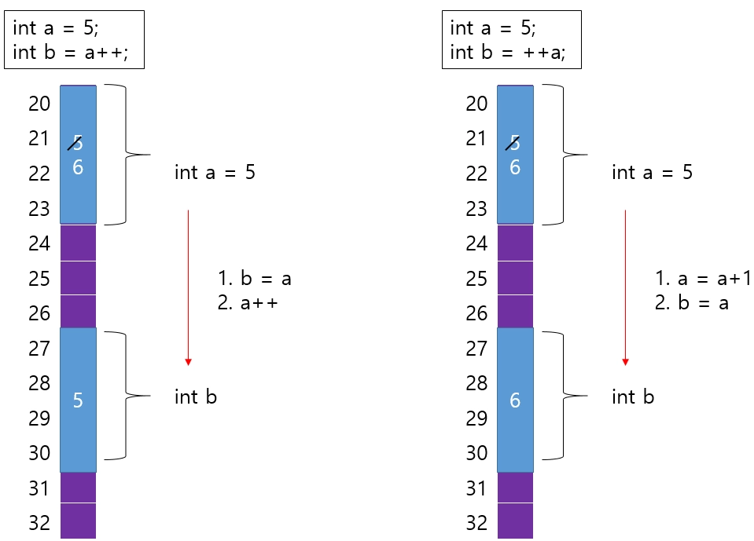

```
| 타입 | 표현하는 데이터 | 설명 |
| --- | --- | --- |
| int | 정수(양수,0,음수) | 소수점 X |
| float,double | 부동 소수 | 소수점 O, 둘은 정밀도 차이 |
| char | 단일 문자 | 작은 따옴표로 한 문자 표현 |
| bool | 논리값 | true 와 false |
| string | 문자열 | 쌍 따옴표로 문자열 표현, <string> 헤더 필요 |
| unsigned | 양수 | 음수 입력 불가, 양수 범위가 2배 |
```
**전위연산과 후위연산이 있습니다.** 
`int b = a++`를 할 경우 a 값을 b에 대입후 a 값을 증가시키고, `int b = ++a`는 a 값을 증가시키고 해당 값을 b에 대입시킵니다.

</aside>

# <strong style="font-size: 36px; color: rgb(255, 255, 255);">3. 느낀점 </strong>
c언어 1~4까지 복습 강의를 듣고 직접 다시 한 번 복습하면서 코드를 계속 짜고 천천히 읽기를 하면 점차 조금씩 익숙해져가고 있다고 느낀다.
하지만 아직 너무 많이 부족하기 때문에 지금보다 더 코드를 많이 보고 직접 스스로 코드를 짜는 것을 많이 해봐야겠다는 생각이 들었다.
한 번 들을 때 넘어갔던 내용도 다시 복습하니 이해가 되는 부분이 있었기 때문에 복습하고 반복 숙달 하도록 노력하자
아직은 수업에 따라가는 정도이지만 더욱 열심히 해서 과제 같은 것이 있을 때 필수만 하는 것이 아닌 플러스 과제도 하고 직접 생각하면서 기능을 여러가지 추가해서 하면서 모르는 부분이 생기면 검색하고 튜터님에게 질문해야겠다.

# <strong style="font-size: 36px; color: rgb(255, 255, 255);">4. 다음 학습 </strong>
c언어 배열, 함수, 포인터를 수업 10시 전까지 복습한다
c++강의 1-6까지 전부 듣는다
가능하면 첫번째 과제까지 풀어본다
