# <strong style="font-size: 50px; color: rgb(255, 255, 255);">2026.03.05.목</strong>

## <strong style="font-size: 36px; color: rgb(255, 255, 255);">1. 학습 키워드</strong>

```
C언어 섹션 5~7(배열, 함수, 포인터)
배열, 2차원 배열, 함수, 스코프,
스택 메모리, 스택 프레임, 변수의 종류
포인터, 주소 연산자, 역참조 연산자,
NULL, void 포인터
```

```
C++ 1-2(프로그래밍 기초 2)
배열, 함수
```


## <strong style="font-size: 36px; color: rgb(255, 255, 255);">2. 학습 내용</strong>
## 배열
```
: 자료구조 중 가장 기초가되는 자료구조.
  사용할 메모리 크기를 고정해서 선언하는 것이 특징
  선언된 후 절대 그 크기 변경 불가
  -> 정적인 자료구조라고도 한다
  ? 선언된 메모리는 연속적으로 할당된다
```

```
배열의 팔요성
: 수많은 수의 변수를 선언할 때 손쉽게 사용
```

```
배열 호텔
배열을 호텔에 비유. 단 이 호텔에는 규칙 존재
1. 사용할 객실 개수를 객실 사용전에 예약. 예약된 개수는 변경 불가
2. 연속된 객실로 배정
3. 객실의 번호는 0번부터 시작. 객실의 번호를 index라고 한다
// 선언 방법
자료형 배열명[배열크기];

//선언과 동시에 초기화 방법
자료형 배열명[배열크기] = {값0, 값1, ...},값(배열크기 -1) } ;
// 자료형 호텔명[객실개수] = { 사람 0, 사람 1, ... , 사람(객실개수-1)};
```

```
배열 1[중요 샘플 코드]
//main.c

#include<stdio.h>

int main()
{
    int i;
    int Array[4]={ 1, 2, 3, 4};

    for (i = 0; i< 4; ++i)
    {
        printf("%d" , Array[i]);
    }

    return 0;
}
```

```
배열 관련 고찰
배열의 index는 항상 0부터 시작
앞으로 대부분의 소스코드들은 0부터 시작하기 때문에 익숙해질 필요가 있다.
```

## 2차원 배열
```
이해 할 때는 1차원 배열을 쌓아올린 형태로 이해
실제로는 메모리 상에는 1차원 배열이 나열되어 있고, 2차원인 척을 한다

// 선언 방법
자료형 배열명[배열크기1][배열크기2];

// 선언과 동시에 초기화 방법
자료형 배열명[줄개수][칸개수] = { { 값00, 값01, ..., 값0(칸개수-1)},
                                             ...
                              { { 값(줄개수-1)0, 값(줄개수-1)1, ..., 값(줄개수-1)(칸개수-1) } };
                                      
// 자료형 호텔명[줄개수][칸개수] = { { 객실00,         객실01,          ... , 객실0(칸개수-1)},
//                                              ...
//                               { { 객실(줄개수-1)0, 객실(줄개수-1)1, ... , 객실(줄개수-1)(칸개수-1) } };
```

## 함수(Function)
```
프로그래밍 언어에서 함수란, 코드 뭉치
반복도히는 코드 뭉치가 있다면 해당 코드 뭉치를 함수로 만들어서 재사용성 높일 수 있다
```
### 함수 작성 방법
```
반환자료형 함수명(매개변수자료형 매개변수명)
{

    return 반환값;
}

int main(void)
{
    int num = 0; // 자료형 변수명 = 값

    함수명(인자값); // 함수 호출
     return 0;
}
```
### main() 함수
```
int main(void)
{
    return 0;

}
```

### PrintOneStar() 함수
```
#include <stdio.h>

void PrintOneStar(void)
{
	printf("*");

	return;
}

int main(void)
{
	PrintOneStar();

	return 0;
}
```
### Add() 함수 1
```
#include <stdio.h>

void Add(int A, int B)
{
	int Result = A + B;

	printf("%d", Result);

	return;
}

int main()
{
	Add(2,5);

	return 0;
}
```
### Add() 함수 2
```
#include <stdio.h>

int Add(int InA, int InB)
{
	int Result = InA + InB;

	return Result;
}

int main()
{
	int Result;
	Result = Add(2,3);

	printf("%d", Result);

	return 0;
}
```

## 스택 메모리(Stack Memory)
```
컴퓨터의 메모리 레이아웃은 크게 스택 메모리, 힙 메모리, 코드 섹션, 데이터 섹션으로 나뉜다
그 중에서 스택 메모리는 함수 호출에 할당될 메모리
결국 지역변수들이 저장되는 공간
스택 메모리는 스택 포인터와 베이스 포인터, 스택 프레임들로 구성되어 있다.
```


## 스택 프레임(Stack Frame)
```
함수가 호츌되면 해당 함수가 사용할 메모리 크기만큼 공간이 확보된다
해당 함수를 위해 확보된 메모리 공간을 스택프레임
나중에 함수가 모두 수행된 뒤에 해당 스택프레임은 다시 반환된다
```

## 스택프레임의 동작
```
[참고] 스택 포인터(Extended Stack Pointer, ESP)
: 현재 스택 프레임의 Top를 가르킨다
push 명령어나 pop 명령어의 피연산자

[참고] 베이스 포인터 (Extended Base Pointer, EBP)
: 현재 스택 프레임의 시작 주소를 가르킨다
```

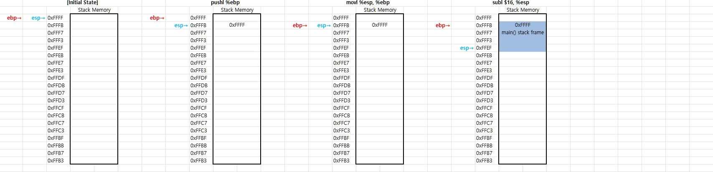
main() 함수의 스택프레임 할당

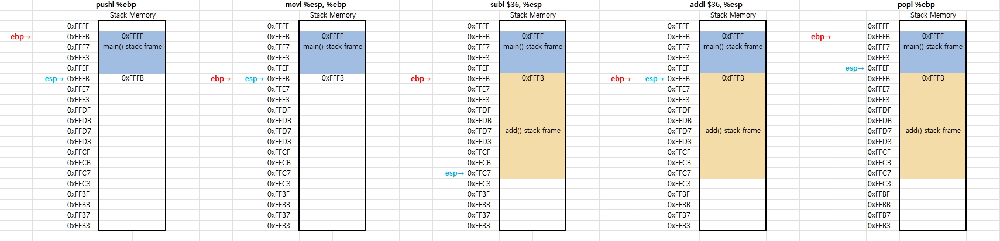
add() 함수의 스택프레임 할당과 해제

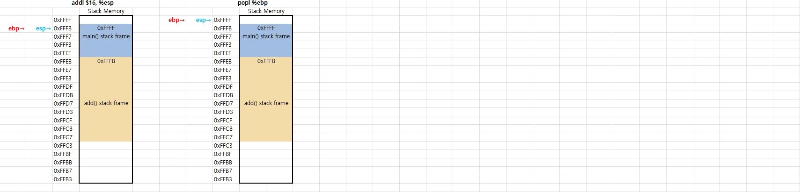
main() 함수의 스택프레임 해제


## 스코프
```
변수나 함수 이름을 사용할 수 있는 범위
```

```
스코프의 종류
1. 블럭 스코프
    : 중괄호 내부에 선언된 변수는 해당 중괄호 내부에서만 사용 가능
      조건문, 반복문 같은 문(statement)에 사용되는 중괄호 범위도 블럭 스코프
      블럭 스코프 안에 또 다른 블럭 스코프가 들어갈 수도 있다
      바깥쪽-> 안쪽 불가
      안쪽 -> 바깥쪽 가능
2. 파일 스코프
    : 어떤 블럭 스코프에도 속하지 않고 파일에 작성된 경우
```

```
변수 가리기 금지
: 블럭 스코프가 다른 경우 같은 변수명을 가진 변수를 선언할 수 있지만 절대 작성하지 말기
```

```
전방 선언(Forward Declaration)
함수의 원형(머리부분)만 따서 파일 스코프 상단에 두고 
함수의 정의는 파일 스코프 하단에 위치시키는 방법

전방 선언 하는 이유: 분할 컴파일을 위해
```

## 변수의 종류
```
변수에는 지역 변수 / 전역 변수가 있다
여기에 static, const, extern 같은 키워드가 붙어서 조금씩 뉘앙스가 달라진다
```

```
지역 변수(Local Variable)
블럭 스코프 내에 선언된 변수. 따라서 스택 메모리에 저장된다
함수가 종료하면 스택 프레임이 반환되면서 더이상 접근 불가
```

```
정적 지역 변수
: 지역 변수 앞에 static 키워드가 붙으면 데이터 섹션에 저장된다
  즉, 함수 종료시 접근 불가한 스택메모리에 저장되는게 아니다
  함수가 종료되어도 값이 유지된다
  이런 변수를 정적 지역 변수라고 한다.
```

```
전역 변수(Global Variable)
: 파일 스코프에 선언된 변수. 데이터 섹션에 저장된다.
```

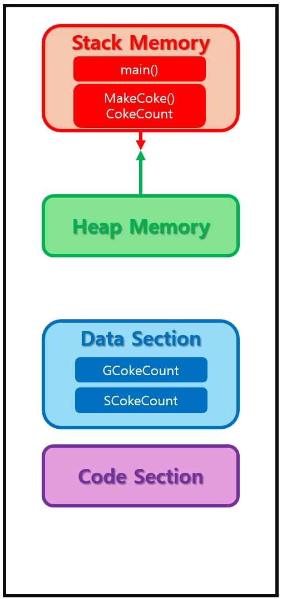


```
정적 전역 변수
: 만약 전역 변수 앞에 static 키워드가 붙는다면, 해당 변수는 해당 파일 내에서만 접근 가능
```

```
const 변수
const 키워드가 붙은 변수. 초기화 이후에 값을 변경할 수 없다. 초기화가 강제된다.
```

## 포인터
```
포인터: 메모리 주소를 저장하는 변수

자료형 변수명 = 값;

자료형* 변수명 = 메모리주소값; // 자료형 쪽에 Asterick를 붙인다
```

```
포인터를 선언할 때 자료형 필요 이유
: 해당 메모리 주소로 가서 얼마만큼ㅂ의 크기로 읽어야 내 데이터인지 모르기 때문
  자료형이 있어야 크기를 알 수 있다
  더 나아가면, 자료형 크기만큼 가면 다음 데이터를 얻을 수 있다
```

## 주소 연산자(address-of operator) &
    피연산자의 메모리 주소를 반환하는 연산자
    기호 &(Ampersand)를 사용한다

```
메모리 주소를 얻을 수 있는 2가지 방법
1. 주소 연산자
2. 배열의 이름
    int Array[1024]; 
	// 여기서 Array는 메모리 주소를 저장한 변수. 특히 그 메모리 주소는 배열의 시작 메모리 주소.
```

## 역참조 연산자(indirection operator) * 
    피연사자로 포인터를 받아서, 해당 메모리 주소에 저장된 값을 읽거나 값을 수정할 때 사용하는 연산자

### [좋은 습관] 메모리 그리기
    포인터 관련 예제를 풀 때 "메모리 그리기" 해보기
    사각형을 그린 다음, 변수들을 적고 각 변수에 메모리 주소를 0x100번지부터 적어준다

```
주소 연산자와 역참조 연산자 1 [중요 샘플 코드]

#include <stdio.h>

int main(void)
{
    int X = 10;
    int* PtrToX = &X;

    printf("%d\n", *PtrToX);

    *PtrToX = 100;

    printf("%d\n", *PtrToX);

    return 0;
}
```

```
포인터 VS 역참조 연산자 VS 곱셈 연산자
셋은 모두 *(Asterisk) 기호를 사용
포인터: 자료형 오른쪽에 붙는다
역참조 연산자: 피연산자가 한 개. 특히 피연산자로 메모리 주소를 받는다
곱셈 연산자: 피연산자가 두 개
```

```
포인터의 단점
공유 받는 사람이 착한 사람인지 모른다
해당 주소로 가서 들어있는 값을 마음대로 수정할 수 있다
아주 강력한 기능임과 동시에 그만큼 잘못 쓰면 큰일
```

```
참조에 의한 호출 Vs. 값에 의한 호출
: 원본값이 바뀌냐 Vs. 안 바뀌냐.

함수 A가 함수 B를 호출 할 때, 인자를 전달하면서 호출한다고 가정해봅시다.
함수 B가 종료될 때 인자의 원본값도 바뀐다면 참조에 의한 호출
인자의 원본값이 바뀔 수 없다면 값에 의한 호출
```

```
// Swap() 함수 1
// Main.c

#include <stdio.h>

void Swap1(int Op1, int Op2);

void Swap2(int* Op1, int* Op2);

int main(void)
{
	int Num1 = 10;
	int Num2 = 20;

	printf("before Swap1()\n");
	printf("Num1: %d, Num2: %d\n", Num1, Num2);

	Swap1(Num1, Num2);

	printf("after Swap1()\n");
	printf("Num1: %d, Num2: %d\n\n", Num1, Num2);

	printf("before Swap2()\n");
	printf("Num1: %d, Num2: %d\n", Num1, Num2);

	Swap2(&Num1, &Num2);

	printf("after Swap2()\n");
	printf("Num1: %d, Num2: %d\n\n", Num1, Num2);

	return 0;
}

void Swap1(int Op1, int Op2)
{
	int Temp;

	Temp = Op1;
	Op1 = Op2;
	Op2 = Temp;

	return;
}

void Swap2(int* Op1, int* Op2)
{
	int Temp;

	Temp = *Op1;
	*Op1 = *Op2;
	*Op2 = Temp;

	return;
}
```

```
// GetMinMax() 함수
// Main.c

#include <stdio.h>
#include <assert.h>

void GetMinMax(const size_t InArrayLength, const int InArray[], int* OutPtrToMin, int* OutPtrToMax);

int main(void)
{
    const int Nums[5] = { 7, 8, 1, 10, 5 };
    int ResultMin;
    int ResultMax;

    GetMinMax(5, Nums, &ResultMin, &ResultMax);

    printf("ResultMin: %d\n", ResultMin);
    printf("ResultMax: %d\n", ResultMax);

    return 0;
}

void GetMinMax(const size_t InArrayLength, const int InArray[], int* OutPtrToMin, int* OutPtrToMax)
{
    size_t i;

    *OutPtrToMin = InArray[0];
    *OutPtrToMax = InArray[0];

    for (i = 0; i < InArrayLength; ++i)
    {
        if (InArray[i] < *OutPtrToMin)
        {
            *OutPtrToMin = InArray[i];
        }

        if (*OutPtrToMax < InArray[i])
        {
            *OutPtrToMax = InArray[i];
        }
    }

    return;
}
```

## NULL 포인터
    #define NULL((void)0);
    아무것도 가르키지 않는 포인터

```
NULL 포인터의 쓰임새
1. 포인터의 초기화
2. 포인터가 더이상 사용중이지 않음을 알리고 싶을 때
3. 포인터가 유효한 메모리 주소를 저장하고 있는지
Ptr = NULL;

if (NULL == Ptr) 
{ 
	/* alert */ 
}
```

```
자료형이 정해지지 않은 포인터
자료형* 변수명 = 메모리주소값;
NULL 포인터는 메모리주소값이 아직 정해지지 않았을 때 사용
자료형을 지금 바로 정할 수 없을 때도 있다
```

## void 포인터
    범용 포인터
    void* 변수명 = 메모리주소 값;

```
어떤 자료형의 포인터라도 void*에 대입 가능하다
즉, 매개변수 자료형으로 void*를 사용하면, 어떤 자료형의 포인터라도 모두 받을 수 있는 함수다
```

```
void 포인터의 주의점
1. void*에 역참조 연산은 불가능
   : 해당 메모리 주소부터 몇 바이트만큼 읽어야 내 데이터인지 모르기 때문
2. void*에 정수를 더하거나 빼는 연산은 불가능
   : 해당 메모리 주소부터 몇 바이트만큼 더하거나 빼야하는지 모르기 때문이다.
```

## 배열
```
배열: 모두 같은 성격의 데이터(학생 성적) 라면, 하나의 구조로 관리하는 것이 더 효율적

배열을 사용하면 같은 타입의 여러 데이터를 하나의 묶음으로 관리할 수 있으며, 반복문을 활용하여 데이터를 효율적으로 처리 가능하다
```
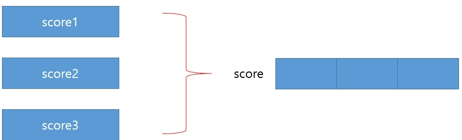

```
배열 문법
배열의 이름은 하나
여러 개의 변수를 나열한 자료구조
-> 접근할 수 있는 방법 필요
배열은 [] 연산자를 통해서 각 원소에 접근 가능하다
임의 접근 : [] 연산자를 통해 한번에 특정 원소에 접근하는 것
```
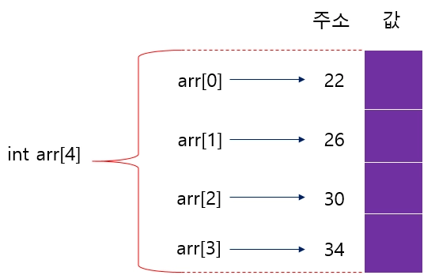

```
변수와 마찬가지로 배열은 선언과 동시에 초기화 및 선언 후 
추후에 초기화가 모두 가능
```

```
배열은 통째로 복사 및 대입 x

각 배열의 원소는 일반 변수와 같이 복사 및 대입이 가능하나, 배열 자체를 통째로 대입하는 것은 불가능
```

## 함수
```
함수 :  작업을 정의하고 이름을 붙이는 문법
아래 그림처럼 코드가 반복되는 경우에는 설계가 수정되면 모든 코드를 하나씩 다 수정해야 하지만, 
함수를 정의하고 호출하는 방식으로 함수만 변경하면 된다
즉 가독성 및 재사용성이 향상
```
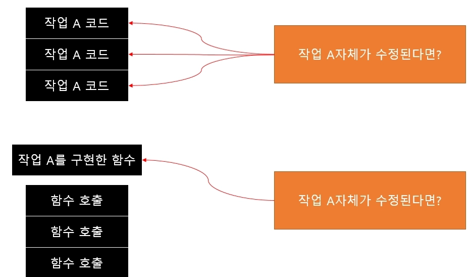

```
작업의 구성요소
1️⃣ 인자
    작업에 사용되는 외부 값
2️⃣ 동작
    어떤 작업을 수행할지 정의
3️⃣ 반환
    작업을 수행한 후 최종적으로 외부에 전달할 값
    #반환은 필수 X, 만약 반환하지 않는 함수를 만들려면 반환 타입은 void
4️⃣ 이름
    해당 작업을 호출할 수 있도록 이름이 필요하다
```

```
값을 전달하는 방식
함수에서 값을 전달하는 방식은 크게 3가지
1️⃣ 값 자체를 전달하는 방식
2️⃣ 주소값을 전달하는 방식
3️⃣ 참조자를 전달하는 방식
```

```
1️⃣ 값 전달 (일반 변수)
C++에서 일반적인 변수(값 타입 변수)는 값을 복사하여 함수로 전달됩니다.
따라서 함수 내부에서 값을 변경해도 원본 변수의 값은 변경되지 않습니다.
```
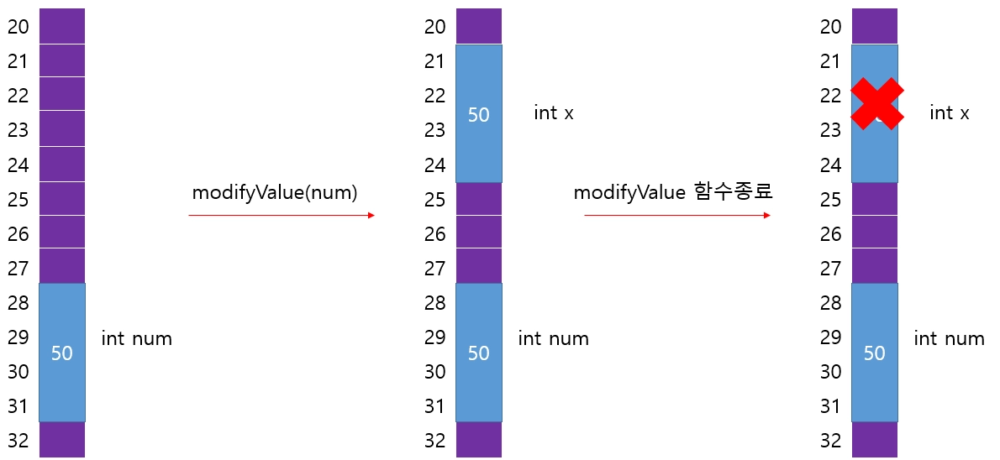

```
2️⃣ 주소값을 전달하는 방식(변수)
    C++에서 변수의 주소값을 함수에 전달하면, 해당 변수에 접근할 수 있게 됩니다.
    따라서 함수가 종료가 된 이후에도 해당 주소의 변수는 값이 수정되어 있습니다.
```
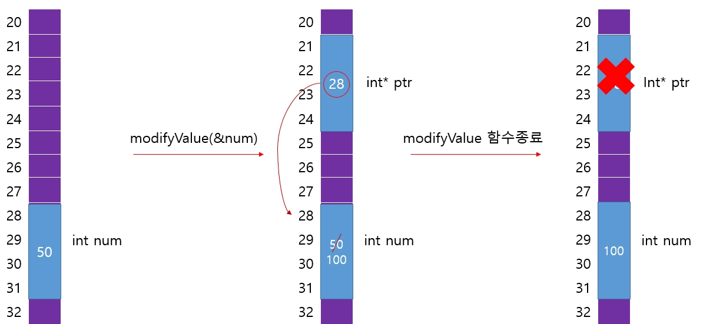

```
2️⃣ 주소값을 전달하는 방식(배열)
    C++에서  배열의 주소값을 함수에 전달하면, 해당 배열에 접근 할수 있게 됩니다.    
    따라서 함수가 종료가 된 이후에도 해당 배열의 값이 수정되어 있습니다.
    (포인터의 원리를 생각해 보면 변수를 전달하는 경우와 동일합니다.)
```
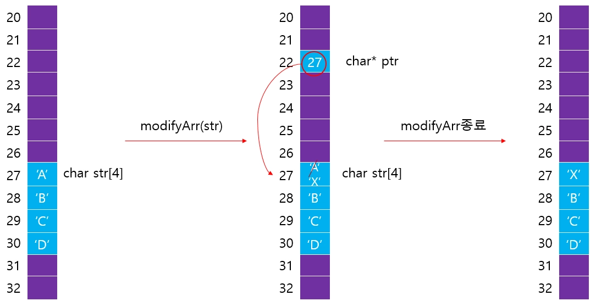

```
3️⃣ 참조자를 전달하는 방식
    참조자로 값을 전달하면, 함수 내부에서 값을 변경할 때, 원본 변수의 값도 변경됩니다.
```
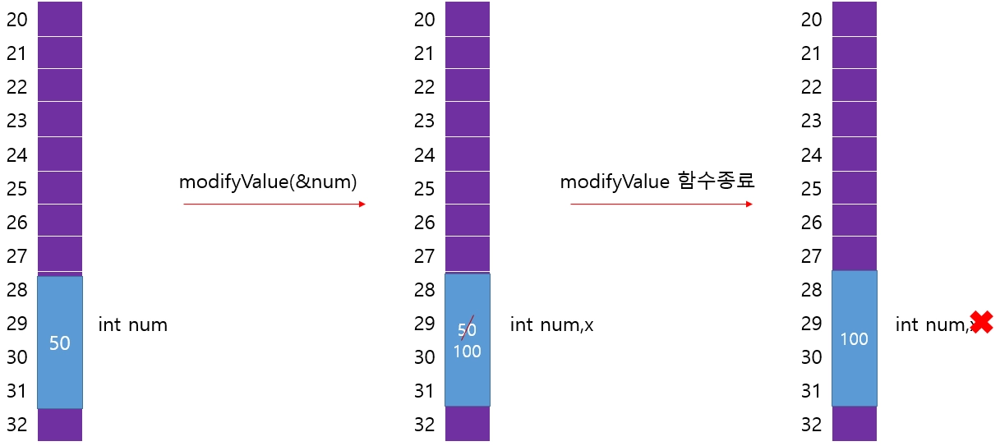


## <strong style="font-size: 36px; color: rgb(255, 255, 255);">3. 느낀점 </strong>
배열과 함수에 대해서 기본적인 개념을 이해하였고 코드를 짜면서 응용을 해봐야지 실력이 향상 될 것 같다.
천천히 읽기를 하면서 코드를 많이 보고 직접 코드를 해보고 실행하고 오류가 나면 수정하면서 성장해야겠다.
1-6까지 1회독 하였지만 복습하고 학습 내용을 정리해야겠다.

## <strong style="font-size: 36px; color: rgb(255, 255, 255);">4. 다음 학습 </strong>
3월 6일까지 제출하는 1번 과제를 도전기능까지 할 수 있으면 같이 해봐야겠다!

