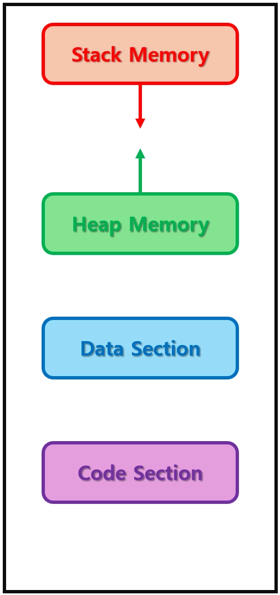
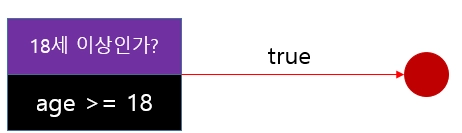
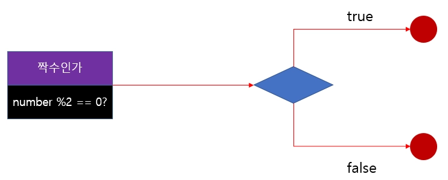
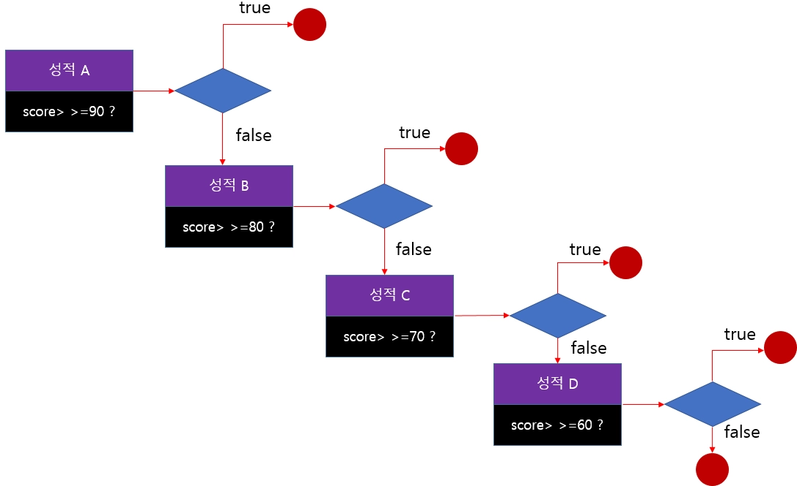
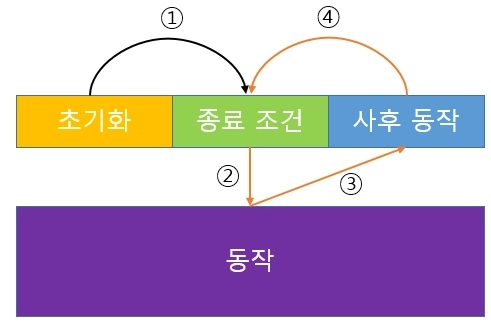
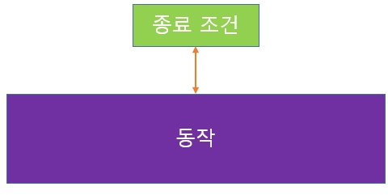

# <strong style="font-size: 50px; color: rgb(255, 255, 255);">2026.03.06.금</strong>

## <strong style="font-size: 36px; color: rgb(255, 255, 255);">1. 학습 키워드</strong>
```
c언어 섹션 8
힙 메모리, 동적 할당
c언어 섹션 9
구조체

C++ 1-3
조건문, 반복문

```


## <strong style="font-size: 36px; color: rgb(255, 255, 255);">2. 학습 내용</strong>

## 메모리 레이아웃(메모리 구조)
    메모리 레이아웃은 크게 스택 메모리, 힙 메모리, 코드 섹션, 데이터 섹션



    코드섹션과 데이터 섹션
    코드섹션 : 작성한 소스코드들이 빌드된 결과물들이 저장되는 곳
    데이터섹션: 전역 변수와 정적 변수 등이 저장되는 곳

```
스택 메모리와 힙 메모리 나뉜 이유

스택 메모리 단점
1️⃣ 스택 메모리에 저장되는 지역 변수(배열 등)의 크기는 컴파일 타임에 고정된다.
    런타임에 더 필요해진다 해도 크기를 늘릴 수 없다
2️⃣ 함수가 종료되면 해당 스택 프레임에 더이상 접근 불가
    즉, 지역변수의 수명은 함수의 수명과 함께
    더 오래 보존하려면 전역변수 혹인 정적변수로 선언해야하는데 이 변수들은 극단적
    프로그램의 수명과 함께한다

-> 런타임 시에 프로그래머가 원하는 만큼 원하는 때에 생성 및 삭제 가능한 메모리가 필요하기 때문이다
```

## 힙 메모리(Heap Memory)
    프로그래머의 메모리 할당과 해제를 통해 관리되는 동적 할당 영역
    
    스택 메모리는 함수의 호출 및 종료에 따라 자동으로 정리되지만 힙 메모리는 아니다

    힙 메모리 장점 
    1️⃣ 프로그래머가 원하는 만큼, 원하는 때에 할당 및 반납이 가능하다.

    힙 메모리 단점 
    1️⃣ 스택 메모리에 비교해 할당/해제 속도가 느리다
        스택 메모리는 자료구조 스택의 특성상 할당 및 해제에 O(1) 시간이 걸린다
        힙 메모리는 할당 받아오려면 사용중이지 않은 메모리이면서 크기가 맞는지 체크 후 제공
        또한 메모리 공간에 구멍(메모리 단편화)이 생길 수도 있어서 효율적인 메모리 관리가 어렵다
    2️⃣ 프로그래머가 직접 메모리 할당 및 해제 해야한다
        메모리 할당만 하고 해제는 안하는 실수를 할 여지가 있다

## 동적 할당의 세가지 단계
```
1️⃣ 메모리 할당(대여)
    힙 메모리 관리자에게 필요한 바이트만큼의 메모리를 달라고 요청
    힙 메모리 관리자는 해당 크기의 연속된 메모리를 찾아서 반환
    반환된 값은 시작 메모리 주소

2️⃣ 메모리 사용
    할당된 힙 메모리 시작 주소를 가지고 원하는 작업 수행
    이때 할당된 메모리 속 데이터는 쓰레기값

3️⃣ 메모리 해제(반납)
    힙 메모리 관리자에게 해당 메모리 주소를 돌려주면서 다 썼다고 알린다
    힙 메모리 관리자는 해당 메모리를 점유되지 않은 메모리 상태로 변경
    메모리 주소를 돌려주지 않으면 메모리 누수(Memory leak) 발생
    메모리 누수 : 해당 메모리가 점유 상태를 벗어나지 못해 사용가능한 메모리가 줄어드는 현상 
```

## 동적 메모리 관련 함수
```
할당: melloc()
재할당 : realloc()
해제 : free()
기타: memset(), memcpy, memcmp()
```

```
void* malloc(size_t size)
memory allocation의 약자. stdlib.h 헤더파일에 선언되어 있다
size 바이트 만큼의 메모리를 반환
할당 실패시 NULL을 반환
```

```
void free(void* ptr)
동적 할당 받은 메모리를 해제하는 함수
다시말해, 메모리 할당 함수를 통해서 얻은 메모리 주소만 해제 가능
```

### [좋은 습관] malloc()를 작성했다면 바로 free()부터 작성
```
동적 할당 받은 메모리 주소를 지역 변수에 저장해뒀다가 해제 안하고 함수가 종료되버리면,
해당 지역변수를 접근할 방법이 사라져 버린다. 지울 방법이 없다.
이렇게 반납하지 않으면 메모리 누수가 발생하므로, 무슨 일이 있어도 free()부터 작성 !
```

```
[malloc() 함수와 free()함수][중요 샘플 코드]
// Main.c

#include <stdio.h>
#include <stdlib.h>

int main(void)
{
	size_t i;
	int* Nums = (int*)malloc(10 * sizeof(int));
	if (NULL == Nums)
	{
		return 0;
	}

	for (i = 0; i < 10; ++i)
	{
		Nums[i] = i * 10;
	}

	for (i = 0; i < 10; ++i)
	{
		printf("%d ", Nums[i]);
	}

	free(Nums);
	Nums = NULL;

	if (NULL != Nums)
	{
		// TODO.
	}

	return 0;
}

```

```
동적 할당 받은 메모리 시작 주소를 연산에 사용한다면?
최초에 받아온 시작 주소를 잃어버린다
그럼 다른 메모리 주소를 free() 함수의 인자로 보낼지도 모른다
사본을 만들어서 포인터 연산에 사용해야 한다
```

```
동적 할당 메모리 소유권
해당 메모리 공간의 주인이 누구인지는 아주 중요한 문제!
-> 반드시 책임 지고 해제해야 한다
-> 주인이 아닌데 마음대로 해제하면 안된다
```

## 구조체(Structure)
    필요한 여러 자료형의 변수들을 한데 묶어서 하나의 자료형처럼 만들 수 있다
```
struct 구조체명
{
    자료형 변수명;
     - - -
};
```

```
[함수의 인자로 구조체 변수 전달 [중요 샘플 코드]]

#include <stdio.h>

struct Date
{
    int Year;
    int Month;
    int Day;
};

void PrintBirthday(struct Date InBirthday);

int main(void)
{
    struct Date Birthday;
    Birthday.Year = 2001;
    Birthday.Month = 9;
    Birthday.Day = 12;

    PrintBirthday(Birthday);

    return 0;
}

void PrintBirthday(struct Date InBirthday)
{
    printf("% d / % d / % d", InBirthday.Year, InBirthday.Month, InBirthday.Day);
}

```

### [참고] 구조체와 객체지향 프로그래밍
    나만의 자료형처럼 만든다는 것은 OOP에서 하나의 물체를 정의하는 것과 같다
    나만의 자료형으로 물체(객체)를 정의하고
    동적할당을 이용해서 물체를 생성 후 원하는 때에 해당 물체를 제거
    이는 객체지향 프로그래밍과 유사

### typedef
    type definition의 약자. 이미 정의되어 있는 자료형에 새로운 별명을 지어준다
    EX) 선생님 -> 쌤

```
size_t 자료형도 사실 typedef unsigned long long size_t
```

### 또다른 구조체 멤버 접근 연산자 ->
    구조체 포인터에 역참조 연산자와 . 연산자를 합친 연산자가 -> 연산자.
    우선순위도 1순위인 연산자라서 괄호 안쳐도 된다

### 객체지향 프로그래밍 언어는 객체 간의 상호작용에 중점을 둔 언어

### 구조체에 멤버 변수만 선언 할 수 있는건 아니다
```
 멤버 함수 2 [중요 샘플 코드]

 // Main.cpp

#include <stdio.h>
#include <stdlib.h>

struct Human
{
	float Height;

	float Weight;

	size_t Age;

	void SayHello(void)
	{
		printf("Hello!\n");

		return;
	}

	void SayMyInfo(void)
	{
		printf("My Height is %.1f.\n", Height);
		printf("My Weight is %.1f.\n", Weight);
		printf("My age is %zu.\n\n", Age);

		return;
	}

};
typedef struct Human Human_t;

int main(void)
{
	Human_t* Park = (Human_t*)malloc(1 * sizeof(Human_t));
	Park->Height = 173.f;
	Park->Weight = 70.f;
	Park->Age = 19;

	Park->SayHello();
	Park->SayMyInfo();

	free(Park);
	Park = NULL;

	return 0;
}
```

```
구조체와 클래스가 완전히 똑같은건 아니다.
```

### 열거형(Enummeration)
    정수에 별명을 붙여서 소스코드를 이해하기 쉽게 해준다
```
enum 열거형명
{
	캐릭터01,
	캐릭터02,
	...
};
```

```
enum 1 [중요 샘플 코드]
// Main.c

#include <stdio.h>

enum EMonth
{
	MONTH_JAN = 1,
	MONTH_FEB = 2,
	MONTH_MAR = 3,
	MONTH_APR = 4
};

enum EASCII
{
	ASCII_A = 65,
	ASCII_B,
	ASCII_C,
	ASCII_D
};

int main(void)
{
	printf("This month's(%d) lucky character is %c.", 3, 66);
		// 갑자기 숫자 3과 66이 튀어나오면 이해가 안될 수 있습니다.

	int March = 3, B = 66;
	printf("This month's(%d) lucky character is %c.", March, B);
		// 물론 위와 같이 하면 가독성이 좋아지긴 하나, 변수가 메모리 공간을 잡아먹음.

	printf("This month's(%d) lucky character is %c.", MONTH_MAR, ASCII_B);

	return 0;
}

```

```
열거형도 typedef가 가능
```

## 조건문
	조건문을 통해 특정 조건을 명시하고 해당 조건이 참 혹은 거짓인 경우 원하는 코드를 실행 가능

## 조건문 문법
```
1️⃣단순 `if`문 입니다.
`if( 조건식 ) {  code; }`  와 같은 방식으로 작성, 해당 조건식이 참인 경우에 코드가 실행됩니다.

만약 나이가 18세 이상인 경우에만 특정 코드가 실행되게 하려면 
아래 그림과 같이 구현
```



2️⃣`if-else` 문
`if` 문의 조건이 참이 아니면 `else` 문의 코드가 실행
예를 들어, 특정수가 `짝수인지 / 홀수`인지 구분해서 동작해야 하는 경우 아래와 같이 로직을 구현
`if-else` 문에서 주의할 점은 `if` 문의 조건식이 참이아니면 `else` 문이 수행되므로 `else` 문에는 조건식이 필요 없다는 것



3️⃣`if-else if-else` 문 
이분법적 논리(yes or no)로 표현할 수 있는 것은 `if-else` 문으로 하면 되지만 조건문을 좀 더 세분화해야 하는 경우
예를 들어, 점수별로 성적 등급을 출력하는 프로그램
90점 이상일 경우 A, 80점 이상일 경우 B, 70점 이상일 경우 C, 60점 이상일 경우 D 그렇지 않으면 F를 출력해야 한다고 가정

아시겠지만 위 설명에서 80점 이상일 경우라는 것은 90점 이상이 아닌 점수 중에서 80점 이상을 말합니다. 즉 80~89점을 의미
이럴 경우 `if-else if-else` 문으로 표현
중간에 있는 `else if`는 여러 개가 올 수 있다.



## 복합 조건(&&, ||)
	&& : 모든 조건이 참이어야 한다.
	|| : 둘 중 하나만 참이어도 된다.


## 반복문
```
for문: 반복의 범위가 명확하게 주어지는 상황에 많이 사용
for 문의 전체적인 동작
초기화 과정은 한 번만 하고, 
이후에 종료 조건 확인 → 동작 → 사후 동작 → 종료 조건 확인 순으로 반복
```


```
while문 : 특정 조건만 확인하며 반복해야 하는 경우 사용
```



## <strong style="font-size: 36px; color: rgb(255, 255, 255);">3. 느낀점 </strong>
오늘은 1-6까지 모든 강의를 들었는데 구조체, 포인터 부분은 익숙해지기 위해서 계속 해봐야겠다
1번 과제를 풀었는데 열심히 더 해야겠다는 생각이 들었다.
강의를 통해서 배운 내용을 활용을 잘 할 수 있도록 내것으로 만들어야겠다.

   
## <strong style="font-size: 36px; color: rgb(255, 255, 255);">4. 다음 학습 </strong>
c언어 배운내용 통합 복습
과제 확인해보기
