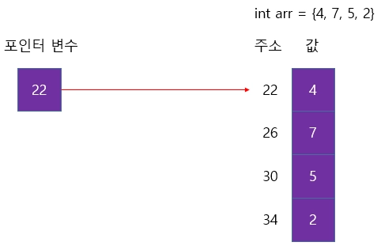
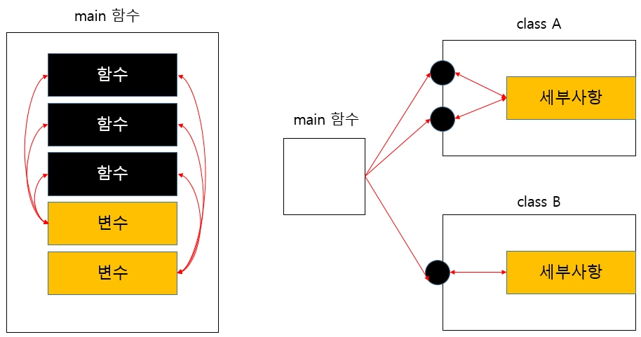
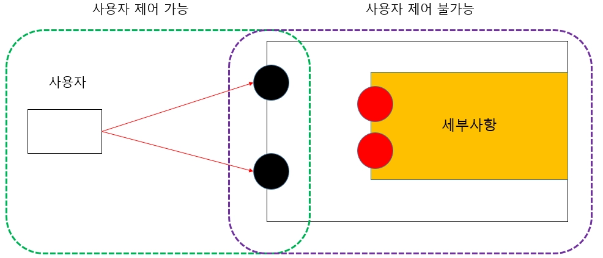
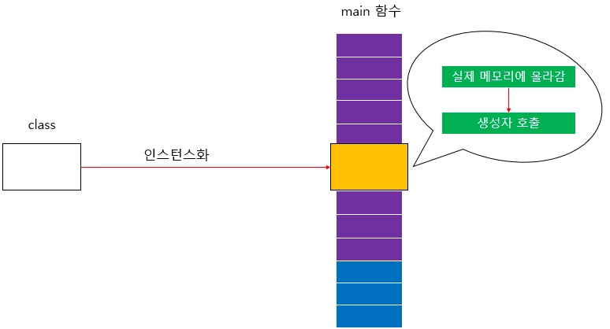
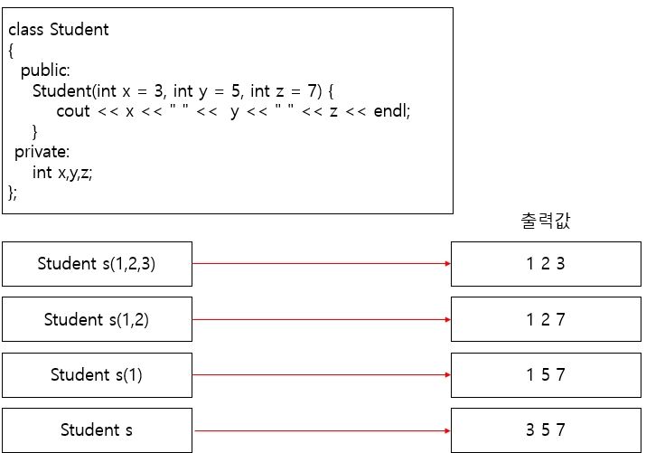
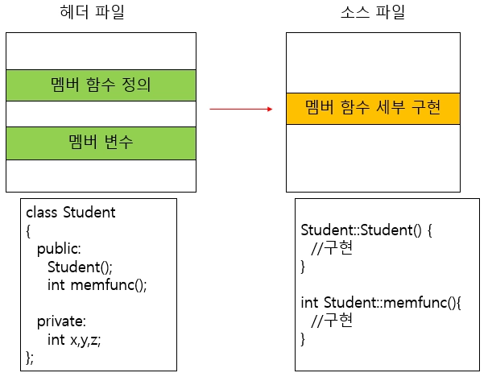
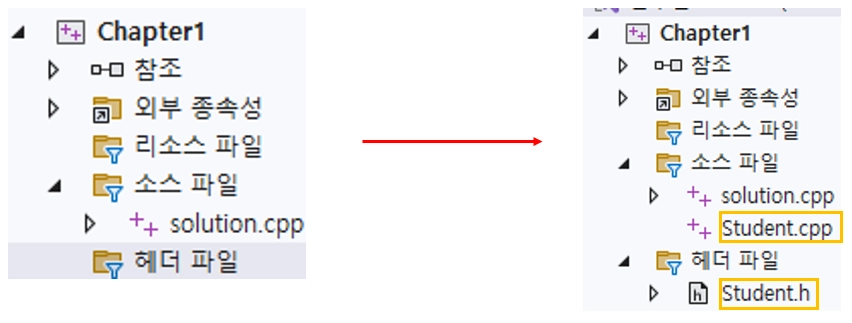
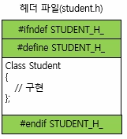
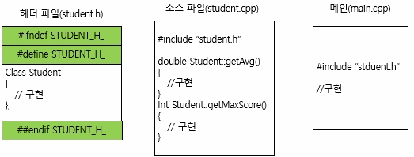

# <strong style="font-size: 50px; color: rgb(255, 255, 255);">2026.03.08.일.</strong>

## <strong style="font-size: 36px; color: rgb(255, 255, 255);">1. 학습 키워드</strong>
포인터, 래퍼런스, 클래스

## <strong style="font-size: 36px; color: rgb(255, 255, 255);">2. 학습 내용</strong>

## 포인터
```
포인터 : 메모리 주소를 저장하는 변수
```

```
포인터 변수의 연산
: 포인터의 모든 연산은 주소값과 관련되어 있다
  2가지 연산은 포인터 변수만 가능
  1. 변수의 주소값을 담을 수 있다
  2. 담고 있는 주소값에 해당되는 메모리에 있는 값을 읽거나 수정할 수 있다.

값이 아닌 주소값 정보를 제공하겠다는 것을 알려줘야 한다
이때 사용하는 연산자는 &
ex) A =&B
```


```
포인터는 주소 값 뿐만 아니라 가리키는 변수의 타입도 필요하다
즉 1. 변수의 시작 주소 / 2. 변수의 타입(변수의 크기를 알기 위해)
```

```
포인터 변수의 역참조
포인터를 활용하려면 해당 주소에 있는 실제 값을 읽고 수정할 수 있어야 한다.
포인터는 주소를 다루는 특성 때문에 산술 연산 역시 주소를 제어하는 방식으로 동작한다
이를 위해서 역참조 연산자 (*) 사용
```

```
배열 이름의 의미
1. 배열 이름은 배열의 시작 주소를 가지고 있다
2. 값을 저장할 수 있다
```

```
배열과 포인터의 차이
배열의 이름은 사용될 때 대부분 포인터로 암시적 형 변환되어 동작
예를 들어, int arr[4];가 있을 때 arr은 배열 전체를 의미
식이나 인자로 사용되면 int* 형으로 변환되어 배열의 첫 번째 원소 주소로 해석
주소값은 변경할 수 없다.

1. 배열 이름은 주소값을 담고 있지만, 이 주소값 대신 다른 주소값을 할당할 수 없다
2. 변수의 크기가 다르다.
```

```
포인터 배열과 배열 포인터
1️⃣포인터 배열은 포인터를 원소로 갖는 배열
예를 들어, `int* ptrArr[4];`는 크기가 4이고, 각 원소가 `int*`인 배열

2️⃣배열 포인터는 배열 전체를 가리키는 포인터
즉 단일 변수가 아닌 배열 통째를 가리키는 변수
보통 다차원 배열을 제어할 때 많이 사용
```

```
포인터 연산
포인터는 주소값을 담는다. 따라서 산술 연산 시, 
일반적인 수치 연산이 아닌 메모리 주소의 이동으로 해석
ptr + 1을 하게 되면, ptr이 담고 있는 주소값에 대한 연산이 수행됩니다. 
포인터의 타입에 따라, 해당 타입 변수의 크기만큼 담고 있는 주소를 증가
```

## 래퍼런스
```
레퍼런스는 특정 변수에 대한 별명을 부여하는 것

한 번 특정 변수의 레퍼런스를 연결하면, 이후로는 마치 그 변수가 두 개의 이름을 갖는것과 같다.
선언 방법은 데이터형 뒤에 &를 붙임
예를 들어, int& ref = var;처럼 사용할 수 있습니다. 이렇게 하면 ref의 값 변경시 var의 값도 변경
```


```
포인터와 레퍼런스의 차이점

1️⃣ 선언과 초기화 시점이 다름
포인터는 선언 후, 나중에 `=` 연산자를 통해 가리킬 대상을 변경 가능
반면에 레퍼런스는 선언과 동시에 초기화해야 하며, 
초기화 이후에는 다른 대상에 재연결 불가

2️⃣ 레퍼런스는 항상 다른 변수와 연결되어 있기 때문에 NULL이라는 게 없다.
반면에 포인터는 유효한 대상이 없음을 나타내기 위해 NULL 혹은 `nullptr`을 가질 수 있다.

3️⃣ 간접 참조 문법의 유무
포인터는 주소값을 담으므로 접근할 때는 `*` 연산을 사용하고 주소를 가져올 때는 
`&` 연산을 사용
하지만 레퍼런스는  변수 자체의 별명이므로 일반 변수와 연산하는 방법이 동일
```

```
상수 레퍼런스
레퍼런스에 상수 제약을 걸어서 읽기 전용으로 사용
상수 레퍼런스를 사용하면 값을 복사하지 않고도 기존 변수를 보호
EX) const int& cref = x; 하면 복사 과정 없이 x의 값을 읽을 수는 있지만 x값을 수정할 수는 없다.
```

## CLASS
```
필수적인 기능을 제외하고 세부 사항을 숨기는 것
```


```
멤버 함수
: 필요한 동작은 멤버 함수로 정의
  보통 멤버 함수는 외부에서도 접근하게 하는 경우가 많다.

멤버 변수
: 세부 데이터는 멤버 변수로 관리
  멤버 함수에서 필요한 정보라든지, class 자체에서 내부 연산시 필요한 정보를 멤버 변수로 관리
  보통 멤버 변수는 외부에서 접근하지 못하게 하는 경우가 많다.
  필요한 동작만 공개하고, 세부 데이터는 숨기는 방식이 변화에 유연하게 대처할 수 있도록 해준다.
```

```
class 내부 구현
1️⃣클래스 내부에서 멤버 함수의 본문까지 직접 정의하는 방법.
2️⃣ 클래스 내부에서 멤버 함수의 선언만 작성하고, 클래스 외부에서 구현하는 방법. → 이걸 많이 사용한다**
```

```
# 접근제어

클래스의 멤버 함수나 멤버 변수에 접근할 때는 객체 뒤에 멤버 접근 연산자 .을 사용

클래스는 접근 지정자를 사용하여 멤버의 접근 권한을 제어 가능

C++의 접근 지정자로는, public, private, protected
class 키워드를 사용할 때, 접근 지정자를 명시하지 않으면 기본적으로 private으로 설정
private 멤버는 클래스 외부에서 직접 접근할 경우 컴파일 에러가 발생
public 멤버는 클래스 외부에서 멤버 접근 연산자로 접근 가능
아래 그림과 같이 사용자가 접근할 수 있는 멤버는 public이고, class 내부에서 접근 가능 한 멤버는 public과 private 모두 가능
```


```
# getter와 setter
 private에 있는 변수를 제어해야 할 때 이용하는 대표적인 방법
 멤버 변수를 바꿀 때 setter를, 값을 가져올 때 getter를 사용
이렇게 하면 변수를 직접 제어하지 않고, 데이터를 안전하게 다룰 수 있다.
```

```
#include <iostream>
#include <algorithm> //max 함수 사용
#include <string>

using namespace std;

class Student
{
public:
    //동작 정의(이를 멤버함수라고 합니다)
    double getAvg();
    int getMaxScore();

	    void setMathScore(int math)
    {
        this->math = math;
    }
    void setEngScore(int eng)
    {
        this->eng = eng;
  
    }
    void setKorScore(int kor)
    {
        this->kor = kor;
    }

    int  getMathScore() { return math; }
    int  getEngScore() { return eng; }
    int  getKorScore() { return kor; }

private:
    //데이터 정의(이를 멤버변수라고 합니다.)
    int kor;
    int eng;
    int math;
};

double Student::getAvg()
{
    return (kor + eng + math) / 3.0;
}

int Student::getMaxScore()
{
    return max(max(kor, eng), math);
}

int main()
{
    Student s;

    s.setEngScore(32);
    s.setKorScore(52);
    s.setMathScore(74);

    //평균 최대점수 출력
    cout << s.getAvg() << endl;
    cout << s.getMaxScore() << endl;

    return 0;
}
```

```
생성자
생성자 : 객체를 생성할 때마다 한 번씩 자동으로 호출되는 특별한 멤버 함수
보통 생성자는 필요한 멤버 변수를 초기화하거나 
객체가 동작할 준비를 하기 위해 사용
생성자는 반환형을 명시하지 않으며, class이름과 동일한 이름을 가진 함수로 정의
1️⃣*정의된 `class`를 변수로 선언하면 해당 객체가 메모리에 올라간다. 이를 인스턴스화
`class`는 설계도에 비유할 수 있으며, 객체 혹은 인스턴스는 설계도에 의해 만들어진 실제 결과물

2️⃣객체가 생성될 때, 멤버 변수를 포함해서 필요한 정보들이 메모리에 올라간다.
이 작업이 완료되면 생성자가 호출
```


### Student에 생성자 적용하기
```
`class`의 기본 문법을 배웠으므로 하나씩 적용해 보고 `student class` 구현에 적용
`student class`는 3개 과목의 점수를 받고 최대 점수와 평균을 반환할 수 있어야 한다.

먼저 `student class`에 생성자를 적용
어차피 3과목의 점수는 무조건 있어야 합니다.

하지만 경우에 따라서는 3과목 점수를 모두 입력하고 싶지 않을 때가 있다.
이러한 상황을 고려하여, C++에서는 기본값을 제공하는 생성자를 제공
필요에 따라 점수를 입력받고, 입력받지 않는 경우엔 기본값을 인자로 받는 생성자를 정의할 수 있다.

기본값을 인자로 받는 생성자는 아래 그림과 같이 사용할 수 있다.
인자를 보면, 대입 연산자를 통해 기본값으로 설정하고자 하는 값을 대입하고 있는 것을 볼 수 있다. 기본값을 인자로 받는 문법은 생성자 뿐 아니라 일반 함수에서도 가능
EX) 아래 클래스는 생성자에 인자가 없을 경우 `x = 3`, `y = 5`, `z = 7`
```


</aside>

- **[코드스니펫] 과목점수 3개를 받는 생성자**
    
    ```cpp
    #include <iostream>
    #include <algorithm> //max 함수 사용
    #include <string>
    
    using namespace std;
    
    class Student
    {
    public:
        //생성자
        Student(int math, int eng, int kor)
    
        {
            this->math = math;
            this->eng = eng;
            this->kor = kor;
        }
        double getAvg();
        int getMaxScore();
    
        //동작 정의(이를 멤버함수라고 합니다)
        void setMathScore(int math)
        {
            this->math = math;
            //this.math = math;와 동일
        }
        void setEngScore(int eng)
        {
            this->eng = eng;
            //this.eng = eng;와 동일
        }
        void setKorScore(int kor)
        {
            this->kor = kor;
            //this.kor = kor;와 동일
        }
    
        int  getMathScore() { return math; }
        int  getEngScore() { return eng; }
        int  getKorScore() { return kor; }
    
    private:
        //데이터 정의(이를 멤버변수라고 합니다.)
        int kor;
        int eng;
        int math;
    };
    
    double Student::getAvg()
    {
        return (kor + eng + math) / 3.0;
    }
    
    int Student::getMaxScore()
    {
        return max(max(kor, eng), math);
    }
    
    int main()
    {
        Student s(32, 52, 74);
    
        //평균 최대점수 출력
        cout << s.getAvg() << endl;
        cout << s.getMaxScore() << endl;
    
        return 0;
    }
    ```
    
- **[코드스니펫] 기본값이 적용된 생성자**
    
    ```cpp
    #include <iostream>
    #include <algorithm> //max 함수 사용
    #include <string>
    
    using namespace std;
    
    class Student
    {
    public:
        //값이 주어지지 않을경우 기본값을 할당하는 생성자
        Student(int math = 32, int eng = 17, int kor = 52)
        {
            this->math = math;
            this->eng = eng;
            this->kor = kor;
        }
        double getAvg();
        int getMaxScore();
    
        //동작 정의(이를 멤버함수라고 합니다)
        void setMathScore(int math)
        {
            this->math = math;
            //this.math = math;와 동일
        }
        void setEngScore(int eng)
        {
            this->eng = eng;
            //this.eng = eng;와 동일
        }
        void setKorScore(int kor)
        {
            this->kor = kor;
            //this.kor = kor;와 동일
        }
    
        int  getMathScore() { return math; }
        int  getEngScore() { return eng; }
        int  getKorScore() { return kor; }
    
    private:
        //데이터 정의(이를 멤버변수라고 합니다.)
        int kor;
        int eng;
        int math;
    };
    
    double Student::getAvg()
    {
        return (kor + eng + math) / 3.0;
    }
    
    int Student::getMaxScore()
    {
        return max(max(kor, eng), math);
    }
    
    int main()
    {
        Student s;
        //아래와 같이 사용할 수도 있음
        //Student s(1);
        //Student s(1, 2);
        //Student s(32, 52, 74);
    
        //평균 최대점수 출력
        cout << s.getAvg() << endl;
        cout << s.getMaxScore() << endl;
    
        return 0;
    }
    ```
    

### Student 구현을 위해 코드 나누기
👉
지금까지 `Student` 클래스를 하나의 파일에 모두 구현

하지만 앞서 설명했듯이, 내부 구현은 사용자가 알 필요가 없는 부분이므로 보통 클래스의 선언부(헤더)와 구현부(소스 파일)을 분리한 뒤, 필요한 곳에서 헤더를 `include` 하여 제공하는 방식을 사용



💡

왜 굳이 파일을 나눠서 구현하나?
쉬운 예로 책을 생각하면 쉽다.
책의 전체 구성을 설명해 주는 목차 혹은 서론 없이 바로 본론으로 들어가게 되면, 전체적인 구조를 파악하기 힘들다.

헤더 파일에 `class`를 정의하는 것은 목차를 만든다 생각하면 되고,
소스 파일에 세부 구현하는 것은 실제 책 내용이라고 생각하면 이해가 쉽다.

글도 마찬가지. 소설을 쓸 때 한 문장으로 200페이지를 쓰는 경우는 없을 겁니다.
코드 역시 모든 내용을 한 파일에 몰아 쓰기보다는, 여러 파일로 나누어 작성하는 편이 유지 보수성과 가독성 면에서 유리

C++에서는 보통 헤더 파일과 소스 파일로 구분하는데, 헤더 파일에는 선언 부를, 소스 파일에는 구현 부를 작성

이전에 구현했던 `Student` 클래스를 예로 들면, 최종적으로 파일 구조는 다음과 같이 변경될 것



### student.h에 Class 정의
👉
`class`를 헤더 파일에 정의할 때 가장 중요한 것은, 해당 `class`가 중복 선언되지 않도록 하는 것.

 내가 만든 헤더 파일을 여러 파일에서 사용하다 보면 `class`가 여러 번 정의될 수 있다.
 이를 방지하기 위해 `#ifndef`라는 구문을 활용



다시 한번 정리하면 아래와 같다.
중요한 포인트를 짚어보고 예제 코드를 보면서 이 구문의 의미를 살펴보겠다.

1️⃣`#ifndef STUDENT_H_`의 의미는 `STUDENT_H_`가 정의되어 있지 않은 경우에만 아래 코드를 수행하라는 의미

2️⃣`#define STUDENT_H_`는 `STUDENT_H_`를 정의

`#ifndef`일 때만 `#define`이 수행되므로 단 한 번만 수행될 수 있다.

3️⃣`#ifndef`가 끝났다는 것을 알려주기 위해 `#endif`를 작성

4️⃣ 최종적으로 `Student Class`는 중복 포함될 수 없게 된다.

- **[코드스니펫] Student class를 헤더파일에 정의 (Student.h)**
    
    ```cpp
    #ifndef STUDENT_H_
    #define STUDENT_H_
    class Student
    {
    public:
        //값이 주어지지 않을경우 기본값을 할당하는 생성자
        Student(int math = 32, int eng = 17, int kor = 52)
        {
            this->math = math;
            this->eng = eng;
            this->kor = kor;
        }
        double getAvg();
        int getMaxScore();
    
    private:
        //데이터 정의(이를 멤버변수라고 합니다.)
        int kor;
        int eng;
        int math;
    };
    #endif
    ```
    

## student.cpp에 class 구현

<aside>
👉

헤더 파일과 소스 파일로 코드를 분리했습니다.
다음 단계는 아래처럼 소스 파일에 `include`한 `class`의 세부 사항 들을 구현하는 것입니다.


</aside>

- **[코드스니펫] Student class를 헤더파일에 정의 (Student.cpp)**
    
    ```cpp
    #include "Student.h"
    #include <algorithm> // max 함수
    
    using namespace std;
    
    double Student::getAvg()
    {
        return (kor + eng + math) / 3.0;
    }
    
    int Student::getMaxScore()
    {
        return max(max(kor, eng), math);
    }
    
    ```
    

### 메인 함수에서 정의한 class 사용

👉
이제 `class`의 정의와 구현이 끝났으므로 실제 `main` 함수에서 사용



📌정의된 `class`가 포함된 `Student.h`를 `include` 한다.


- **[코드스니펫] Student class를 헤더파일에 정의 (main.cpp)**
    
    ```cpp
    #include <iostream>
    #include "Student.h"
    
    using namespace std;
    
    int main()
    {
        Student s;
        Student s2(1);
        Student s3(1,2);
        Student s4(32,52,74);
    
        //평균 최대점수 출력
        cout << s.getAvg() << endl;
        cout << s.getMaxScore() << endl;
    
        return 0;
    }
    ```
    


## <strong style="font-size: 36px; color: rgb(255, 255, 255);">3. 느낀점 </strong>
오늘은 공부하는 시간을 확보하지 못해 c++에서 다시 봐야될 부분을 복습
시간 활용을 잘 해야겠고 낭비되는 시간을 줄이자
그래도 점차 주말에 공부하는 시간이 늘어나는데 저녁에 하기 때문에 아침에 일어나서부터 할 수 있도록 노력하자


   
## <strong style="font-size: 36px; color: rgb(255, 255, 255);">4. 다음 학습 </strong>
 C++1-1~1-6, C언어 배운내용 복습