# <strong style="font-size: 50px; color: rgb(255, 255, 255);">2026.03.09.월</strong>

## <strong style="font-size: 36px; color: rgb(255, 255, 255);">1. 학습 키워드</strong>

```
스택 메모리, 힙 메모리, Dangling Pointer, 스마트 포인터,
얕은 복사, 깊은 복사, 언리얼엔진 메모리 관리, 언리얼엔진 리플렉션 시스템
```

## <strong style="font-size: 36px; color: rgb(255, 255, 255);">2. 학습 내용</strong>

## 스택 메모리
```
스택 메모리의 가장 큰 특징 : 변수의 생존 주기가 끝나면 선언 시 할당되었던 메모리가 자동으로 회수된다는 점

따라서 사용자가 직접 메모리를 해제할 필요가 없다.

변수의 생존 주기는 아래 그림과 같이 선언된 라인을 기준으로 가장 가까운 마침 괄호`}`
```
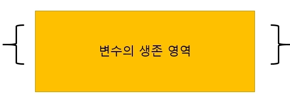

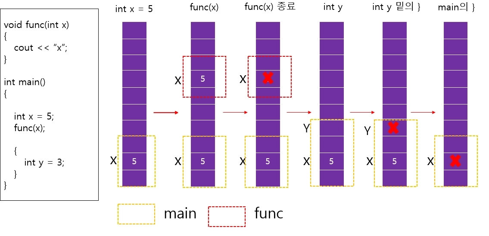

함수 내에서 선언된 변수 생존 주기
```
    #include <iostream>
    using namespace std;
    
    void func1() {
        int a = 10;  // 지역 변수 'a', stack 메모리에서 관리됨
        cout << "func1: a = " << a << endl;
    }  // func1()이 종료되면 'a'는 소멸됨
    
    int main() {
        func1();  // func1() 호출
        // 'a'는 func1() 호출 중에만 존재하고, 함수 종료 후 소멸됨
        return 0;
    }

```


반복 내에서 선언된 변수 생존 주기
```
    #include <iostream>
    using namespace std;
    
    void func3() {
        for (int i = 0; i < 3; ++i) {  // 반복문 안에서 지역 변수 'i'가 매번 새로 생성됨
            int temp = i * 10;  // 반복문 안에서만 유효한 'temp'
            cout << "Iteration " << i << ": temp = " << temp << endl;
        }  // 반복문 끝날 때마다 'temp'는 소멸됨
    }
    
    int main() {
        func3();  // func3 호출
        return 0;
    }
```


중첩함수 내에서 선언된 변수 생존 주기
```
    #include <iostream>
    using namespace std;
    
    void func2() {
        int b = 20;  // 지역 변수 'b', stack 메모리에서 관리됨
        cout << "func2: b = " << b << endl;
    }
    
    void func1() {
        int a = 10;  // 지역 변수 'a', stack 메모리에서 관리됨
        cout << "func1: a = " << a << endl;
        func2();  // func2() 호출
    }  // func1() 종료 시 'a'는 소멸되고, func2() 종료 후 'b'도 소멸됨
    
    int main() {
        func1();  // func1() 호출
        return 0;
    }
```

## 힙 메모리
스택 메모리는 메모리를 자동으로 회수해 주는 장점이 있는 반면, 단점도 존재
1️⃣ 일반적으로 할당 가능한 스택 메모리의 크기가 제한적입니다.
    변수의 스코프(생존 영역)을 벗어나면 자동으로 해제되므로, 메모리를 더 길거나 유연하게 관리하기 어렵습니다.

이 문제를 해결하기 위해 힙(동적) 메모리를 사용

1️⃣동적 할당 시 `new` 연산자를 사용하고, 해제 시 `delete` 연산자를 사용합니다.

2️⃣스택과 달리 자동으로 해제되지 않으므로 메모리 누수 등의 위험이 있을 수 있습니다.

3️⃣동적 할당된 객체(또는 변수)의 생존 주기는 사용자가 `delete`로 해제할 때까지 유지됩니다.

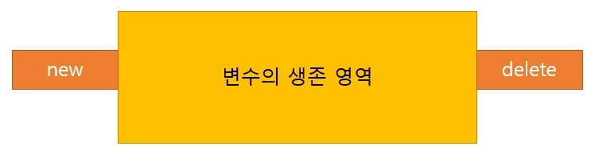


변수 하나의 영역에 대한 동적할당
```
#include <iostream>
using namespace std;

void func1() {
    int* ptr = new int(10);  // 힙 메모리에 정수 10 할당
    cout << "Value: " << *ptr << endl;
    delete ptr;             // 메모리 해제
}

int main() {
    func1();
    return 0;
}
```


배열의 동적 할당과 해제
```
#include <iostream>
using namespace std;

void func2() {
    int* arr = new int[5];  // 힙 메모리에 정수 배열 5개 할당
    for (int i = 0; i < 5; ++i) {
        arr[i] = i * 10;
        cout << "arr[" << i << "] = " << arr[i] << endl;
    }
    delete[] arr;  // 배열 메모리 해제
}

int main() {
    func2();
    return 0;
}
```
메모리 해지를 하지 않는 예시
```
#include <iostream>
using namespace std;

void func3() {
    int* ptr = new int(20);  // 힙 메모리에 정수 20 할당
    cout << "Value: " << *ptr << endl;
    // 메모리 해제를 하지 않음
}

int main() {
    func3();  // 메모리 누수 발생
    return 0;
}
```
사용자 입력 기반으로 배열 동적 할당
```
#include <iostream>
using namespace std;

void createDynamicArray() {
    int size;
    cout << "Enter the size of the array: ";
    cin >> size;  // 배열 크기를 사용자로부터 입력받음

    if (size > 0) {
        int* arr = new int[size];  // 입력받은 크기만큼 동적 배열 생성
        for (int i = 0; i < size; ++i) {
            arr[i] = i * 2;  // 배열 초기화
            cout << "arr[" << i << "] = " << arr[i] << endl;
        }
        delete[] arr;  // 동적으로 할당한 배열 메모리 해제
    } else {
        cout << "Invalid size!" << endl;
    }
}

int main() {
    createDynamicArray();
    return 0;
}

```

## Dangling Pointer
```
식당을 방문하려고 했으나, 이미 그 건물이 철거된 상태라면 헛걸음

C++에서도 유사한 상황이 발생

포인터는 메모리가 해제되었는지 여부를 자동으로 알 수 없기 때문

이미 해제된 메모리의 주소를 계속 가지고 있는 포인터를 사용하는 것은 매우 위험
```
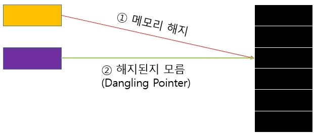

 Dangling Pointer 예시
 ```
 #include <iostream>
using namespace std;

void func5() {
    int* ptr = new int(40);  // 힙 메모리에 정수 40 할당
    int* ptr2 = ptr;

    cout << "ptr adress = " << ptr << endl;
    cout << "ptr2 adress = " << ptr2 << endl;
    cout << *ptr << endl;

    delete ptr;

    cout << *ptr2 << endl;
}

int main() {
    func5();
    return 0;
}
 ```

메모리를 이중 해지 하는 예시
```
#include <iostream>
using namespace std;

void func4() {
    int* ptr = new int(30);  // 힙 메모리에 정수 30 할당
    cout << "Value: " << *ptr << endl;
    delete ptr;             // 첫 번째 해제
    // delete ptr;          // 두 번째 해제 (코드 활성화 시 문제 발생)
}

int main() {
    func4();
    return 0;
}
```

### 메모리 누수(Memory Leak)
프로그램이 점점 더 많은 메모리를 차지하게 되어 결국 사용할 수 있는 메모리가 부족

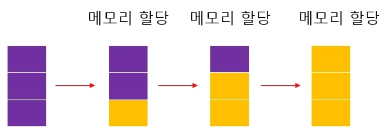

## 스마트 포인터
```
`Heap 메모리`은 여러 가지 장점들을 제공

메모리를 직접 관리해야 한다는 부담
C++에서는 스마트 포인터를 제공 : `Dangling Pointer`가 발생하지 않도록 자동으로 관리

스마트 원리의 핵심 원리는 `new` / `delete`를 사용하지 않는 자동 메모리 관리

`delete`를 직접 호출해서 메모리를 관리하는 방식 대신, 각 스마트 포인터의 목적에 맞게 자동으로 메모리 관리
```

```
1️⃣ unique_ptr은 객체에 대한 단일 소유권을 관리
객체의 소유권을 명확히 하고 소유권 이전을 통해 효율적인 자원관리가 가능
아래 그림처럼 move를 통해 소유권을 이동하는 식으로 관리
```
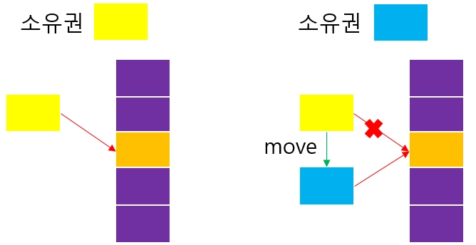

```
2️⃣ shared_ptr은 레퍼런스 카운트를 관리
레퍼런스 카운트란 현재 객체를 참조하는 포인터의 개수를 카운팅 하는 것
레퍼런스 카운트가 0이 되면 객체는 자동으로 메모리 해제
이를 활용해서 Dangling Pointer 및 MemoryLeak 문제를 효과적으로 방지
```
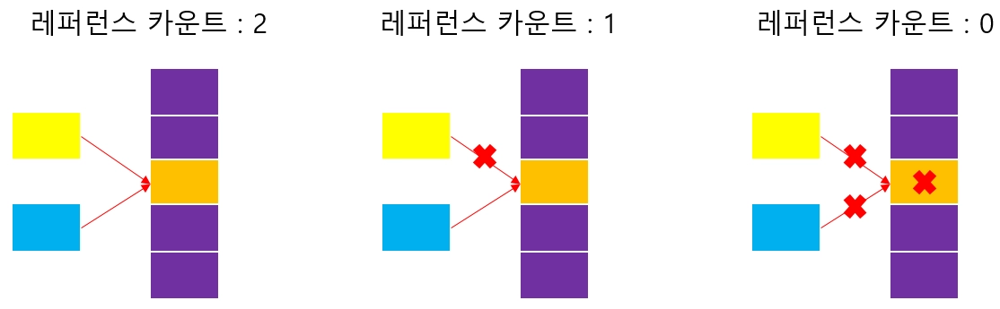

```
3️⃣ `weak_ptr`은 객체의 소유권을 공유하지 않습니다.
    다른 스마트 포인터와 다르게 레퍼런스 카운트를 증가시키지 않는 약한 참조
    'shared_ptr` 는 유용하지만 순환참조가 발생할 수 있다.
    순환 참조란, 두 개 이상의 객체가 서로를 shared_ptr로 가리켜 참조하는 상황. 이러한 순환 참조는 메모리 누수를 유발할 수 있다.
    이 상황에서 서로 순환하고 있는 shared_ptr중 하나를 weak_ptr로 대체하면 순환 고리가 끊어지게 되므로 문제를 해결할 수 있다.
    정리하면 shared_ptr은 관찰과 소유를 하는 반면, weak_ptr은 관찰만 한다고 표현
```
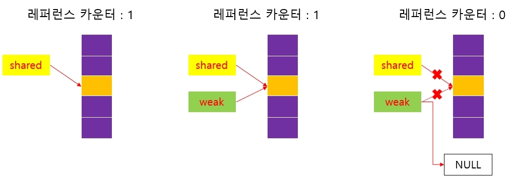


### unique_ptr
    객체 소유권을 관리하는 스마트 포인터
    단 하나의 포인터만 객체를 소유

```
1️⃣소유권의 개념만 있기 때문에 복사 혹은 대입이 불가능
    이걸 시도하는 순간 컴파일 에러가 발생
```
기본적인 uinque_ptr 사용법
```
#include <iostream>
#include <memory> // unique_ptr 사용
using namespace std;

int main() {
    // unique_ptr 생성
    unique_ptr<int> ptr1 = make_unique<int>(10);

    // unique_ptr이 관리하는 값 출력
    cout << "ptr1의 값: " << *ptr1 << endl;

    // unique_ptr은 복사가 불가능
    // unique_ptr<int> ptr2 = ptr1; // 컴파일 에러 발생!

    // 범위를 벗어나면 메모리 자동 해제
    return 0;
}
```

```
2️⃣복사가 불가능하며 move를 사용해서 소유권 이전만 가능
```
move로 unique_ptr 소유권 이전
```
#include <iostream>
#include <memory> // unique_ptr 사용
using namespace std;

int main() {
    // unique_ptr 생성
    unique_ptr<int> ptr1 = make_unique<int>(10);

    // unique_ptr이 관리하는 값 출력
    cout << "ptr1의 값: " << *ptr1 << endl;

    // unique_ptr은 복사가 불가능
    // unique_ptr<int> ptr2 = ptr1; // 컴파일 에러 발생!

    // 범위를 벗어나면 메모리 자동 해제
    return 0;
}
```

```
3️⃣ 일반적인 클래스 객체를 unique_ptr로 관리하는 방법
```
일반 클래스에서 unique_ptr 사용하는 방법
```
#include <iostream>
#include <memory>
using namespace std;

class MyClass {
public:
    MyClass(int val) : value(val) {
        cout << "MyClass 생성: " << value << endl;
    }
    ~MyClass() {
        cout << "MyClass 소멸: " << value << endl;
    }
    void display() const {
        cout << "값: " << value << endl;
    }
private:
    int value;
};

int main() {
    // unique_ptr로 MyClass 객체 관리
    unique_ptr<MyClass> myObject = make_unique<MyClass>(42);

    // MyClass 멤버 함수 호출
    myObject->display();

    // 소유권 이동
    unique_ptr<MyClass> newOwner = move(myObject);

    if (!myObject) {
        cout << "myObject는 이제 비어 있습니다." << endl;
    }
    newOwner->display();

    // 범위를 벗어나면 newOwner가 관리하는 메모리 자동 해제
    return 0;
}

```

### shared_ptr
    shared_ptr 은 하나의 객체를 여러 개의 포인터가 함께 참조할 수 있는 스마트 포인터
    내부적으로 레퍼런스 카운터를 관리
    use_count() 메서드를 활용하여 현재 객체를 참조하는 포인터의 수를 확인
    reset() 메서드로 소유 중인 객체를 해제하거나 다른 객체로 변경

```
1️⃣ shared_ptr은 내부적으로 레퍼런스 카운트를 관리하며 이를 통해 복사 및 대입 연산으로 여러 개의 포인터가 하나의 객체를 공유할 수 있다.
```
기본적인 shared_ptr 사용법
```
#include <iostream>
#include <memory> // shared_ptr 사용
using namespace std;

int main() {
    // shared_ptr 생성
    shared_ptr<int> ptr1 = make_shared<int>(10);

    // ptr1의 참조 카운트 출력
    cout << "ptr1의 참조 카운트: " << ptr1.use_count() << endl; // 출력: 1

    // ptr2가 ptr1과 리소스를 공유
    shared_ptr<int> ptr2 = ptr1;
    cout << "ptr2 생성 후 참조 카운트: " << ptr1.use_count() << endl; // 출력: 2

    // ptr2가 범위를 벗어나면 참조 카운트 감소
    ptr2.reset();
    cout << "ptr2 해제 후 참조 카운트: " << ptr1.use_count() << endl; // 출력: 1

    // 범위를 벗어나면 ptr1도 자동 해제
    return 0;
}
```

```
2️⃣ 일반적인 클래스에서 shared_ptr을 사용하는 방법
```
일반 클래스에서 shared_ptr 사용법
```
#include <iostream>
#include <memory>
using namespace std;

class MyClass {
public:
    MyClass(int val) : value(val) {
        cout << "MyClass 생성: " << value << endl; // 출력: MyClass 생성: 42
    }
    ~MyClass() {
        cout << "MyClass 소멸: " << value << endl; // 출력: MyClass 소멸: 42
    }
    void display() const {
        cout << "값: " << value << endl; // 출력: 값: 42
    }
private:
    int value;
};

int main() {
    // shared_ptr로 MyClass 객체 관리
    shared_ptr<MyClass> obj1 = make_shared<MyClass>(42);

    // 참조 공유
    shared_ptr<MyClass> obj2 = obj1;

    cout << "obj1과 obj2의 참조 카운트: " << obj1.use_count() << endl; // 출력: 2

    obj2->display(); // 출력: 값: 42

    // obj2를 해제해도 obj1이 객체를 유지
    obj2.reset();
    cout << "obj2 해제 후 obj1의 참조 카운트: " << obj1.use_count() << endl; // 출력: 1

    return 0;
}
```

### weak_ptr
    weak_ptr 은 레퍼런스 카운트를 증가시키지 않는 약한 참조방식으로 동작하는 스마트 포인터 
    lock()  호출 후 반환된  shared_ptr 이 유효한지 확인 후에 사용

```
1️⃣weak_ptr은 레퍼런스 카운트에 영향을 미치지 않는 약한 참조이므로, 반드시 lock()함수로 내부 객체 유효성을 확인하고 사용
```
 lock()함수로 유효성을 확인하고 weak_ptr를 사용하는 예시
 ```
 #include <iostream>
#include <memory>

class A {
public:
    void say_hello() {
        std::cout << "Hello from A\n";
    }
};

class B {
public:
    std::weak_ptr<A> a_ptr;

    void useA() {
        if (auto a_shared = a_ptr.lock()) { // 유효한지 확인
            a_shared->say_hello();
        } else {
            std::cout << "A is no longer available.\n";
        }
    }
};

int main() {
    std::shared_ptr<B> b = std::make_shared<B>();
    
    {
        std::shared_ptr<A> a = std::make_shared<A>();
        b->a_ptr = a;
        b->useA(); // A가 유효하므로 Hello 출력
    } // A는 scope을 벗어나며 소멸됨

    b->useA(); // A는 이미 소멸되었기 때문에 메시지 출력
}
 ```

```
2️⃣shared_ptr 은 순환 참조 문제가 발생할 수 있습니다.  순환 참조 발생시 순환 고리중 하나를 weak_ptr로 변경하면 이 문제를 해결
```
shared_ptr를 사용해서 순환참조가 발생하는 예시
```
#include <iostream>
#include <memory>

class B; // Forward declaration

class A {
public:
    std::shared_ptr<B> b_ptr;
    ~A() { std::cout << "A destroyed\n"; }
};

class B {
public:
    std::shared_ptr<A> a_ptr;
    ~B() { std::cout << "B destroyed\n"; }
};

int main() {
    auto a = std::make_shared<A>();
    auto b = std::make_shared<B>();

    a->b_ptr = b;
    b->a_ptr = a;

    // main 함수가 끝나도 A와 B는 서로 참조 중이라 메모리 해제가 안 됨
    return 0;
}
```
weak_ptr로 순환참조를 해결하는 예시
```
#include <iostream>
#include <memory>

class B; // Forward declaration

class A {
public:
    std::shared_ptr<B> b_ptr;
    ~A() { std::cout << "A destroyed\n"; }
};

class B {
public:
    std::weak_ptr<A> a_ptr; // weak_ptr로 변경
    ~B() { std::cout << "B destroyed\n"; }
};

int main() {
    auto a = std::make_shared<A>();
    auto b = std::make_shared<B>();

    a->b_ptr = b;
    b->a_ptr = a; // weak_ptr로 참조

    return 0;
}

```


## 얕은 복사
```
일반적으로 포인터나 동적으로 할당된 자원을 관리하는 객체는 메모리 안정성을 위해 깊은 복사를 사용하는 것이 바람직
얕은 복사(Shallow Copy)란,  클래스 내의 포인터 멤버를 복사할 때 포인터가 가리키는 데이터가 아닌 포인터가 저장하고 있는 주소값만 복사하는 것을 의미
즉, 두 객체가 동일한 동적 메모리 영역을 가리키게 됨
얕은 복사를 수행한 후 원본 객체가 메모리를 해제하면, 복사된 객체의 포인터는 해제된 메모리 영역을 가리키게 됨. 즉  dangling pointer가 발생할 수 있다.
```

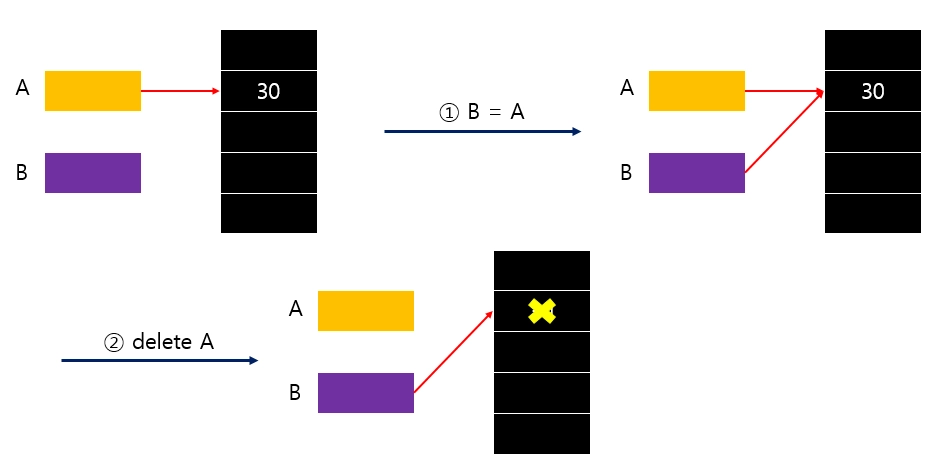

얕은복사 코드
```
#include <iostream>
using namespace std;

int main() {
    // 포인터 A가 동적 메모리를 할당하고 값을 30으로 설정
    int* A = new int(30);

    // 포인터 B가 A가 가리키는 메모리를 공유
    int* B = A;

    cout << "A의 값: " << *A << endl; // 출력: 30
    cout << "B의 값: " << *B << endl; // 출력: 30

    // A가 동적 메모리를 해제
    delete A;

    // 이제 B는 Dangling Pointer(해제된 메모리를 가리키는 포인터)
    // 이 시점에서 B를 통해 접근하면 Undefined Behavior 발생
    cout << "B의 값 (dangling): " << *B << endl; // 위험: 정의되지 않은 동작

    return 0;
}
```


## 깊은 복사
    깊은 복사(Deep Copy)는 클래스의 포인터 멤버가 가리키는 동적 데이터를 새로 할당된 독립적인 메모리 영역에 복제
    원본 객체와 복사된 객체는 서로 독립적인 메모리 공간을 소유하므로 dangling pointer가 발생하지 않는다.

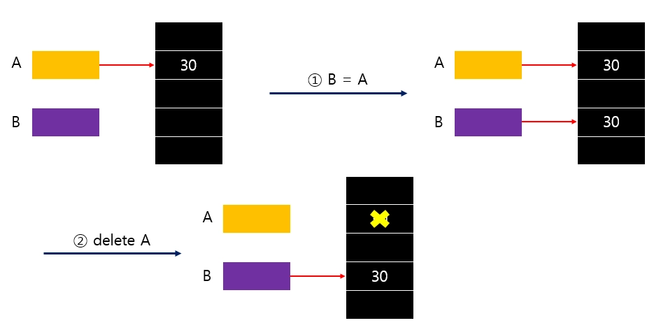

깊은복사 코드
```
#include <iostream>
using namespace std;

int main() {
    // 포인터 A가 동적 메모리를 할당하고 값을 30으로 설정
    int* A = new int(30);

    // 포인터 B가 A가 가리키는 값을 복사 (깊은 복사)
    int* B = new int(*A);

    cout << "A의 값: " << *A << endl; // 출력: 30
    cout << "B의 값: " << *B << endl; // 출력: 30

    // A가 동적 메모리를 해제
    delete A;

    // B는 여전히 독립적으로 자신의 메모리를 관리
    cout << "B의 값 (깊은 복사 후): " << *B << endl; // 출력: 30

    // B의 메모리도 해제
    delete B;

    return 0;
}
```

## 언리얼엔진 메모리 관리
```
언리얼 엔진은 객체들의 메모리 관리를 자동화하기 위해 가비지 컬렉션 시스템을 사용

가비지 컬렉션은 마치 로봇 청소기가 더 이상 사용하지 않는 물건(메모리)를 알아서 치워주는 것과 같다고 할 수 있다.

이를 통해 개발자가 메모리 해제를 수동으로 처리하는 부담을 덜고, 메모리 누수나 댕글링 포인터와 같은 메모리 오류를 줄일 수 있다.
```
아래와 같이 3단계로 진행


1️⃣루트셋에서 시작**

- 먼저 루트셋에 포함된 객체들을 식별합니다.
- 이 객체들은 항상 살아있다고 간주되는 특별한 객체입니다.
- 예를 들어, 게임 엔진 자체, 플레이어 컨트롤러 등이 루트셋에 포함될 수 있습니다. 
이는 가비지 컬렉션 대상이 아닙니다. 청소 시, 절대 버려서는 안되는 물건으로 비유할 수 있습니다.

2️⃣마크 단계 - 도달 가능성 분석

- 루트셋 객체에서 시작해서 직간접적으로 참조하는 UObject를 마크 합니다. 이는 객체가 사용중임을 나타냅니다.

3️⃣스윕 단계 - 메모리 회수

- 마크 단계가 완료되면 마크되지 않은 객체들이 차지하고 있던 메모리를 회수. 이 과정에서 해당 객체의 소멸자가 호출되고 메모리가 반환

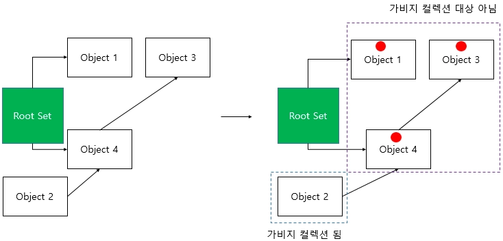


2️⃣`UObject`에는 가비지 컬렉션 동작 방식을 제어하는 다양한 플래그가 존재

이 플래그들은 가비지 컬렉션의 동작에 중요한 정보를 제공하며, `GUObjectArray`라는 전역 배열에 저장된 각 객체 정보의 일부로 관리


📌 RF_RootSet

- 이 플래그가 설정된 객체는 루트셋의 일부로 관리
- 즉 설정된 시점부터 가비지 컬렉션 대상이 아닙니다. `AddToRoot()` 함수를 통해 설정하고, `RemoveFromRoot()`함수를 통해 해제할 수 있다.

📌RF_BeginDestroyed

- 객체의 `BeginDestroy()` 함수가 호출되었음을 나타냅니다.
- 해당 함수는 객체가 실제로 메모리에서 해제되기 전에 필요한 정리 작업을 수행하는 함수

📌RF_FinishDestroyed
- 객체의 `FinishDestoy()` 함수가 호출되었음을 나타냅니다. 
- 해당 함수는 객체 소멸의 마지막 단계로, 이 함수 호출 후 객체의 메모리가 완전히 해제

## 언리얼엔진 리플렉션 시스템
```
리플렉션이란 프로그램이 실행 중에 자신의 구조와 상태를 검사하고 수정할 수 있는 능력
C++의 경우 자체적인 리플렉션 기능이 없기 때문에 언리얼 엔진은 자체적인 리플렉션 시스템을 구축
```

리플렉션은 왜 필요?
```
리플렉션은 UObject를 위한 운영체제와 같다. 
언리얼 엔진 내부에서 동작하는 여러 모듈(가비지 컬렉터, 스크립트 시스템) 등은 모두 `UObject` 기반
하지만 사용자가 정의한 타입들의 경우 엔진에서 알지 못하므로, 이를 처리할 수 있도록 타입 정보를 공유해야 합니다. 이를 위한 작업이 "리플렉션"
```
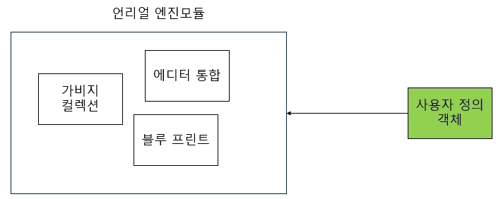

```
리플렉션의 핵심은 UHT 코드 생성기
UHT는 C++ 컴파일러가 수행되기 되기 전에 동작
C++ 코드 내에서 메타 데이터를 얻고,  내부적으로 소스 코드를 생성
이 동작이 완료된 이후에 C++ 컴파일러가 수행
```
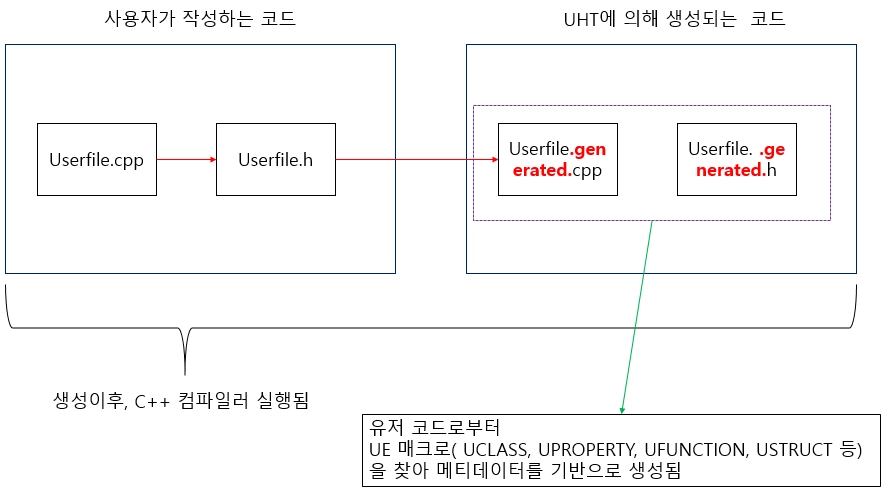

언리얼 엔진에서 핵심  리플렉션 매크로
| **매크로** | **리플렉션에서의 목적** | **일반적인 위치** |
| --- | --- | --- |
| UCLASS() | C++ 클래스를 UObject 기반의 리플렉션 시스템에 등록 | 클래스 정의 앞 |
| UPROPERTY() | 멤버 변수를 리플렉션 시스템에 노출 | 멤버 변수 선언 앞 |
| UFUNCTION() | 멤버 함수를 리플렉션 시스템에 노출 | 멤버 함수 선언 앞 |
| USTRUCT() | C++ 구조체를 리플렉션 시스템에 등록 | 구조체 정의 앞 |
| GENERATED_BODY() | UHT가 생성하는 리플렉션 및 엔진 지원 코드를 위한 삽입 지점 | 클래스/구조체 본문 첫 줄 |


USTRUCT() 예시
```
// FMyStructData.h (or within another .h)
#pragma once

#include "CoreMinimal.h"
#include "UObject/ObjectMacros.h"
#include "MyStructData.generated.h"

USTRUCT(BlueprintType) // 블루프린트에서 이 구조체를 타입으로 사용할 수 있도록 합니다.
struct FMyStructData
{
    GENERATED_BODY() // UHT가 필요한 코드를 생성하도록 합니다.

public:
    UPROPERTY(EditAnywhere, BlueprintReadWrite, Category = "MyStructData")
    int32 SampleInt;

    UPROPERTY(EditAnywhere, BlueprintReadWrite, Category = "MyStructData")
    FString SampleString;

    FMyStructData() : SampleInt(0), SampleString(TEXT("Default")) {}
};
```

UCLASS() 예시
```
UCLASS(Blueprintable, BlueprintType) // 블루프린트에서 생성 가능하고 타입으로 사용 가능하도록 합니다.
class YOURPROJECT_API UMyReflectedObject : public UObject // UObject를 상속받습니다.
{
    GENERATED_BODY() // UHT가 필요한 코드를 생성하도록 합니다.

public:
    // ... Properties and Functions will go here ...
    UMyReflectedObject(); // Constructor
};
```

리플렉션 기능을 종합

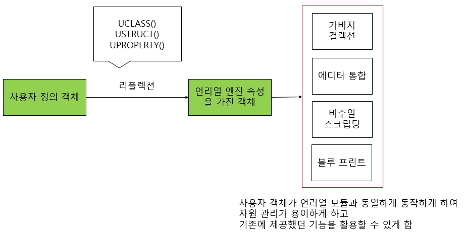


## <strong style="font-size: 36px; color: rgb(255, 255, 255);">3. 느낀점 </strong>
```
스택 메모리 같은 경우 변수의 생존 주기가 끝나면 자동으로 회수가 되기 때문에 
사용자가 따로 할 필요는 없는데 원하는 만큼 못하기 때문에 
힙 메모리를 사용하고 힙 메모리 같은 경우 원하는 만큼 사용 가능하지만 
반드시 시작 했으면 끝을 작성해야한다.
c++에서는 스마트포인터로 new/ delete를 작성하지 않아도 자동으로 메모리 관리할 수 있게 해준다.
스마트 포인트는 총 3종류가 있고 unique같은 경우에는 단일 객체, shared같은 경우 포인터 개수를 카운팅하고 
weak같은경우 shared에서 메모리 누수가 발생할 문제를 해결하는 데 이용한다.
얕은 복사와 깊은 복사가 있는데 일반적으로는 메모리 영역도 같이 복사하는 깊은 복사를 활용하는 것이 좋다
언리얼엔진에서는 메모리 관리를 자동화하기위한 가비지 컬렉션 시스템을 사용한다. 
이를 통해서 메모리 해제를 수동으로 처리하는 부담을 덜고, 메모리 누수같은 메모리 오류를 줄일 수 있다.
리플렉션은 프로그램이 실행 중에 자신의 구조와 상태를 검사하고 수정할 수 있는 능력인데
c++같은 경우는 자체적인 기능이 없어서 언리얼 엔진은 자체적인 리플렉션 시스템을 구축하였다
```
   
## <strong style="font-size: 36px; color: rgb(255, 255, 255);">4. 다음 학습 </strong>
C언어 1-5~1-9 예제 전부 풀기
C++ 2-2 강의 듣기
가능하면 
C++ 1-1~1-6 복습 필요한 부분 복습하기