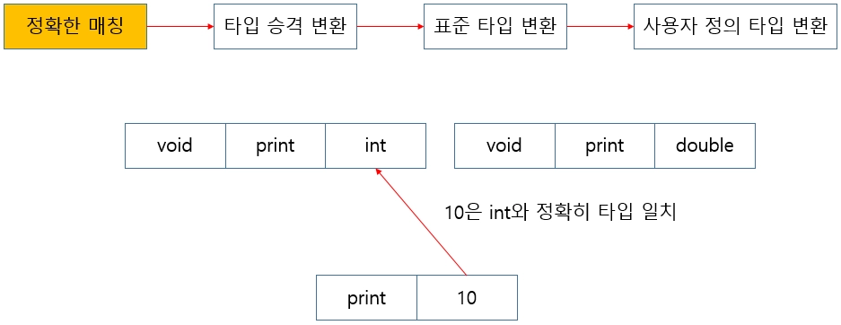
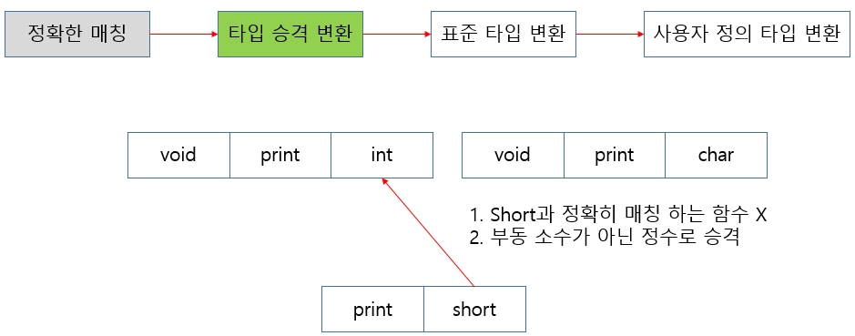
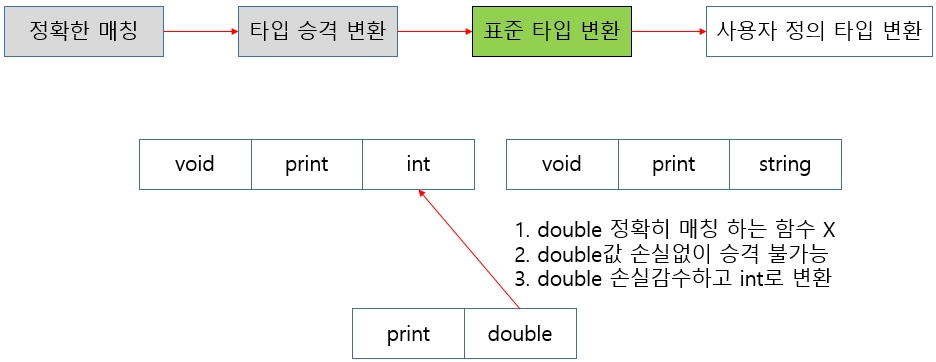
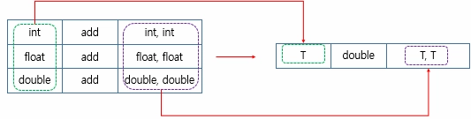
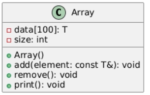

# <strong style="font-size: 50px; color: rgb(255, 255, 255);">2026.03.10.화</strong>

## <strong style="font-size: 36px; color: rgb(255, 255, 255);">1. 학습 키워드</strong>
```
함수 오버로딩, 템플릿, 템플릿 클래스
```

## <strong style="font-size: 36px; color: rgb(255, 255, 255);">2. 학습 내용</strong>
## 함수 오버로딩
```
C++에서는 동일한 이름의 함수를 여러 개 정의 가능하다
C++은 함수 이름과 매개변수 타입 정보를 함께 사용해 구분

네임 맹글링(Name Mangling)
: 함수 이름 구분을 위해 내부적으로 고유한 이름을 부여하는 것
```

```
함수 오버로딩을 적용하려면, 이름이 같아도 각 함수가 명확히 구분해야 한다
함수 오버로딩이 유효해지는 조건 
1️⃣ 매개변수 타입이 다른 경우
2️⃣ 매개변수의 개수가 다른 경우
```

### 오버로딩이 되지 않는 경우
```
1️⃣ 타입 변환이 가능한 매개변수로 인해 두 개 이상의 오버로딩된 함수가 호출 후보가 되는 경우

2️⃣ 디폴트 매개변수로 인해 함수 호출 형태가 중복되는 경우

3️⃣ 매개변수의 타입만 포인터와 배열로 다른 경우

4️⃣ 함수의 반환 타입만 다른 경우
```

### 함수 오버로딩의 순서
```
이미지와 같은 명확한 우선순위 규칙에 따라 호출할 함수를 결정
```


```
1️⃣ 정확한 매개변수 타입 일치 
    호출 인자 타입과 매개변수 타입이 정확히 일치하는 경우
```


```
2️⃣ 타입 승격 변환 
    값이 손실되지 않는 방향으로 변환하는 것을 승격
- `char` or `short` → `int`
- `float` → `double`
- `bool` → `int`
```


```
3️⃣ 표준 타입 변환
    승격보다는 조금 더 광범위
    값 손실 발생 가능성 있음
- `int` → `double`
- `double` → `int`
- `double` → `float`
```


```
4️⃣ 사용자 정의 타입 변환
    클래스 타입의 변환 함수나 생성자 등을 통해 이뤄지는 변환
```

## 템플릿
    템플릿은 타입에 관계없이 일반화된 코드를 작성하기 위한 문법

```
템플릿을 이용한 일반화된 함수는 아래와 같은 형태로 정의
template <typename T>
-> 이 의미는 어떤 타입이 올지 모르겠으나, 그 타입을 T라고 부르겠다는 의미
    이후에는 일반화하려는 타입 자리에 실제 타입 대신 T를 사용
```



## 템플릿 클래스
    함수뿐만 아니라, 클래스도 템플릿으로 사용해 일반화 가능
    ex) 배열에 원소를 추가하고 삭제하는 기능을 가진 클래스를 정의할 때도 템플릿을 활용하여 
    다양한 타입의 데이터에 대해 동작하도록 일반화 가능


### 아래 요구사항에 맞는 템플릿 클래스 `Array`를 만들어 보기


📌내부에 최대 100개 원소를 저장할 수 있는 배열과, 원소 개수를 나타내는 변수를 갖는다.

📌생성자에서 초기 원소 개수는 0으로 한다.

📌`add()` 메서드를 구현한다. 인자를 받고 원소를 배열 맨 끝에 추가한다. 
100개를 초과하면 더 이상 원소를 받지 않는다.

📌`remove()` 메서드를 구현한다. 현재 저장된 원소가 1개 이상이면, 마지막 원소를 제거한다.

📌`print()` 메서드를 구현한다. 현재 저장된 모든 원소를 출력한다.


전체적인 구조 이미지




배열을 템플릿 클래스로 구현
```
// 목적: 클래스 템플릿으로 배열을 일반화하여 원소 추가 및 삭제 기능 구현하기
#include <iostream>
using namespace std;
    
template <typename T>
class Array {
    T data[100];
    int size;
public:
    Array() : size(0) {}
    
    void add(const T& element) {
        if(size < 100)
            data[size++] = element;
    }
    
    void remove() {
        if(size > 0)
            size--;
    }
    
    void print() {
        for(int i = 0; i < size; i++)
            cout << data[i] << " ";
        cout << endl;
    }
};
    
int main() {
    Array<int> arr; // 정수형 배열 생성
    arr.add(10);
    arr.add(20);
    arr.add(30);
    arr.print();
    
    arr.remove();
    arr.print();
    return 0;
}
    
    // 출력결과:
    // 10 20 30
    // 10 20
```

## <strong style="font-size: 36px; color: rgb(255, 255, 255);">3. 느낀점 </strong>
C++ 언어에서는 함수 이름, 매개변수 타입 정보, 인자값으로 동일한 이름의 함수를 여러 개 정의가 가능하다.
하지만 애매모호하거나 이미 있는 경우 불가능하기 때문에 잘 확인해서 사용해야한다.
함수 오버로딩의 순서는 정확한 매개변수 타입이 일치하는 것, 타입 승격 변환, 표준 타입 변환. 사용자 정의 타입 변환이 있다.
템플릿 같은 경우는 타입에 관계없이 일반화된 코드를 작성하기 위해서 사용한다.
템플릿 클래스는 함수뿐만 아니라 클래스도 템플릿으로 사용해서 일반화 할 수 있다.
템플릿 클래스를 이해를 잘해야지 C++언어를 사용할 때 많이 활용하는 STL에 대해서 잘 알 수 있다

## <strong style="font-size: 36px; color: rgb(255, 255, 255);">4. 다음 학습 </strong>
1. 2번 과제 풀기
2. 수업 노션 C++ 3까지 예습