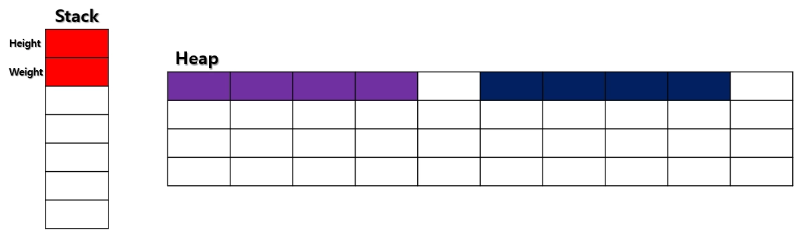
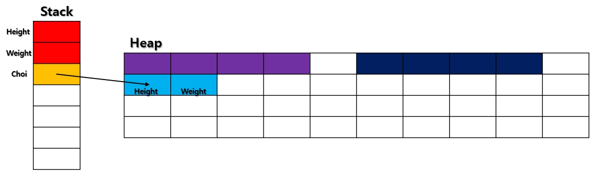
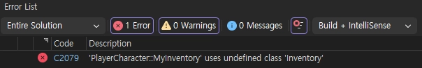

# <strong style="font-size: 50px; color: rgb(255, 255, 255);">2026.03.11.수</strong>

## <strong style="font-size: 36px; color: rgb(255, 255, 255);">1. 학습 키워드</strong>
참조(Reference), nullptr, 생성자, 소멸자, 클래스 전방 선언 

## <strong style="font-size: 36px; color: rgb(255, 255, 255);">2. 학습 내용</strong>

### 네임 스페이스(namespace)
    전역변수/전역함수/클래스 등의 이름 충돌을 피하기 위해서 사용하는 키워드.

### 범위 지정 연산자 ::
    어디에 소속되어 있는지 명시하기 위해 사용하는 연산자.

### using 키워드
    타이핑 양을 줄이기 위해서 사용하는 키워드.
    ex) std:: 같은 것들을 적지 않아도 되게끔 해줍니다.
    하지만 std:: 이런것 ~에를 작성하는 것이 실수를 안하게 해준다

### cin과 >> 연산자
    C언어의 scanf() 함수와 역할이 유사

    cin의 상태 종류
    1️⃣ goodbit : “아무 문제 없음”, “기본 상태”
        
    2️⃣ eofbit : “더이상 읽을 입력 데이터가 없음”

    3️⃣ failbit : “읽고자 하는 입력 데이터의 자료형이나 형식이 맞지 않음”

    4️⃣ badbit : “입력 장치의 심각한 오류”, 거의 일어나지 않음.

### cin.clear() 함수
    eofbit, failbit, badbit을 unset 시켜주는 함수. 즉, good state가 된다.

### cin.ignore() 함수
    파일 끝에 도달하거나 지정한 수 만큼 문자를 버리면 멈춘다.

### 참조(Reference)
    이미 존재하는 변수명에 또 하나의 별명을 붙여주는 문법. 
    즉, 변수의 별명을 지어주는 문법

### 참조는 NULL을 대입할 수 없습니다. 
    포인터는 NULL 대입 가능

### 참조는 선언과 동시에 반드시 초기화 되어야만 합니다. 
    포인터는 초기화 안해도 컴파일 가능

### 참조는 참조하는 대상을 바꿀 수 없습니다. 
    포인터는 참조 하는 대상을 바꿀 수 있습니다.

```
[심화] 참조를 공부할 때 살펴보면 도움 되는 주제.

값에 의한 호출(call by value)
**참조**에 의한 호출(call by **reference**)
다만 여기서의 **참조**는 위에 나온 문법인 **참조**와는 미묘하게 다릅니다.
여기서의 **참조**는 포인터와 **참조** 같은 Indirection 개념 전체
```

### 객체 지향 프로그래밍(Object-Oriented Programming, OOP)
    클래스(설계도)를 통해 만들어진 객체(실체, Object, Instance, 개체)간의 상호작용을 구현하기 위한 프로그래밍
    ex) DNA(클래스)를 통해 사람 A(객체)와 사람 B(객체)가 태어났다(생성되었다).
    사람 A가 사람 B에게 인사한다. 인사를 받은 사람 B가 사람 A에게 인사한다, …
    이러한 상호작용을 구현하기 위한 프로그래밍.

### 클래스(Class) [중요 샘플 코드]
```
// Main.cpp

class 클래스명
{
public:
	멤버변수자료형 멤버변수명;

	반환자료형 멤버함수명(매개변수자료형 매개변수명) {}

};

int main(void)
{
	클래스명 객체이름;

	return 0;
}
```

### C++에서 객체를 생성하는 두 가지 방법
```
// Main.cpp

#include <iostream>

class Human
{
public:
	float Height;

	float Weight;

};

int main(void)
{
	Human Kim;
	Human* Choi = new Human();

	Kim.Height = 170.f;
	Kim.Weight = 58.f;

	Choi->Height = 173.f;
	Choi->Weight = 80.f;

	std::cout << '(' << Kim.Height << ", " << Kim.Weight << ')' << std::endl;
	std::cout << '(' << Choi->Height << ", " << Choi->Weight << ')' << std::endl;

	delete Choi;
	Choi = nullptr;

	return 0;
}
```

```
Human Kim;
객체 Kim은 스택 메모리에 생성됩니다.
지역변수이므로 생명주기가 함수와 같습니다.
```



```
Human* Choi = new Human();
힙 메모리에 공간이 동적 할당되면서 Human 객체가 생성됩니다.
포인터 Choi는 해당 Human 객체의 시작 메모리 주소를 담고 있게 됩니다.
주의할 점은 지역변수 Choi는 스택메모리, Human 객체는 힙메모리에 존재한다는 것
```



### new를 사용한 뒤에는 반드시 delete

### 접근 제어자(Access Modifier)
    어디에서 접근 하느냐에 따라 접근을 제어해주는 키워드.
    1️⃣ public : 어디에서나 접근 가능

    2️⃣ protected : 클래스의 멤버 함수와 자식 클래스의 멤버 함수 내에서 접근 가능

    3️⃣ private : 클래스의 멤버 함수에서만 접근 가능

```
기본 접근 제어자
C++에서 구조체를 선언 및 정의하고 접근 제어자를 안쓰면 기본적으로 public,
클래스를 선언 및 정의하고 접근제어자를 안쓰면 기본적으로 private 접근 제어자
```

## 생성자(Constructor)
    객체가 만들어질 때 자동으로 호출되는 함수.
    내가 직접 호출하기도 하고(명시적 호출), 컴파일러가 호출하기도 합니다.(암시적 호출)


### 기본 생성자(Default Constructor)
    클래스에 생성자가 없으면 컴파일러가 기본 생성자를 자동적으로 만들어 줍니다.
    기본 생성자는 매개변수를 받지 않습니다.
    생성자가 이미 정의 있는 경우에는 기본 생성자를 구현하지 않습니다.

## 오버로딩
    같은 이름이지만 매개변수 목록은 다르게 함수를 재정의하는 것.

### 생성자 오버로딩
    생성자인데, 매개변수 목록을 다양하게해서 재정의 할 수 있습니다.
    이를 생성자 오버로딩

## 소멸자(Destructor)
    객체가 소멸될 때 자동으로 호출되는 함수.
    ex) delete 호출, 함수 종료에 따른 스택 프레임 반환 등

### [심화] RAII(Resource Acquisition Is Initialization)
```
C++에서는 객체에게 필요한 자원을 생성자에서 획득하게끔하고,
소멸자에서 획득한 자원을 해제하도록 설계하는 것이 필수적입니다.
즉, 자원을 획득한 주체가 정리까지도 맡게끔 합니다.
이를 RAII라고 하며, C++ 메모리 관리의 핵심 철학
```
### C언어에서의 malloc() / free() Vs. C++의 new / delete
    가장 큰 차이점은 new / delete는 생성자 / 소멸자가 자동으로 호출된다는 점

### const 멤버 함수
    함수 내부에서 클래스의 멤버 변수를 수정하지 못하는 함수.
    주로 출력만 하는 함수라던가 getter 함수에서 자주 쓰입니다. 

### 캡슐화와 Getter / Setter

```
OOP 원칙 중에는 캡슐화라는 것이 있습니다.
캡슐화란 객체의 멤버 변수를 외부에서 직접 접근 할 수 없게 만들어서 보호합니다.
꼭 필요한 경우, 읽고 싶을 때는 Getter 함수를 통해 읽고 
쓰고 싶을 때는 Setter 함수를 통해 씁니다.
```

### Getter / Setter의 장점

## 클래스 전방 선언
    어떤 클래스가 “어딘가에는” 정의되어 있을 것이라고 컴파일러에게 알리는 구문. // 함수 전방선언과 동일한 역할

### 클래스 전방선언이 모든걸 해결해줄까?

```
아닙니다. 전방선언 되었다 한들, 전방선언된 클래스의 크기까지 알 순 없기 때문입니다.
위 예제에서는 PlayerCharacter 클래스가 컴파일되며 해당 클래스의 크기가 결정되어야 하는데,
멤버 변수로 가지고 있는 Inventory 객체가 값 자료형입니다. 근데 Inventory 클래스의 크기를 모름. 전방선언으론 알 수 없습니다.
결론은 클래스 전방선언으로 포인터는 가능하지만, 값 자료형으로는 안됩니다.
값 자료형 전에 해당 클래스의 크기까지 알 수 있게끔 해야합니다. 방법은 두 가지입니다.
```
```
1️⃣ 쓰기 전에 해당 클래스가 미리 정의되어 있어야 합니다.
2️⃣ 헤더 파일을 인클루드 합니다.
```



```
하나의 헤더파일만 수정되어도 모든 클래스들이 영향을 받고 재컴파일 되게 됩니다.

그러니 객체 포인터 자료형이라면 전방선언을 최대한 해주고,
어쩔 수 없이 객체 값 자료형을 써야 할 때는 인클루드 하는 방식을 추천
```

### friend 키워드
```
다른 클래스나 다른 함수에서 내 클래스의 private 혹은 protected 멤버에 접근 할 수 있게 허용해줍니다.
”베스트 프렌드(다른 클래스나 다른 함수)는 내 모든 걸 알고 있고 가져가도 된다!”
```

```
Human 클래스에서 friend 키워드로 Pet 클래스를 지정했다고 해봅시다.
그럼 Pet도 Human 클래스를 friend 키워드로 지정한 효과가 날까요?

아닙니다. 따로 작성하지 않는 이상, 단방향성임에 주의
```

## 오버로딩(Overloading)    
    같은 이름이지만 매개변수 목록은 다르게 함수를 재정의하는 것을 “오버로딩”

### 함수를 비슷하게 다시 작성하는 경우에는 총 세 가지 경우
```
1️⃣ 함수 중복 정의(컴파일 에러)
    같은 반환 자료형, 같은 이름, 같은 매개변수 목록으로 함수를 다시 정의하는 경우.

2️⃣ 함수 오버라이딩
    같은 반환 자료형, 같은 이름, 같은 매개변수 목록으로 
    부모 클래스의 멤버 함수를 다시 정의하는 경우.

3️⃣ 함수 오버로딩
    같은 이름, 다른 매개변수 목록으로 함수를 다시 정의하는 경우.
    반환 자료형은 오버로딩의 판단 기준이 아님.
```

### 함수 오버로딩 매칭
```
오버로딩된 함수 중에 어떤 함수를 호출해야 하는지 판단하는 과정.
함수 매칭 결과는 3가지가 있습니다.
첫 번째, 가장 적합한 함수를 하나 찾은 경우 -> 정상 작동
두 번째, 매칭 되는 함수를 여러 개 찾은 경우 -> 컴파일 에러
세 번째, 매칭 되는 함수를 찾을 수 없는 경우 -> 컴파일 에러
```

## <strong style="font-size: 36px; color: rgb(255, 255, 255);">3. 느낀점 </strong>


## <strong style="font-size: 36px; color: rgb(255, 255, 255);">4. 다음 학습 </strong>
c++언어 4~10 예습
복습
 