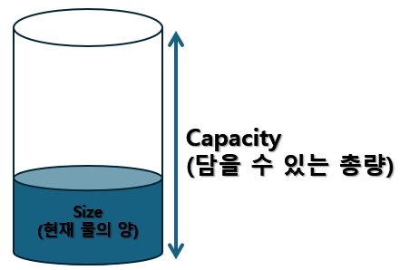

# <strong style="font-size: 50px; color: rgb(255, 255, 255);">2026.03.12.목</strong>


## <strong style="font-size: 36px; color: rgb(255, 255, 255);">1. 학습 키워드</strong>
```
상속, 다형성, 가상함수, 템플릿, 벡터,

고정폭 정수형, enum class
```

## <strong style="font-size: 36px; color: rgb(255, 255, 255);">2. 학습 내용</strong>

### 상속(Inheritance)
```
공통 기능을 부모에 모아두고 자식이 그걸 기반으로 확장하는 방식
자식 클래스는 부모 클래스의 멤버 변수와 멤버 함수를 그대로 사용할 수 있으면서,
본인 클래스만의 멤버 변수와 멤버 함수도 추가 가능
```

### 상속 필요 이유 
```
1. 코드 재사용성
   : 똑같은 멤버 변수와 독같은 멤버 함수들을 가진 두 클래스가 있다면 해당 멤버 변수와 멤버 함수를 
     부모 클래스로 묶기 가능

2. 확장성
    : 공통 부분은 부모클래스, 자식 클래스만의 멤버 함수와 멤버 변수들을 가지면서 자식 클래스의 기능 확장 가능

3. 유지보수에 유리
    : 공통 부분을 부모 클래스에 묶어두면, 부모 클래스 한 곳만 수정하면
      많은 자식 클래스의 부분에도 자동으로 적용
      but 영향을 미치는 곳이 많기 때문에 잘못 바꾸면 단점, 잘 사용하면 장점
```

### 자식 클래스 정의 방법
```
class 자식클래스명 : public 부모클래스명
{
};  //  세미콜론 잊지마!

class cat : public Animal
{
};
```

### 멤버 함수와 멤버 변수
```
OOP에서 멤버 함수는 해당 객체의 "행동" OR "동작"
       멤버 변수는 해당 객체의 "속성"
```
```
class Animal
{
public:
	void MakeSound();
	
	void Eat();
		// 동물이라면 할만한 행동들을 멤버 함수로 정의

public:
	unsigned int Age;
		// 동물이라면 가질만한 속성들을 멤버 변수로 정의
};
```

### 상속 관계에서 생성자/소멸자
```
상속 관계면, 자식 클래스의 객체가 생성,제거될 때 부모 클래스의 생성자와 소멸자도 같이 호출
생성자는 부모 먼저
소멸자는 자식 먼저
```

### 다형성
```
자료형은 부모 자료형으로 같으나, 실제 멤버 함수는 다른 멤버 함수가 초출되는 성질
```

### 다형성을 구현하는 방법
```
// Animal.h

#pragma once

class Animal
{
public:
	Animal();
	
	virtual ~Animal();

	//void MakeSound();
	virtual void MakeSound();
		// 자식 클래스마다 행동을 다르게 구현해야하는 멤버 함수 앞에 virtual 키워드를 붙여 줍니다.

	//void Eat();
	virtual void Eat();
		// virtual 키워드가 붙은 멤버 함수를 "가상 함수"라고 합니다.
	
};
```

```
// Dog.h

#pragma once

#include "Animal.h"

class Dog : public Animal
{
public:
	Dog();

	virtual ~Dog();

	virtual void MakeSound();
		// 부모 클래스의 가상 함수를 재정의합니다. 이를 "오버라이드(Override)"라고 합니다.

	virtual void Eat();

};

```

### 가상함수
```
OOP에서의 가상 : "뭘 할지 정해진게 없다"를 의미한다. 
”자식들 중 누가 호출하는지에 따라 다른 로직이 수행된다.”
```

### 순수 가상 함수
```
무조건 이 행동을 자식 클래스에서 정의하게끔 강제가 필요할 때
순수 가상 함수 문법 사용
순수 가상 함수는 자식 클래스에서 구현하지 않으면 컴파일 에러가 난다.
```

```
순수 가상 함수를 의역
: 부모 클래스에서는 정의 못하겠고, 자식들 중 누가 호출하는지에 따라 다른 로직이 수행된다.
```


```
// Animal.h

#pragma once

class Animal
{
public:
	Animal();

	virtual ~Animal();

	virtual void MakeSound();

	//virtual void Eat();
	virtual void Eat() = 0;
		// 가상 함수의 맨 뒤에 '= 0'을 붙이면 순수 가상 함수가 됩니다.

};

```

### 추상 클래스 
```
순수 가상 함수를 1개 이상 가지고 있는 클래스를 추상 클래스
추상 클래스는 객체 생성 불가
쉽게 하면, 클래스에 정의할 수 없는 함수가 있는 클래스
```

### C++ std::string 필요성
```
std::string은 필요에 따라 길이가 변할 수 있다
게다가 문자열을 수정할 수 있는 여러 API도 제공해줌
```

### 템플릿
```
함수나 클래스를 개별적으로 작성하지 않아도 여러 자료형으로 사용할 수 있게 해준다
하지만 템플릿을 인스턴스화 할 때마다 컴파일러가 내부적으로 코드를 생성하기 때문에 적절하게 이용하는 것이 중요하다.
```

### 함수 템플릿 문법
```
// template <typename T> <함수선언>;
// template <class T> <함수선언>;

template <typename T>
T Add(T InA, T InB)
{
    // ...
}

template <class T>
T Add(T InA, T InB)
{
    // ...
}
```

```
함수 템플릿을 호출할 때 템플릿 인자를 생략 가능
Add<int>(3, 10);
Add(3, 10); // 자료형을 추측해서 코드를 만들어 줍니다.
```

### 클래스 템플릿 1
```
// MyArray.h

#pragma once

template <typename T>
class MyArray
{
	enum 
	{ 
		MAX = 1024 
	};

public:
	MyArray() // 템플릿 클래스는 생성자 또한 헤더 파일에 정의해줘야 합니다.
		: Capacity(static_cast<size_t>(MAX))
		, Size(0)
	{
	}

	inline size_t GetCapacity() const 
	{ 
		return Capacity; 
	}

	inline size_t GetSize() const 
	{ 
		return Size; 
	}

	inline T GetData(size_t InIndex) const 
	{ 
		return Data[InIndex]; 
	}

	inline void SetData(size_t InIndex, T InData) 
	{ 
		Data[InIndex] = InData; 
	}

	bool Add(T InData) // 방법 01. 클래스 내에 정의.
	{
		if (Size < Capacity)
		{
			Data[Size] = InData;
			++Size;
			return true;
		}

		return false;
	}

private:
	T Data[MAX];

	size_t Capacity;

	size_t Size;

};

// 방법 02. 클래스 외부이지만 헤더파일에 정의.
/*
template<typename T>
bool MyArray<T>::Add(T InData)
{
	if (Size < Capacity)
	{
		Data[Size] = InData;
		++Size;
		return true;
	}

	return false;
}
*/
```

```
// MyArray.cpp

#include "MyArray.h"
```

```
// Main.cpp

#include <iostream>
#include "MyArray.h"

int main()
{
	MyArray<int> IntArray;
	IntArray.Add(11);
	IntArray.Add(22);
	IntArray.Add(33);
	IntArray.Add(44);
	IntArray.Add(55);
	IntArray.Add(66);
	IntArray.Add(77);

	return 0;
}

```

### 클래스 템플릿 2
```
// MyArray.h

#pragma once

template <typename T>
class MyArray
{
	enum 
	{ 
		MAX = 1024 
	};

public:
	MyArray()
		: Capacity(static_cast<size_t>(MAX))
		, Size(0)
	{
	}

	inline size_t GetCapacity() const 
	{ 
		return Capacity; 
	}

	inline size_t GetSize() const 
	{ 
		return Size; 
	}

	T GetData(size_t InIndex) const;

	void SetData(size_t InIndex, T InData);

	bool Add(T InData);

private:
	T Data[MAX];

	size_t Capacity;

	size_t Size;

};

template <typename T>
bool MyArray<T>::Add(T InData)
{
	if (Size < Capacity)
	{
		Data[Size] = InData;
		++Size;
		return true;
	}

	return false;
}

template <typename T>
T MyArray<T>::GetData(size_t InIndex) const
{
	if (InIndex < Size)
	{
		return Data[InIndex];
	}
	return T();
}

template <typename T>
void MyArray<T>::SetData(size_t InIndex, T InData)
{
	if (InIndex < Size)
	{
		Data[InIndex] = InData;
	}
}
```

```
// MyArray.cpp

#include "MyArray.h"
```

```
// Main.cpp

#include <iostream>
#include "MyArray.h"

int main()
{
	MyArray<int> IntArray;
	IntArray.Add(11);
	IntArray.Add(22);
	IntArray.Add(33);
	IntArray.Add(44);
	IntArray.Add(55);
	IntArray.Add(66);
	IntArray.Add(77);

	size_t IntArraySize = IntArray.GetSize();
	std::cout << "IntArray's size: " << IntArraySize << std::endl;

	for (size_t i = 0; i < IntArraySize; ++i)
	{
		std::cout << "IntArray[" << i << "]: " << IntArray.GetData(i) << std::endl;
	}

	return 0;
}
```

### 템플릿 - 클래스 - 객체
```
클래스를 통해 객체를 생성해 낼 수 있습니다.
템플릿을 통해서 클래스를 생성해 낼 수 있습니다.
템플릿은 클래스 뿐만 아니라, 함수도 찍어낼 수 있습니다.
```

### 템플릿 프로그래밍의 단점.
```
1. 템플릿 클래스가 정의된 헤더 파일을 많은 곳에서 인클루드 하고 있고,
    인스턴스화로 인한 헤더 파일 수정이 발생한다면
    인클루드 하고 있는 모든 파일이 다시 재컴파일 된다. 이로인해 컴파일 시간이 길어질 수 있다
2. 템플릿 인스턴스화로 인해 코드 길이 증가, 사용자 정의 클래스마저 인자로 받는다면,
    헤더 파일 코드가 기하급수적으로 늘어나고, 이는 exe 파일의 거대화를 초래한다.
```

### Standard Template Library(STL)
```
메모리 자동 관리가 제공되는 자료구조 라이브러리
템플릿 프로그래밍 기반이라, 다양한 자료형의 데이터들을 저장
STL 자료구조에는 벡터(Vector) / 맵(Map) / 셋(Set) / 스택(Stack) / 큐(Queue) / 리스트(List) 등이 있으나,
벡터와 맵 정도만 쓰이고, 셋이 아주 가끔 쓰이는 편
STL 자료구조는 다른 말로 “컨테이너
```

### 회사 내부에서 만드는 STL 대체품들
```
많은 회사들이 자신만의 컨테이너를 만들어 STL을 대체하기도 합니다.
따라서 STL을 어느정도 공부하시면, 거의 대부분 비슷하게 동작하므로 빠르게 적응 할 수 있습니다.
Unreal Engine: TArray, TMap, TMultiMap, TSet.
    언리얼 엔진의 객체들을 전용 컨테이너.
EA의 EASTL: STL과 호환됩니다. 메모리 문제 등을 고친 컨테이너
```

### 벡터(vector)
```
데이터 개수가 증가함에 따라 자동으로 메모리를 관리해주는 배열. 동적 배열.
배열이기 때문에 그 안에 저장된 모든 요소들은 연속된 메모리 공간에 위치
또한 어떤 요소에도 임의로 접근(Random access)이 가능
```

### push_back() 함수
```
vector의 맨 뒤에 요소를 추가

Scores.push_back(30);
Names.push_back("Navi");
MyCats.push_back(NewCat);
```

### pop_back() 함수
```
vector의 맨 뒤에 있는 요소를 제거합니다
단, 비어 있는 vector에 pop_back() 함수를 호출하면 런타임 오류가 발생할 수 있습니다.

Scores.pop_back();
```

### 벡터의 capacity, size
```
capacity() 함수 : 저장 가능한 최대 요소 개수를 반환

size() 함수 : 현재 저장된 요소 개수를 반환

Scores.capacity();
Scores.size();
```



### reserve(size_t _Newcapacity)
```
vector의 현재 capacity를 수정합니다.

_Newcapacity가 기존 capacity보다 작은 경우(_Newcapacity < capacity)에는 아무 일도 발생하지 않습니다.
_Newcapacity가 기존 capacity보다 큰 경우(capacity < _Newcapacity)에는 메모리 재할당이 발생합니다.
단, 값 초기화는 해주지 않습니다.

Scores.reserve(10u);
```

### 벡터의 size가 커지다가 capacity를 넘어서게 되면 어떻게 될까요?
```
더 넓은 메모리를 동적할당하고, 그 곳으로 기존 데이터를 모두 복사해갑니다.
당연히 이런 재할당이 빈번하면 큰 비용이 들어갑니다.
따라서 벡터를 사용할 때는 처음부터 어느정도 크게 잡고 사용하는 것이 바람직합니다.
그래야 불필요한 재할당 및 복사를 막을 수 있습니다.
이때 사용하는 함수가 reserve() 함수입니다.
```

### resize(const size_t _Newsize)
```
vector의 현재 size를 수정합니다. 새로 생긴 데이터는 0에 준하는 값으로 초기화 해줍니다.

_Newsize가 기존 size보다 작은 경우(_Newsize< size)에는 초과분을 삭제합니다.
_Newsize가 기존 capacity보다 큰 경우(capacity < _Newsize)에는 메모리 재할당이 발생합니다.

Scores.resize(10u);
```

### clear() 함수
```
vector를 싹다 지웁니다. 크기(size)는 0이 되고 용량은 변하지 않습니다.

Scores.clear();
```

### assign(size_t n, T x);
```
n개의 x 값을 벡터에 대입

std::vector<int> D1Vector;
D1Vector.assign(16u, 100); // 16 크기(size)의 공간을 모두 100으로 초기화.

std::vector<std::vector<float>> D2Vector;
D2Vector.assign(4u, vector<float>(8u, 0.f)); // 4 x 8 2차원 배열을 모두 0.f로 초기화
```

### 기본 자료형과 바이트 크기
```
아래 자료형들의 바이트 크기는 얼마일까요?
char / 1바이트
short / 2바이트
long / 4바이트
long long / 8바이트
 int / 4바이트
왜 이런 것들을 외워야 할까요?
```

### 고정폭 정수형
```
C++11에서 아래와 같은 고정폭 정수형 자료형이 지원됩니다.
int8_t / uint8_t
int16_t / uint16_t
int32_t / uint32_t
int64_t / uint64_t
intptr_t / uintptr_t
...
```

### 고정폭 정수형은 정수 자료형의 크기를 보장
```
부가적으로 가독성까지 좋아졌습니다.

int8_t Score = Human01->GetID();
```

### enum
```
기존의 enum은 enum 멤버를 int형 변수에 대입하는 것도,
다른 enum 멤버와의 비교도 가능했었습니다. 즉, 엉망이 될 수 있습니다.
```

### enum class
```
C++11부터 지원합니다.
독자적인 자료형으로 지원됩니다.
정수형으로의 암시적 캐스팅이 없습니다. 필요하다면 프로그래머가 명시적으로 캐스팅 해야합니다.

enum class에는 기저 정수형을 지정할 수도 있습니다.
ex) enum class 열거형명 : uint8_t과 같은 식으로 지정 가능하며 8비트 크기로 제한
```

### enum에 할당할 바이트 크기를 정하는 방법.
```
#include <cstdint> // uint8_t를 위한 인클루드

enum class EPosition : uint8_t
{
    TOP,
    JUNGLE,
    MID,
    SUPPORT,
    BOTTOM = 0x100 
	    // 컴파일 경고가 나면서 8비트 부분만 떼서 0으로 저장되거나,
	    // 컴파일 에러가 날 수도 있습니다.
};
```

### 이제는 enum 대신에 enum class를 사용하자!


## <strong style="font-size: 36px; color: rgb(255, 255, 255);">3. 느낀점 </strong>
상속을 통해서 코드를 재사용하고 확장하며 나중에 유지보수에 유리할 수 있지만 잘 사용하면 좋지만
잘못 사용할 경우 독이니 꼼꼼히 생각하고 필요한 경우 잘 사용해야겠다.
순수 가상함수로 반드시 필요한 행동일 경우 사용하고 자식 클래스에서 구현해야지 컴파일 에러가 안 난다.
템플릿의 경우 다양한 자료형을 활용할 경우에는 용이하게 사용할 수 있지만 작은 수의 자료형만 필요한데 템플릿을 사용하면
오히려 코드를 방대하게 만들기 때문에 적절하게 사용해야겠다.
오늘 배운 내용들 같은 경우 잘 사용하면 약이고 잘못 사용하면 독이기 때문에 공부를 열심히 하고 코드도 많이 작성하면서
직접 체드시키고 응용하는 개발자가 되야겠다.
   
## <strong style="font-size: 36px; color: rgb(255, 255, 255);">4. 다음 학습 </strong>
지금까지 배운 C, C++ 라이브세션 복습하기!
예제 풀어보기!