# <strong style="font-size: 50px; color: rgb(255, 255, 255);">2026.03.13.금</strong>

## <strong style="font-size: 36px; color: rgb(255, 255, 255);">1. 학습 키워드</strong>
```
STL, 컨테이너, 알고리즘, 반복자
```


## <strong style="font-size: 36px; color: rgb(255, 255, 255);">2. 학습 내용</strong>

### STL
```
STL(Standard Template Library)은 C++ 표준 라이브러리의 일부로, 컨테이너, 알고리즘, 반복자 등의 템플릿 기반 구성 요소를 포함
STL을 활용하면 다양한 자료구조와 알고리즘을 직접 구현하지 않고도, 사용 가능하다
```

### 컨테이너
```
컨테이너는 데이터를 담는 자료구조
데이터를 담는 방식이나 제공하는 메서드에 따라 여러 가지 컨테이너를 제공
```

```
1️⃣ 모든 컨테이너는 템플릿으로 구현되어 있으므로, 다양한 타입의 데이터를 저장 가능
```

```
2️⃣ 모든 컨테이너는 메모리 관리를 내부적으로 한다
따라서 사용 시 메모리 해제를 직접 고려하지 않아도 됨
```

```
3️⃣ 대부분 컨테이너는 반복자를 제공
따라서 내부 구현을 몰라도 동일한 방식으로 컨테이너를 순회 가능
```
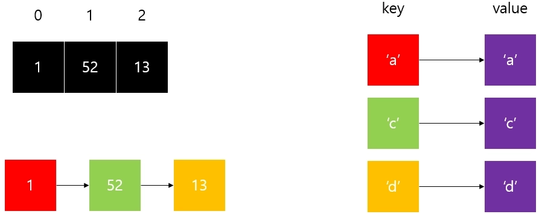

### 벡터
```
벡터는 배열과 매우 유사한 컨테이너
```

### 백터의 대표적인 특징
```
1️⃣ 템플릿 클래스로 구현되어 특정 타입에 종속 x
```

```
2️⃣ 삽입되는 원소 개수에 따라 내부 배열의 크기가 자동으로 조정
```

```
3️⃣ 임의 접근이 가능. (인덱스를 통해 특정 위치에 접근)
```

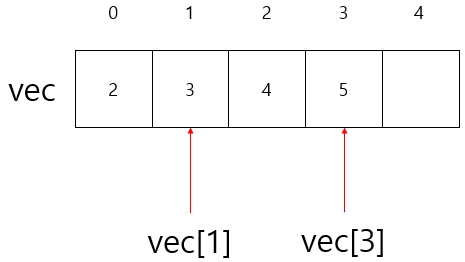

```
4️⃣ 삽입 / 삭제는 맨 뒤에 하는 게 좋습니다. 
(중간 삽입 / 삭제는 배열 복사가 필요하므로 비효율적)
```
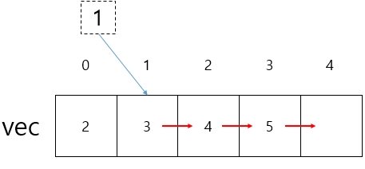

### 벡터의 선언 

```
1️⃣ 빈 벡터를 선언하거나 특정 값으로 초기화하는 코드입
`vec`는 빈 벡터이므로 크기가 0이고, `vec2`의 크기는 5이며 모든 값이 10 이다.
```
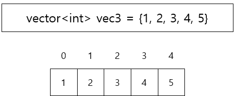
    
```
2️⃣ 초기화 리스트를 사용하여 백터를 선언하는 코드
특정 값으로 벡터를 초기화할 때 자주 사용
초기화하는 원소의 개수가 적을 때 주로 활용
```


```
3️⃣ 다른 벡터의 복사하거나 대입하는 방법도 있습니다.
기존에 생성된 벡터의 복사본을 만들 때 많이 사용
```
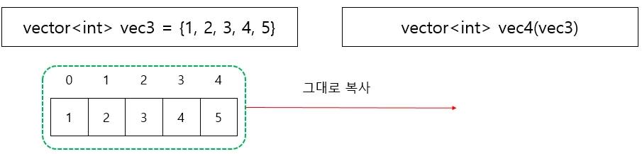


```
4️⃣ 2차원 배열처럼 벡터를 사용하려면, 벡터의 타입을 벡터로 하면 됩니다.
아래와 같이 하면 2차원 벡터처럼 사용할 수 있습니다
```
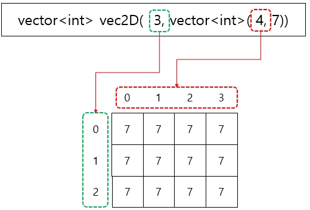
```

### 벡터의 동작

```
1️⃣ push_back
    벡터의 맨 끝에 원소를 추가하는 메서드입니다.
    원소의 개수가 늘어남에 따라 크기는 자동으로 증가하므로, 
    별도의 메모리 관리를 신경 쓸 필요가 없습니다.
```
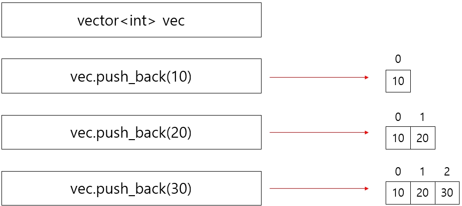

```
2️⃣ pop_back
    벡터의 맨 끝에 원소를 제거하는 메서드입니다.
    맨 끝 원소가 제거되면 벡터 크기가 자동으로 줄어듭니다.
```
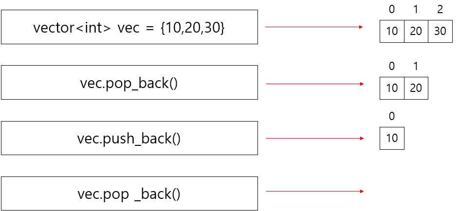

```
3️⃣ size
    현재 벡터의 크기(원소 개수)를 확인할 때 사용하는 메서드입니다.
    보통 벡터의 전체 원소를 대상으로 반복문을 돌릴 때 유용하게 쓰입니다.
```
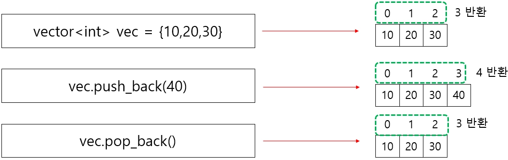

```
4️⃣ erase
    특정 위치(또는 구간)의 원소를 제거하는 함수입니다.  
    벡터는 내부적으로 배열을 사용하므로, 중간 원소를 삭제할 때, 
    많은 원소를 옮겨야 할 수 있습니다.   
    따라서 시간 복잡도가 커질 수 있으므로, 자주 사용하지 않는 것이 좋습니다.

    # 벡터의 성능을 떨어뜨려서 사용하지 않는 것이 좋다
```
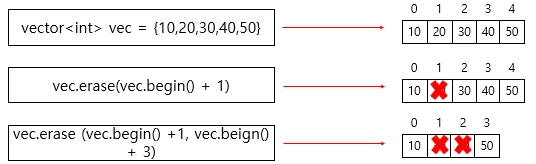

### 맵
```
특정 키를 사용하여 값을 검색하는 기능을 제공하는 컨테이너가 바로 맵
```

```
배열은 정수형 인덱스를 활용하여 특정 위치의 값을 빠르게 찾아주지만,
맵은 키를 활용하여 값과 쌍으로 저장하고 검색합니다.
맵은 이러한 기능을 제공하는 대표적인 연관 컨테이너
```

### 맵의 주요한 특성
```
1️⃣ 키-값 쌍은 `pair<const Key, Value>` 형태로 저장됩니다.
```

```
2️⃣ 키값을 기준으로 내부 데이터가 자동으로 정렬됩니다.
```

```
3️⃣ 중복된 키값을 허용되지 않습니다.
```

### 맵의 선언
```
맵을 선언할 때는 키-값 쌍을 저장하기 위해 키 타입과 값 타입 두 가지를 지정해야 합니다.
이 두 타입은 동일할 수도 있고, 서로 다를 수도 있으며, 키 타입은 비교 연산이 가능해야 합니다.
```

### 맵의 동작
```
맵에서 제공하는 많은 함수 중, 가장 많이 사용되는 것
```

```
1️⃣ `map`은 `key` 순으로 오름차순 정렬됩니다.
    이는 사용자가 별도로 정렬을 수행하지 않아도, 삽입 및 삭제가 이루어질 때마다 내부적으로 정렬 상태를 유지하기 때문입니다.

    아래와 같이 `myMap`을 하나 선언합니다.
    `myMap`은 키의 타입은 정수형이고 값의 타입은 문자열인 맵입니다.
    `myMap[키] = 값`을 하게 되면 `키-값` 쌍이 하나 만들어지고 자동으로 키 순으로 관리됩니다.
```
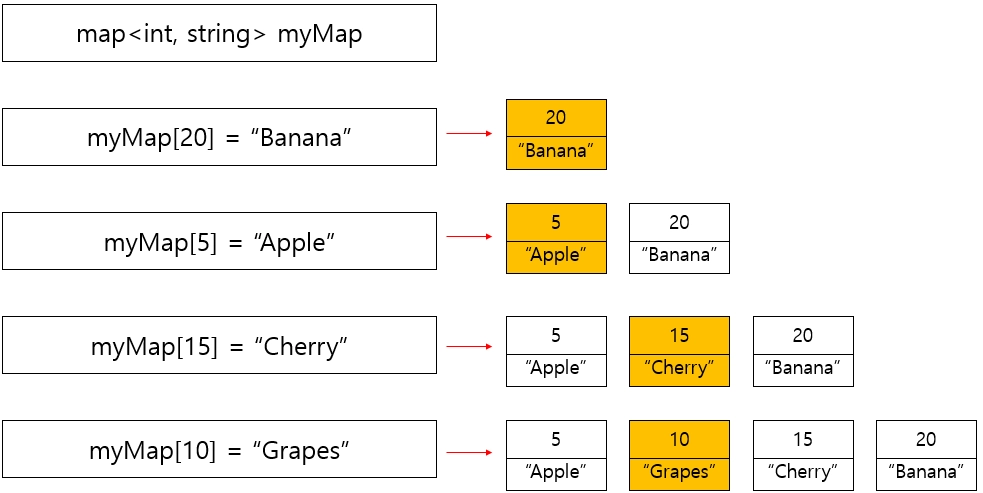

```
 2️⃣ insert()
    make_pair()를 이용하여 pair 객체를 생성한 후 insert 함수를 사용할 수 있습니다.
    또한 {}를 활용한 방법이나 []를 사용하여 값을 추가할 수도 있습니다.
```

```
3️⃣ find()
find 메서드를 사용하면 특정 키가 map에 존재하는지 확인할 수 있습니다.
find는 키가 존재하면 해당 키의 이터레이터를 반환하고, 존재하지 않으면 map.end()를 반환합니다. (이터레이터는 뒤에서 배웁니다.)
```
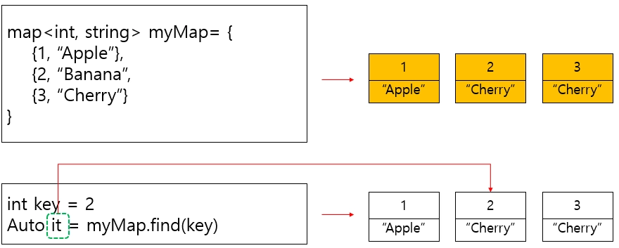

```
4️⃣ size()
    맵에 키-값 쌍의 개수를 반환하는 함수입니다. 
```
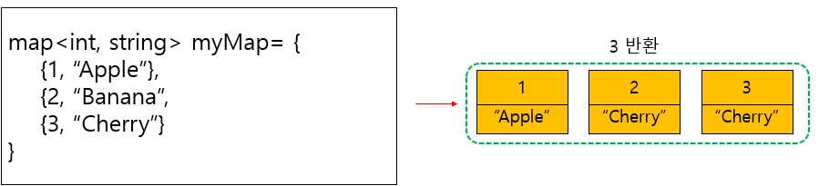

```
5️⃣ erase(key)
    맵의 특정 key를 가진 요소만 삭제합니다.
```
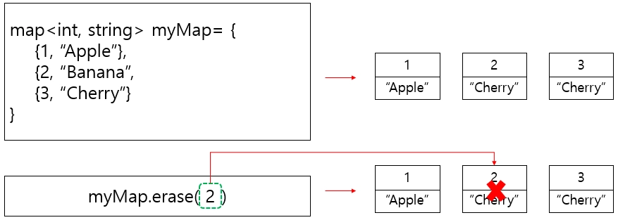

```
6️⃣ clear
    맵에 있는 모든 원소를 삭제하는 함수입니다. 
    clear는 맵뿐 아니라 대부분 컨테이너에 존재합니다.
```
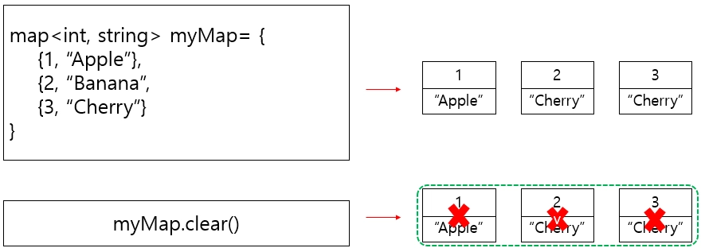

### 알고리즘
```
`STL`은 다양한 컨테이너와 독립적으로 동작하는 범용 알고리즘을 제공합니다.

예를 들어, 특정 원소 값을 찾거나, 정렬을 하는 등의 기능을 표준 라이브러리에서 
바로 사용할 수 있습니다.

더 좋은 점은 특정 컨테이너의 내부 구현을 몰라도 동일한 방식으로 알고리즘을 
적용할 수 있다는 것입니다.

이것이 가능한 이유는 반복자 덕분입니다. 
반복자는 컨테이너의 요소를 추상화하여 일관된 방식으로 접근할 수 있도록 도와줍니다.

반복자에 대한 내용은 뒤에서 자세히 학습하고, 지금은 `STL`에 이런 기능이 있구나! 
정도로 가볍게 살펴보시면 좋겠습니다.
```

### sort
```
컨테이너 내부의 데이터를 정렬하는 함수입니다.
기본 타입(int, double 등)의 경우 사용자 정렬 함수 없으면 오름차순으로 정렬됩니다.
또한 사용자 정렬 함수를 정의할 수도 있습니다.

엄밀히 말하면 사용자 정렬 함수는 인자를 1개 받는 경우와 2개 받는 경우가 있으나, 이 수업에서는 2개를 받는 경우만 다루도록 하겠습니다.

사용자 정렬 함수 comp(a, b) 구현 시 알아두어야 할 것은 아래와 같습니다.
```

```
1️⃣ 현재 컨테이너에서 첫 번째 인자 a가 앞에 있는 원소를 의미합니다.
```

```
2️⃣ `comp(a, b)`가 true 이면 a와 b의 순서는 유지됩니다. 
만약 false인 경우 a와 b의 순서를 바꿉니다.
```

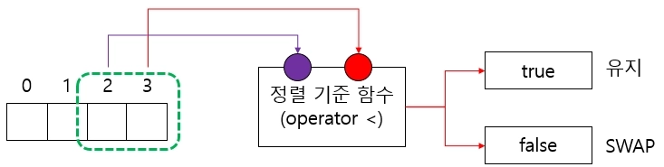

### find
```
find는 컨테이너 내부에서 특정 원소를 찾아 해당 원소의 반복자를 반환하는 함수입니다.
세부 동작은 아래와 같습니다.
find(first last, 찾을 값)과 같이 사용하며, 세부 사항은 아래와 같습니다.
```

```
1️⃣ `find(first, last)`가 탐색 대상입니다.
```

```
2️⃣ 원소를 찾은 경우 해당 원소의 반복자를 반환합니다.
```

```
3️⃣ 원소를 찾지 못한 경우 `last` 반복자를 반환합니다
```

### 반복자
```
지금까지 컨테이너와 알고리즘에 대해서 알아봤습니다.
컨테이너의  내부 구조는 서로 다르지만, 
우리는 대부분 알고리즘을 동일한 코드를 활용해서 사용할 수 있었습니다.

즉 컨테이너 구현 방식에 의존하지 않고(내부 구현을 몰라도) 알고리즘을 활용하는데 문제가 없습니다.
이는 반복자를 기반으로 알고리즘이 동작하기 때문입니다.
반복자는 컨테이너의 요소에 대한 일관된 접근 방법을 제공하므로, 알고리즘이 특정 컨테이너의 내부 구현과 무관하게 동작할 수 있습니다.
```
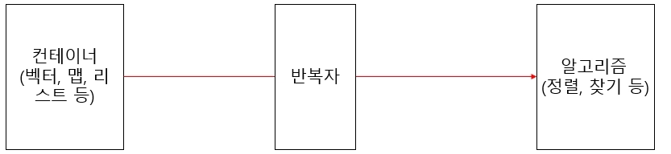

### 순방향 반복자
순방향 반복자는 앞에서부터 뒤로 순차적으로 순회하는 반복자입니다.

```
1️⃣ `begin()`은 컨테이너의 첫 번째 원소를 가리키는 반복자입니다.
```
```
2️⃣ `end()`는 컨테이너의 마지막 원소 다음을 가리키는 반복자입니다.
```
`end()`를 마지막 원소 다음을 가리키도록 정한 이유는 아래와 같습니다.
```
1️⃣ 일관된 반복 구조 유지합니다.
```
```
2️⃣탐색 실패를 쉽게 표현할 수 있습니다.
```
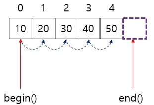

### 역방향 반복자
역방향 반복자는 컨테이너의 마지막 원소부터 첫 번째 원소까지 역순으로 순회할 수 있도록 해주는 
반복자입니다. 

```
1️⃣`rbegin()`은 컨테이너의 마지막 원소를 가리키는 역방향 반복자입니다.
```

```
2️⃣`rend()`는 컨테이너의 첫 번쨰 원소 이전을 가리키는 역방향 반복자입니다.
```
예를 들어, 컨테이너의 첫 번째 원소까지 탐색했지만 원하는 원소를 찾지 못한 경우, `rend()`를 반환하여 탐색 실패를 명확하게 표현할 수 있습니다.

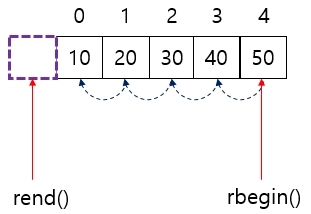

## <strong style="font-size: 36px; color: rgb(255, 255, 255);">3. 느낀점 </strong>
STL을 활용해서 다양한 자료구조와 알고리즘을 직접 구현하지 않가도 사용할 수 있기 때문에 유용하다.
컨테이너는 데이터를 담는 자료구조다.
벡터는 중간 삽입, 삭제는 비효율적이다 -> 중간에 삽입하면 뒤에 있는 것들 전부 변경이 되기 때문에 변경하는데 들어가는 비용이 많다.
맵은 키, 값으로 특정 키를 사용하여 값을 검색 할 수 있다.
반복자를 활용하면 특정 컨테이너의 내부 구현을 몰라도 동일한 방식으로 알고리즘 적용할 수 있다.
반복자는 컨테이너의 요소를 추상화하여 일관된 방식으로 접근할 수 있도록 도와준다.

   
## <strong style="font-size: 36px; color: rgb(255, 255, 255);">4. 다음 학습 </strong>
 C++ 1~9 예제 풀기
 C++2-4 강의 듣기