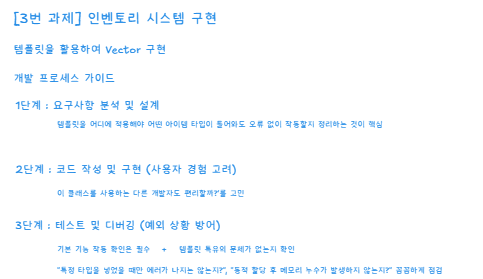
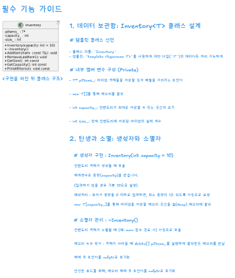
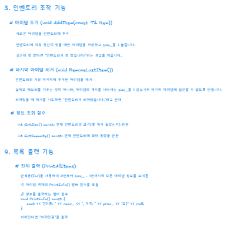
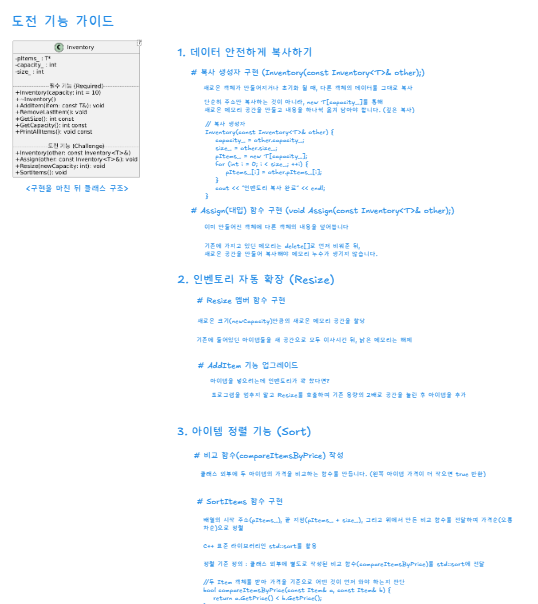

# <strong style="font-size: 50px; color: rgb(255, 255, 255);">2026.03.17.화</strong>

## <strong style="font-size: 36px; color: rgb(255, 255, 255);">1. 학습 키워드</strong>
과제 

## <strong style="font-size: 36px; color: rgb(255, 255, 255);">2. 학습 내용</strong>

## <strong style="font-size: 36px; color: rgb(255, 255, 255);">3. 느낀점 </strong>
더욱 활용할 수 있도록 노력해야겠다!
   
## <strong style="font-size: 36px; color: rgb(255, 255, 255);">4. 다음 학습 </strong>
C++ 복습