# <strong style="font-size: 50px; color: rgb(255, 255, 255);">2026.03.19.목</strong>

## <strong style="font-size: 36px; color: rgb(255, 255, 255);">1. 학습 키워드</strong>
```
응집도, 결합도, SOLID 원칙
```

## <strong style="font-size: 36px; color: rgb(255, 255, 255);">2. 학습 내용</strong>
### 응집도
```
응집도는 클래스  또는 모듈 내부의 구성 요소들이 얼마나 밀접하게 관련되어 있는지를 나타냄
일반적으로 응집도가 높을수록 좋은 설계다
클래스 내부에 관련 없는 기능들이 포함되어 있으면,  
변경이 자주 발생하고, 확장하기도 쉽지 않다.
```

### 응집도가 낮은 경우
```
: 서로 관련 없는 기능들이 하나의 클래스에 포함된 경우

EX) 피자 배달
1. 피자 배달
2. 웹사이트 디자인
3. 마케팅
4. 창고 관리
```

### 응집도가 높은 경우
```
: 서로 관련 있는 모듈들만 하나의 클래스에 있는 경우

EX) 피자 배달
1. 피자 배달 경로 확인
2. 배달 예상 시간 측정
3. 주문한 고객 대응
```


### 응집도 실제 예시
```
아래 기능을 제공하는 코드를 구현
1️⃣ 특정 문자열을 받고 메시지를 출력
2️⃣ 두 수의 합을 반환
3️⃣ 특정 문자열을 받고 역으로 출력

그리고 추가적으로 아래 기능이 추가되는 상황

1️⃣ 두 수의 곱을 반환하는 기능 추가
2️⃣ 특정 문자열을 받고 메시지를 출력하기 전 대문자로 변환합니다.
```

#### 응집도가 낮은 코드
```
Utility 클래스 하나에 모든 걸 구현
이것은 좋은 설계일까요? 아래와 같은 이유로 좋은 설계라고 보기 어렵다
1️⃣ 목적이 다른 기능이 섞여 있습니다.
2️⃣ 하나의 `class`에 모든 기능이 집중되어 유지 보수가 어렵습니다.
```
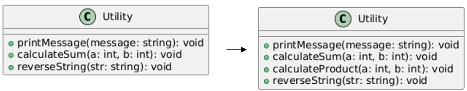
```
// 기능을 추가 전 예시코드
#include <iostream>
#include <string>
using namespace std;

class Utility {
public:
    void printMessage(const string& message) {
        cout << "Message: " << message << endl;
    }

    void calculateSum(int a, int b) {
        cout << "Sum: " << (a + b) << endl;
    }

    void reverseString(const string& str) {
        string reversed = string(str.rbegin(), str.rend());
        cout << "Reversed: " << reversed << endl;
    }
};

int main() {
    Utility util;
    util.printMessage("Hello");
    util.calculateSum(5, 10);
    util.reverseString("world");
    return 0;
}
```

```
// 기능을 추가 후 예시코드
#include <iostream>
#include <string>
#include <algorithm> // for transform
using namespace std;

class Utility {
public:
    void printMessage(const string& message) {
        string upperMessage = message;
        transform(upperMessage.begin(), upperMessage.end(), upperMessage.begin(), ::toupper);
        cout << "Message: " << upperMessage << endl;
    }

    void calculateSum(int a, int b) {
        cout << "Sum: " << (a + b) << endl;
    }

    void calculateProduct(int a, int b) {
        cout << "Product: " << (a * b) << endl;
    }

    void reverseString(const string& str) {
        string reversed = string(str.rbegin(), str.rend());
        cout << "Reversed: " << reversed << endl;
    }
};

int main() {
    Utility util;
    util.printMessage("Hello");
    util.calculateSum(5, 10);
    util.calculateProduct(5, 10);
    util.reverseString("world");
    return 0;
}

```

#### 응집도가 높은 코드
```
응집도를 높이기 위해 클래스를 목적에 따라 나누어 구현
이를 통해 다음과 같은  같은 장점을 얻을 수 있다.
1️⃣ 기능 변경이 필요할 때 특정 `class`만 수정하면 됩니다.
2️⃣관련된 `class`끼리 정보를 공유하여 코드의 구조가 명확해집니다.
```
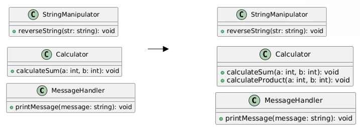

```
// 기능을 추가 전 예시코드
#include <iostream>
#include <string>
#include <algorithm> // for transform
using namespace std;

class MessageHandler {
public:
    void printMessage(const string& message) {
        cout << "Message: " << message << endl;
    }
};

class Calculator {
public:
    void calculateSum(int a, int b) {
        cout << "Sum: " << (a + b) << endl;
    }
};

class StringManipulator {
public:
    void reverseString(const string& str) {
        string reversed = string(str.rbegin(), str.rend());
        cout << "Reversed: " << reversed << endl;
    }
};

int main() {
    MessageHandler messageHandler;
    messageHandler.printMessage("Hello");

    Calculator calculator;
    calculator.calculateSum(5, 10);

    StringManipulator stringManipulator;
    stringManipulator.reverseString("world");

    return 0;
}

```

```
// 기능을 추가 후 예시코드
#include <iostream>
#include <string>
#include <algorithm> // for transform
using namespace std;

class MessageHandler {
public:
    void printMessage(const string& message) {
        string upperMessage = message;
        transform(upperMessage.begin(), upperMessage.end(), upperMessage.begin(), ::toupper);
        cout << "Message: " << upperMessage << endl;
    }
};

class Calculator {
public:
    void calculateSum(int a, int b) {
        cout << "Sum: " << (a + b) << endl;
    }

    void calculateProduct(int a, int b) {
        cout << "Product: " << (a * b) << endl;
    }
};

class StringManipulator {
public:
    void reverseString(const string& str) {
        string reversed = string(str.rbegin(), str.rend());
        cout << "Reversed: " << reversed << endl;
    }
};

int main() {
    MessageHandler messageHandler;
    messageHandler.printMessage("Hello");

    Calculator calculator;
    calculator.calculateSum(5, 10);
    calculator.calculateProduct(5, 10);

    StringManipulator stringManipulator;
    stringManipulator.reverseString("world");

    return 0;
}

```

### 결합도
```
결합도는 모듈 또는 클래스 간의 의존성을 나타낸다.
일반적으로 결합도는 낮을수록 좋은 코드
결합도가 높으면 각 모듈 간 의존성이 강해져, 
하나의 모듈이 변경될 때, 다른 모듈도 영향을 받게 된다.
```

### 결합도 실제 예시
```
자동차와 엔진의 관계를 코드로 구현
1️⃣자동차는 초기에 Engine이 장착되어 있다.
2️⃣자동차 시동이 걸리면 엔진이 동작한다고 출력
   하지만 이제 엔진의 종류가 다양해졌고, 자동차가 여러 종류의 엔진을 지원해야 한다.
```

#### 결합도가 높은 코드
```
자동차 클래스가 디젤 엔진 클래스를 직접 포함
이 구조는 아래와 같은 문제점이 있다.
1️⃣ 새로운 전기 엔진을 추가하려면 자동차 클래스도 수정해야 한다.
2️⃣ 변경이 잦은 경우 수정 범위가 커지고 유지 보수가 어려워진다.
```
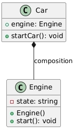

```
// 기능 추가 전 예시코드
#include <iostream>
#include <memory>
#include <string>

using namespace std;

class Engine {
public:
    virtual void start() = 0;
    virtual ~Engine() = default;
};

class DieselEngine : public Engine {
public:
    void start() {
        cout << "Diesel Engine started" << endl;
    }
};

class Car {
private:
    unique_ptr<Engine> engine; // 인터페이스에 의존하여 결합도 감소

public:
    Car(unique_ptr<Engine> eng) : engine(move(eng)) {}

    void startCar() {
        engine->start();
        cout << "Car started" << endl;
    }
};

int main() {
    auto engine = make_unique<DieselEngine>();
    Car myCar(move(engine));
    myCar.startCar();
    return 0;
}

```

```
//  기능 추가 후 예시코드
#include <iostream>
#include <memory>

using namespace std;

// 공통 인터페이스 정의
class Engine {
public:
    virtual void start() = 0;
    virtual ~Engine() = default;
};

// DieselEngine 구현
class DieselEngine : public Engine {
public:
    void start() {
        cout << "Diesel Engine started" << endl;
    }
};

// 새로운 ElectricEngine 구현
class ElectricEngine : public Engine {
public:
    void start() {
        cout << "Electric Engine started silently" << endl;
    }
};

// Car 클래스는 Engine 인터페이스에만 의존
class Car {
private:
    unique_ptr<Engine> engine;

public:
    Car(unique_ptr<Engine> eng) : engine(move(eng)) {}

    void startCar() {
        engine->start();
        cout << "Car started" << endl;
    }
};

int main() {
    // DieselEngine을 사용하는 경우
    auto dieselEngine = make_unique<DieselEngine>();
    Car dieselCar(move(dieselEngine));
    dieselCar.startCar();

    // ElectricEngine을 사용하는 경우
    auto electricEngine = make_unique<ElectricEngine>();
    Car electricCar(move(electricEngine));
    electricCar.startCar();

    return 0;
}

```

### SOLID 원칙
```
SOLID 원칙이란 객체지향 설계에서 유지 보수성과 확장성을 높이기 위한 5가지 원칙을 의미
`SOLID` 원칙의 주요 목적
1️⃣유지보수성 및 확장성 향상
2️⃣변경에 유연한 설계 제공

'SOLID'
'S' : 단일 책임 원칙(SRP)
'O' : 개방 폐쇄 원칙(OCP)
'L' : 리스 코프 치환 원칙(LSP)
'I' : 인터페이스 분리 원칙(ISP)
'D' : 의존 역전 원칙(DIP)
```
### 단일 책임 원칙(SRP)
```
각 클래스는 하나의 책임만 가져야 한다는 원칙
즉, 클래스는 하나의 변경 이유만을 가져야 하며, 특정 기능이나 역할을 수행하는 데 집중
```

```
아래 상황을 구현
1️⃣ 학생의 이름을 받을 수 있어야 한다.
2️⃣ 학생의 이름을 출력할 수 있어야 한다.
3️⃣ 학생의 점수를 받고 성적을 계산할 수 있어야 한다.
```

#### 잘못 적용된 사례
```
아래와 같이 Student 클래스에 모든 메서드가 구현된 경우
Student 클래스는 Student 정보만 있는 게 최선
```
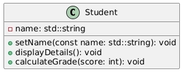

```
// 단일 책임 원칙이 제대로 적용되지 않은 코드
#include <iostream>
#include <string>

class Student {
public:
    void setName(const std::string& name) {
        this->name = name;
    }

    void displayDetails() {
        std::cout << "Student Name: " << name << std::endl;
    }

    void calculateGrade(int score) {
        if (score >= 90) {
            std::cout << "Grade: A" << std::endl;
        } else if (score >= 80) {
            std::cout << "Grade: B" << std::endl;
        } else {
            std::cout << "Grade: C" << std::endl;
        }
    }

private:
    std::string name;
};
```

#### 제대로 적용된 사례
```
각 기능을 나눠서 클래스를 구현했
`Student`는 학생 정보만 담고 있고 성적 계산은 `GradeCalculator`에서 하고 있다.
그리고 출력은 `StudenetPrinter`에서 맡고 있다.
```
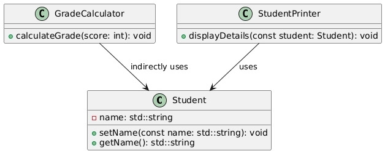

```
// 단일 책임 원칙이 제대로 적용된 코드
#include <iostream>
#include <string>

// 학생 정보 관리 클래스
class Student {
public:
    void setName(const std::string& name) {
        this->name = name;
    }

    std::string getName() const {
        return name;
    }

private:
    std::string name;
};

// 성적 계산 클래스
class GradeCalculator {
public:
    void calculateGrade(int score) {
        if (score >= 90) {
            std::cout << "Grade: A" << std::endl;
        } else if (score >= 80) {
            std::cout << "Grade: B" << std::endl;
        } else {
            std::cout << "Grade: C" << std::endl;
        }
    }
};

// 출력 클래스
class StudentPrinter {
public:
    void displayDetails(const Student& student) {
        std::cout << "Student Name: " << student.getName() << std::endl;
    }
};
```


### 개방 폐쇄 원칙(OCP)
```
확장에는 열려 있어야 하고, 수정에는 닫혀있어야 한다는 개념
즉, 기존 코드를 최소한으로 변경하면서 새로운 기능을 추가할 수 있도록 설계
```

```
아래 상황을 구현
📌도형에 해당되는 번호를 받고, 해당 도형을 그려주는 클래스 제작
```

#### 잘못 적용된 사례
```
아래와 같이 ShapeManager 클래스 하나가 모든 도형을 다 관리하고 있는 경우는 잘못된 것
어떤 도형이 추가된다면 drawShape의 코드가 수정
즉 ShapeManager는 계속해서 영향을 받는다
```
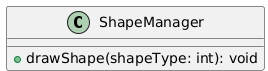

```
// 개방 폐쇄 원칙이 제대로 적용되지 않은 코드
class ShapeManager {
public:
    void drawShape(int shapeType) {
        if (shapeType == 1) {
            // 원 그리기
        } else if (shapeType == 2) {
            // 사각형 그리기
        }
    }
};
```


#### 제대로 적용된 사례
```
ShapeManager는 Shape의 인터페이스를 인자로 받는다.
도형이 추가된다고 해도 ShapeManager는 전혀 영향을 받지 않는다.
해당 도형 관련 클래스가 수정되고 Shape 인터페이스만 구현해 주면 된다.
```
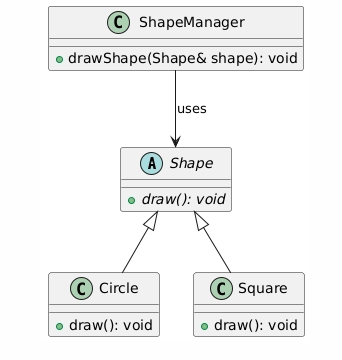

```
// 개방 폐쇄 원칙이 제대로 적용된 코드
class Shape {
public:
    virtual void draw() = 0; // 순수 가상 함수
};

class Circle : public Shape {
public:
    void draw() {
        // 원 그리기
    }
};

class Square : public Shape {
public:
    void draw() {
        // 사각형 그리기
    }
};

class ShapeManager {
public:
    void drawShape(Shape& shape) {
        shape.draw(); // 다형성 활용
    }
};
```


### 리스 코프 치환 원칙(LSP)
```
자식 클래스는 부모 클래스에서 기대되는 행동을 보장해야 한다.
객체지향 프로그래밍에서 다형성을 활용할 때, 
부모 클래스를 사용하는 코드가 자식 클래스로 대체되더라도 정상적으로 동작해야 한다.

이를 위해 자식 클래스는 부모 클래스의 동작을 일관되게 유지
```

```
아래 상황을 구현
1️⃣ 모든 도형은 넓이를 계산할 수 있어야 합니다.
2️⃣ `Rectangle`클래스와 이를 상속받는 `Square` (정사각형) 클래스를 설계해 봅시다.
```

#### 잘못 적용된 사례
```
아래와 같이 `Rectangle` 인터페이스가 존재하고 `Square`는 이를 상속받는다.
하지만! `Square`는 정사각형

너비와 높이를 따로 설정할 필요가 없다. 
따라서 `Rectangle`에서 기대하는 행동을 보장하지 못한다.
```
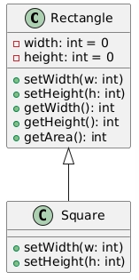

```
// 리스코프 치환이 제대로 적용되지 않은 코드
#include <iostream>

class Rectangle {
public:
    virtual void setWidth(int w) { width = w; }
    virtual void setHeight(int h) { height = h; }
    int getWidth() const { return width; }
    int getHeight() const { return height; }
    int getArea() const { return width * height; }

private:
    int width = 0;
    int height = 0;
};

class Square : public Rectangle {
public:
    void setWidth(int w) override {
        Rectangle::setWidth(w);
        Rectangle::setHeight(w); // 정사각형은 너비와 높이가 같아야 함
    }
    void setHeight(int h) override {
        Rectangle::setHeight(h);
        Rectangle::setWidth(h); // 정사각형은 너비와 높이가 같아야 함
    }
};

void testRectangle(Rectangle& rect) {
    rect.setWidth(5);
    rect.setHeight(10);
    std::cout << "Expected area: 50, Actual area: " << rect.getArea() << std::endl;
}

int main() {
    Rectangle rect;
    testRectangle(rect); // Expected area: 50

    Square square;
    testRectangle(square); // Expected area: 50, Actual area: 100 (문제 발생)
    return 0;
}

```

#### 제대로 적용된 사례
```
ShapeManager는 Shape의 인터페이스를 인자로 받는다.
도형이 추가된다고 해도 ShapeManager는 전혀 영향을 받지 않는다.
해당 도형 관련 클래스가 수정되고 Shape 인터페이스만 구현해 주면 된다.
```
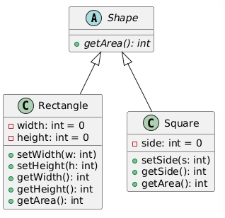


```
//  리스코프 치환 원칙이 제대로 적용된 코드
#include <iostream>

class Shape {
public:
    virtual int getArea() const = 0; // 넓이를 계산하는 순수 가상 함수
};

class Rectangle : public Shape {
public:
    void setWidth(int w) { width = w; }
    void setHeight(int h) { height = h; }
    int getWidth() const { return width; }
    int getHeight() const { return height; }
    int getArea() const override { return width * height; }

private:
    int width = 0;
    int height = 0;
};

class Square : public Shape {
public:
    void setSide(int s) { side = s; }
    int getSide() const { return side; }
    int getArea() const override { return side * side; }

private:
    int side = 0;
};

void testShape(Shape& shape) {
    std::cout << "Area: " << shape.getArea() << std::endl;
}

int main() {
    Rectangle rect;
    rect.setWidth(5);
    rect.setHeight(10);
    testShape(rect); // Area: 50

    Square square;
    square.setSide(7);
    testShape(square); // Area: 49
    return 0;
}

```

### 인터페이스 분리 원칙(ISP)
```
클라이언트는 자신이 사용하지 않는 메서드에 의존하지 않아야 한다는 원칙
즉, 하나의 거대한 인터페이스보다는 역할별로 세분화된 인터페이스를 만들어, 
필요한 기능만 구현하도록 설계해야 한다.
```

```
아래 요구사항에 맞는 설계
📌프린트, 스캔이 가능해야 한다.
```

#### 잘못 적용된 사례
```
프린터, 스캔을 하나의 클래스에서 모두 구현하게 되면, 
이를 상속받는 클래스에서는 필요가 없는 경우에도 이를 모두 구현
```
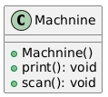

```
// 인터페이스 분리 원칙이 제대로 적용되지 않은 코드
class Machnine {
private:

public:
    Machnine() {}

    void print() {
        //세부 기능 구현
    }

    void scan() {
        //세부 기능 구현
    }
};
```


#### 제대로 적용된 사례
```
프린터, 스캔, 팩스 클래스를 따로 구현하게 되면 각각 필요한 클래스만 가져다가 사용
```
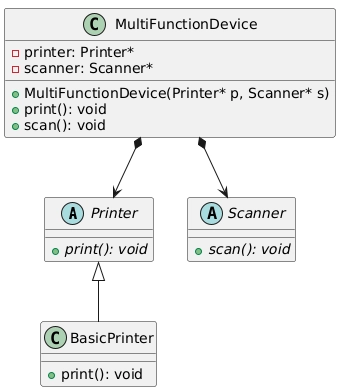

```
// 인터페이스 분리 원칙이 제대로 적용된 코드
 class Printer {
public:
    virtual void print() = 0;
};

class Scanner {
public:
    virtual void scan() = 0;
};

class BasicPrinter : public Printer {
public:
    void print() override {
        // 문서 출력
    }
};

class MultiFunctionDevice {//
private:
    Printer* printer;
    Scanner* scanner;

public:
    MultiFunctionDevice(Printer* p, Scanner* s) : printer(p), scanner(s) {}

    void print() {
        if (printer) printer->print();
    }

    void scan() {
        if (scanner) scanner->scan();
    }
};
```

###  의존 역전 원칙(DIP)
```
고수준 모듈은 저 수준 모듈에 직접 의존하는 것이 아니라, 두 모듈 모두 추상화에 의존해야 한다.

쉽게 말하면, 구체적인 구현(저 수준 모듈)에 의존하는 것이 아니라, 인터페이스나 추상 클래스 같은 추상화 계층을 두어 결합도를 낮추는 것이 좋은 설계
```

```
아래 요구사항에 맞는 설계
1️⃣ 컴퓨터는 키보드와 모니터가 있다.
2️⃣ 키보드는 입력을 받을 수 있고 모니터는 출력할 수 있다.
```

#### 제대로 적용된 사례
```
키보드와 모니터를 인터페이스화해서 강한 결합이 아닌 약한 결합으로 했다.
이런 설계는 다른 입 / 출력장치로 쉽게 교체 가능
```
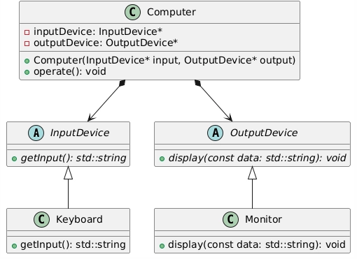

```
// 인터페이스 분리 원칙이 제대로 적용된 코드
#include<string>
class InputDevice {
public:
    virtual std::string getInput() = 0;
};

class OutputDevice {
public:
    virtual void display(const std::string& data) = 0;
};

class Keyboard : public InputDevice {
public:
    std::string getInput() override {
        return "키보드 입력 데이터";
    }
};

class Monitor : public OutputDevice {
public:
    void display(const std::string& data) override {
        // 화면에 출력
    }
};

class Computer {
private:
    InputDevice* inputDevice;
    OutputDevice* outputDevice;

public:
    Computer(InputDevice* input, OutputDevice* output) 
        : inputDevice(input), outputDevice(output) {}

    void operate() {
        std::string data = inputDevice->getInput();
        outputDevice->display(data);
    }
};

```


## <strong style="font-size: 36px; color: rgb(255, 255, 255);">3. 느낀점 </strong>
응집도는 클래스 또는 모듈 내부의 구성 요소들이 얼마나 밀접하게 관련이 되어있는지를 의마하고 높을수록 좋은 설계다.
결합도는 모듈 또는 클래스 간의 의존성을 의미하고 낮을수록 좋은 코드다.
SOLID 원칙은 유지보수 및 확정성을 높이기 위한 객체지향 설계에서 5가지 원칙이다.
S는 단일 책임 원칙으로 각 클래스는 하나의 책임만 가져야 한다는 원칙이다.
O는 개방 폐쇄 원칙으로 확장에는 열려 있어야 하고, 수정에는 닫혀 있어야 한다는 개념이다.
L은 리스 코프 치환 원칙으로 자식 클래스는 부모 클래스의 동작을 일관되게 유재해야 한다는 것이다.
I는 인터페이스 분리 원칙으로 클라이언트는 자신이 사용하지 않는 메서드에 의존하지 않아야 한다는 원칙이다.
D는 의존 역전 원칙으로 고수준 모듈은 저 수준 모듈에 직접 의존하는 것이 아니라, 두 모듈 모두 추상화에 의존해야 한다.


## <strong style="font-size: 36px; color: rgb(255, 255, 255);">4. 다음 학습 </strong>
1. C++ 3-1 강의 디자인 패턴
2. 협업을 위한 깃 연습
3. C++ 언어 1-1~1-6 복습
4. C언어 복습