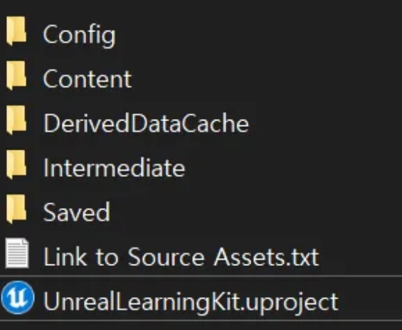
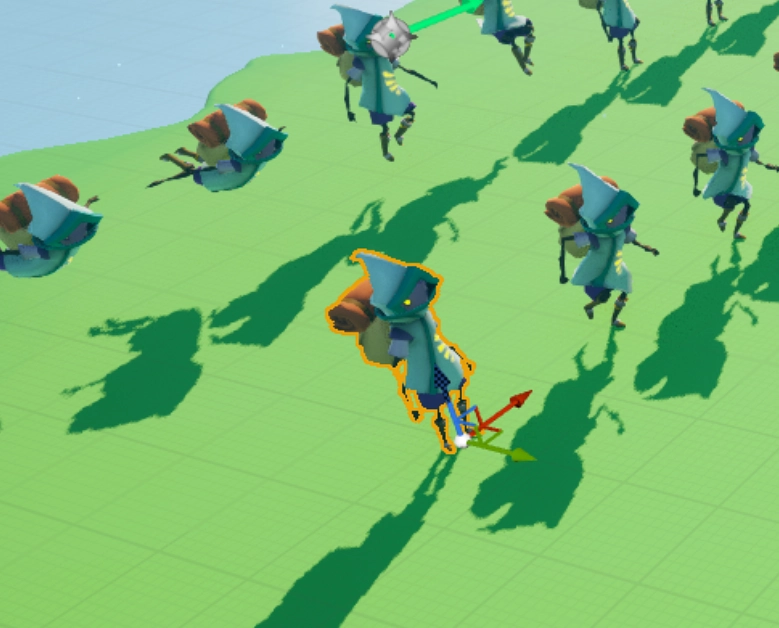
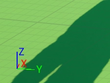
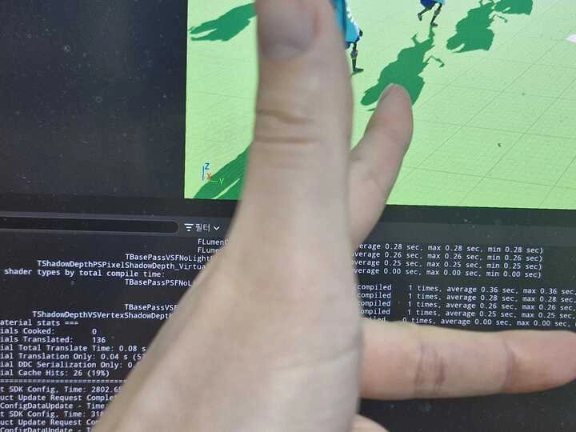
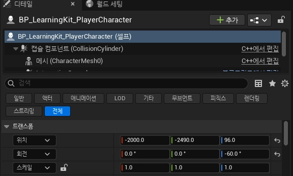
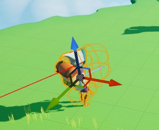
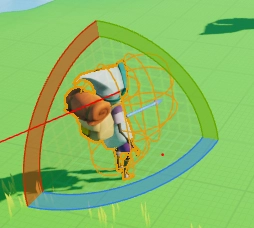
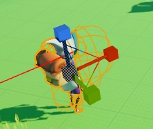
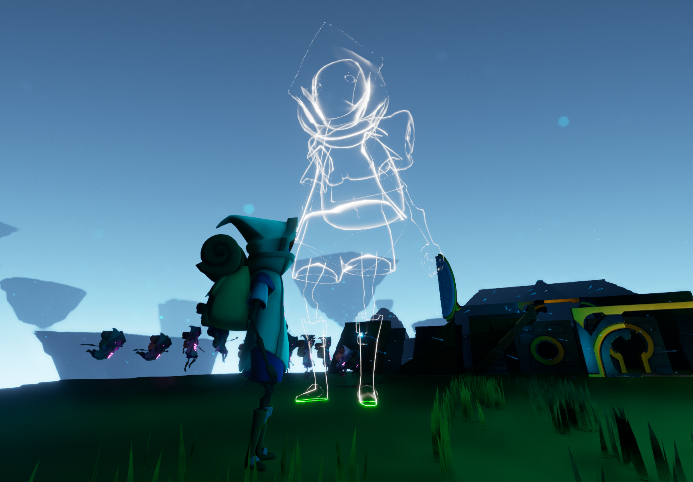

# <strong style="font-size: 48px; color: rgb(255, 255, 255);"> [Unreal 8기] DAY 2 게임 개발 과정에 대해 알아보고 언리얼 엔진과 놀아보기!</strong>
# 게임 개발 과정
다양한 직군들이 모야서 개발한다
1. 게임 기획자 
“어떤 게임을 만들까?”를 생각하는 사람!
- 게임 기획자는 우선, **스토리 라인을** 구상, 그리고 이 스토리 라인을 기반으로 **레벨 디자인도 하고요. 또한,** **게임 규칙을 면밀하게 정한다
    - 예를 들어, 플레이어가 위험한 던전을 탐험하며 강력한 보스를 물리쳐야 하는 MMORPG게임을 생각해볼게요. 게임 기획자는 그 던전의 구조, 적의 배치, 보스의 패턴, 그리고 플레이어가 어떤 무기로 보스를 상대하게 될지까지 치밀하게 계획해야 한다
    - 그래야 프로그래머들이 기획자의 의도대로 연출을 할 수 있으니까요!
- 또한, 난이도를 조정하고, 게임의 핵심 재미(핵심 재미요소)를 정의하는 것도 기획자의 중요한 역할 괜히 밸런스 패치라는 용어가 있는게 아니겠죠?! 개발을 아무리 열심히해도 기획적 요소가 엉터리라면 게임은 흥하기가 어렵습니다.
2. 아티스트(그래픽 디자이너, 애니메이터)- 
- 기획자가 만든 설계도를 바탕으로 **눈으로 볼 수 있도록 구체화** 하는 사람!
컨셉 아티스트
게임의 분위기와 컨셉을 정의하는 일러스트를 그려 전체적인 ‘톤 앤 매너’를 잡아준다
3D 모델러
- 캐릭터, 몬스터, 건물, 무기 등등 게임 세계를 구성하는 모든 물체를 3D 모델로 만듭니다!
- 애니매이터
    - 만들어진 3D 모델에 ‘생명’을 불어넣는 역할을 합니다!
    - 캐릭터가 달리고 점프하고 공격하는 모든 동작이 부드럽게 이어지도록 하죠.
3. 프로그래머
게임 기획자가 상상한 규칙과 아티스트가 만든 자산(리소스)에 생명과 움직임을 부여하는 사람!
- 클라이언트 프로그래머
    - 플레이어가 직접 눈으로 보고, 손으로 조작하는 모든 상호 작용에 관련된 부분을 구현합니다!
    - 뿐만 아니라, 그래픽 및 사운드 연동 및 UI/UX 개선까지 해야하죠! 그래서, 클라이언트 프로그래머는 생각보다 여러 팀과 협업을 하곤 한답니다. (서버 프로그래머에 비해선요)
    - 그리고, 퍼포먼스 최적화도 클라이언트 프로그래머의 핵심 소양입니다.
- 서버 프로그래머
- 온라인 게임에서 게임 전체의 질서 유지를 담당하고 데이터의 일관성과 공정성을 보장하는 역할을 합니다!
- 또한, 해킹된 클라이언트라고 항상 가정을 하고 갖은 치트나 해킹 시도 등을 방어할 수 있어야 합니다.
- 게임을 흥하게는 하지 못할지언정 망하게는 할 수 있는 제 1의 직업이 서버 프로그래머라 서버의 안정성은 항상 필수입니다! → 이로 인해, 회사마다 다르긴 하지만 야간 근무도 교대로 하는 경우가 있을 수 있어요.

4. 사운드 디자이너
우리가 만든 가상 세계에 더 깊이 빠져들게 하는 마법사 같은 사람!
- 좋은 OST와 배경음악은 플레이어의 입장에서 여러 감정선을 표현하고 그걸 유저들에게 고스란히 혹은 그 이상으로 전달할 수 있는 매개체죠.
- 아니면, 아주 적당한 효과음 연출로 게임의 몰입도를 높여주는 역할을 하는 분들이 사운드 디자이너입니다!
5. pd
게임 스튜디오에 있는 팀 전체를 오케스트라처럼 지휘하는 사람!
- 사실상, 게임 스튜디오의 리더이자 CEO가 바로 PD입니다.
- 게임 개발은 큰 규모 + 긴 기간의 프로젝트가 많습니다. 수십, 수백 명이 모여서 수개월, 수년 동안 작업하는데 방향을 잃지 않고 목적지까지 안전하게 도착하려면 PD와 PD를 보좌하는 PM들의 역할이 중요합니다!
- 게임이 우리가 생각하는대로 만들어지는지 큰 그림을 끊임없이 체크도 하고요.
    - 보통, 마일스톤을 지정해놓고 빌드를 내서 자체 테스트하고 포스트모템을 진행하죠!
- 일정 관리, 예산 조율까지 개발 외적으로 모든 업무들을 담당하는 포지션이라고 생각하시면 됩니다.

# 언리얼 에디터 찬찬히 살펴보기

여기 보면 .uproject라는 다소 생소한 확장자의 파일이 있는데요. 이게 바로 언리얼 프로젝트 파일입니다. 해당 파일은 나중에 배우실 블루프린트를 포함해서 머티리얼, 3D 에셋, 애니메이션과 같은 모든 게임 콘텐츠들을 담고 있는 파일입니다.

## 뷰포트(Viewport)
- 화면의 중앙에 위치하며, 3D 월드를 직접 볼 수 있는 영역입니다.
- 카메라를 조작하여 월드를 탐색하거나 오브젝트를 배치합니다.
- 마우스 우클릭과 WASD 키를 사용하여 뷰를 이동할 수 있어요!

## 아웃라이너(Outliner)
- 화면 오른쪽 상단에 위치하며, 현재 씬에 배치된 모든 오브젝트를 계층 구조로 보여줍니다.
- 각 오브젝트를 선택하여 속성을 수정하거나 삭제할 수 있습니다.
- 위의 스샷처럼 보통은 오브젝트의 성격에 따라 조명, 스태틱 메시, VFX와 같은 폴더들로 나누고 오브젝트를 계층적으로 관리하는게 관례이긴 합니다!

## 디테일 (Details)
- 아웃라이너 아래에 위치하며, 선택한 오브젝트의 속성을 보여주고 편집할 수 있습니다.
- 예를 들어, 위치(Position), 회전(Rotation), 크기(Scale)를 수정하거나 특정 속성을 설정할 수 있죠!

## 콘텐츠 브라우저
언리얼 에디터 하단에서 해당 화면이 안보이면 CTRL + SPACE를 눌러주세요!
- 화면 하단에 위치하며, 프로젝트에 사용되는 모든 에셋(모델, 텍스처, 머티리얼 등)을 관리합니다.
- 에셋을 끌어서 뷰포트에 배치할 수 있어요! 드래그 앤 드롭!

## 메뉴 바
- 화면 상단에 위치하는 메뉴들이 있는 바입니다.
- 파일 저장, 프로젝트 설정, 빌드 등 다양한 작업을 수행할 수 있는 메뉴를 제공해요!
- 이 메뉴 바에 대해선 차근차근 알아가시면 됩니다!

# 뷰포트 알아보기!
- **카메라 이동**
    - **마우스 오른쪽 버튼을 누르고 있는 상태**에서 WASD 키를 눌러 이동.
        - 계속 누르고 있어야 WASD 키가 입력되며 지도를 돌아다닐 수 있습니다!
- **마우스 휠 버튼을 사용**
    - ZOOM IN(확대) / ZOOM OUT(축소)를 할 수 있어요!
        - ZOOM OUT을 하면 맵(레벨)의 전반적인 구성을 보기가 좀 더 편해지죠.
        - ZOOM IN을 하면 특정 구역에 집중할 수 있고요!

- 왼쪽 클릭으로 이렇게 배치된 오브젝트를 선택할 수 있습니다!
- 이 오브젝트를 선택하면 **기즈모**라고 하는 친구가 보여지는데요.
    - 파란색, 빨간색, 초록색 화살표의 조합이 기즈모에요!
    - 이 기즈모에 대해선 뒤에서 살펴볼게요!
- 선택한 오브젝트를 드래그하여 오브젝트의 위치도 변경이 가능합니다!

# 뷰포트 내 오브젝트 용어 정리
- **월드**
    - 정의
        - **레벨이 존재하는 최상위 컨테이너로 모든 액터와 구성 요소를 포함**합니다.
        - 하나의 월드에는 하나 이상의 레벨이 포함됩니다.
    - 역할
        - 게임 로직의 전반적인 상태를 관리합니다.
        - 물리 시뮬레이션, 이벤트 처리, 그리고 게임 루프를 제어합니다.
    - 특징
        - 추후에 여러분들이 배우실 언리얼 엔진의 API를 통해 월드를 관리하고 상태를 변경할 수 있습니다!
        - 또한, 여러 개의 레벨을 동시에 로드하고 관리할 수 있어요!

- **레벨**
    - 정의
        - 레벨은 게임 또는 프로젝트의 하나의 "씬"을 의미해요.
        - 언리얼 엔진에서 작업하는 공간을 정의하며, 월드의 구성 요소들을 담고 있습니다.
    - 역할
        - 게임 환경(맵)을 설계하고, 액터와 이벤트를 배치하는 데 사용됩니다.
        - 여러 레벨을 조합하여 대규모 환경을 만들 수 있습니다.
    - 특징
        - 레벨 파일은 `.umap` 확장자를 가집니다!
        - `Type==World`로 검색하면 해당 프로젝트 내 레벨 파일들을 볼 수 있어요!
        
- **액터**
    - 정의
        - 액터는 언리얼 엔진 월드 내에서 존재하는 모든 오브젝트를 뜻합니다.
        - 기본적으로 레벨에 배치되거나 생성될 수 있는 개체라고 생각하시면 됩니다.
    - 역할
        - 게임플레이 로직을 담당하거나 환경 구성 요소를 나타내는 역할이에요.
        - 캐릭터, 조명, 카메라, 사운드, 물리 오브젝트 등이 포함됩니다!
    - 특징
        - 액터는 위치, 회전, 크기와 같은 변환(Transform) 속성을 가집니다.
        - Blueprint 또는 C++로 커스텀 액터를 만들 수 있어요. 이건 나중에 배울겁니다!

  - **폰**
    

    - 정의
        - 폰은 액터의 일종으로, **플레이어나 AI가 조종할 수 있는 오브젝트**를 뜻해요!
        - 그냥 레벨 내에 배치된 장애물이나 장식품과는 다릅니다!
        - 게임의 캐릭터를 구현하는 데 주로 사용됩니다.
    - 역할
        - 플레이어 컨트롤러의 경우에는 입력(Input)을 받아서 움직임과 동작을 제어합니다.
        - AI 컨트롤러가 폰을 조작하여 NPC를 구현할 수도 있습니다.
    - 특징
        - 폰은 "컨트롤러(Controller)"에 의해 제어됩니다.
        - **빙의(possess)**라는 개념이 있는데 이 역시 나중에 배울겁니다!
        - 캐릭터 클래스는 폰을 기반으로 한 확장된 클래스입니다.
        - 실제로 스샷에 있는 친구도 캐릭터 클래스가 부모 클래스에요.

# 좌표계 알아보기!

이건 좌표계를 보여주는 기즈모라고 합니다. 이건 왼손 좌표계를 사용해요. 왼손으로 이렇게 해보면 똑같이 확인할 수 있습니다.

엄지가 Z축, 검지가 X축, 중지가 Y축이라 생각하시면 이 스샷에서 조그마하게 보이는 기즈모랑 똑같죠? 예를 들어서, X축을 +하면 앞으로 전진, -하면 뒤로 후진하게 됩니다. 

 좌표계는 로컬 좌표계와 월드 좌표계가 있다

## 트랜스폼

이제 우리 주인공 캐릭터를 선택한 상황에서 오른쪽의 디테일 창을 보면 트랜스폼이란 섹션이 있어요. 이 트랜스폼은 3D 공간에서 오브젝트의 위치, 방향, 크기를 결정하는 요소입니다.
트랜스폼은 다음 3가지로 구성
1. **위치 (Position)**: 오브젝트가 어디에 있는지 → `W`키로 위치 조정 가능
    
    
    
2. **회전 (Rotation)**: 오브젝트가 어떤 방향을 향하고 있는지 → `E`키로 회전 가능
    
    
    
3. **크기 (Scale)**: 오브젝트가 얼마나 큰지 → `R`키로 크기 조정 가능
    
    

## 머터리얼 꾸며보기

# <strong style="font-size: 48px; color: rgb(255, 255, 255);"> END</strong>