# <strong style="font-size: 48px; color: rgb(255, 255, 255);"> [Unreal 8기] DAY 3 블루프린트를 이용한 비주얼 스크립팅</strong>
# 1. 오늘의 목표
<aside>
1️⃣
블루프린트가 무엇인지 배우고, 변수, 이벤트 함수에 대해 배워본다.
</aside>
<aside>
2️⃣
Branch, Sequence, 함수에 대해 배워보고 이를 이용하여 간단한 과제를 진행해본다.
</aside>
<aside>
3️⃣
While, For, Array, ForEach, 열거형, 구조체, Switch에 대해 배워보고 간단한 과제를 진행해본다.
</aside>

## 블루프린트란
블루프린트는 언리얼 엔진에서 제공하는 비주얼 스크립팅 시스템.

노드 기반의 블럭을 연결해서 프로그래밍이 가능하게 하는 시스템

## 변수와 연산
### 이벤트함수와  PrintString() 함수
이벤트 함수 : 어떤 사건(Event)이 발생하면 호출되는 함수
BeginPlay : "게임 플레이 시작"이라는 사건이 발생하면 호출되는 함수
Tick : 매 게임 프레임마다 호출되는 함수

### 블루프린트 변수
변수(Variable)
상수(값, Constant)를 저장할 수 있는 그릇
언리얼에서는 멤버변수를 속성(Property)라고 많이 부른다

### 블루프린트 변수의 Get, Set 노드
Get 불러오기
Set 설정

### 블루프린트 연산 노드
비교 연산 노드

블루프린트에서 비교 연산자는 두 값을 비교하여 참 또는 거짓을 반환하는데 사용. 
노드 생성 방법은 사칙 연산과 동일하게 레벨 블루프린트 화면에서 우클릭 후 기호를 검색.

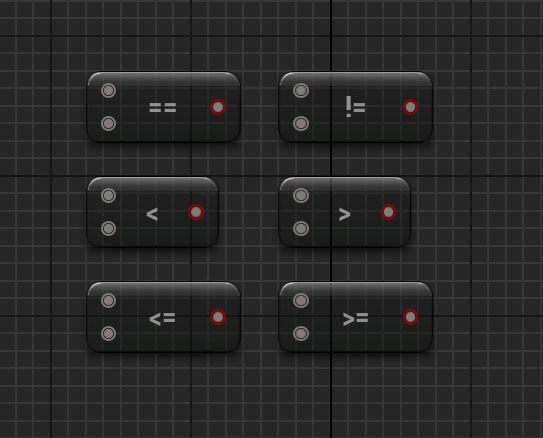

| **연산자** | **설명** |
| --- | --- |
| `==` | 두 값이 같은지 비교 |
| `!=` | 두 값이 다른지 비교 |
| `<` | 첫 번째 값이 두 번째 값보다 작은지 비교 |
| `>` | 첫 번째 값이 두 번째 값보다 큰지 비교 |
| `<=` | 첫 번째 값이 두 번째 값보다 작거나 같은지 비교 |
| `>=` | 첫 번째 값이 두 번째 값보다 크거나 같은지 비교 |

논리 연산 노드
블루프린트에서 논리 연산은 여러 조건을 조합하거나 반전하여 
복잡한 논리적 흐름을 처리할 때 사용.

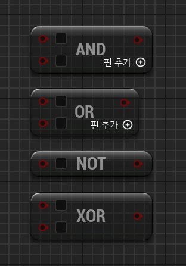

| **연산자** | **설명** |
| --- | --- |
| **AND** | 두 조건이 모두 참일 때만 결과가 `True`가 됩니다. |
| **OR** | 두 조건 중 하나라도 참이면 결과가 `True`가 됩니다. |
| **NOT** | 조건의 결과를 반대로 만듭니다. |
| **XOR** | 두 조건 중 하나만 참일 때 `True`가 됩니다.
→ true(1) 1의 개수가 홀수개면 true.  짝수개면 false |

## 흐름 제어 - 1

###  Branch와 Sequence

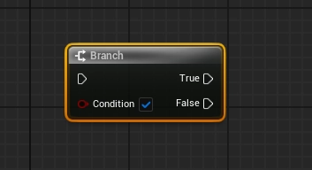

Branch는 Condition 매개변수가 True냐 False냐에 따라
실행 흐름을 나눌 수 있는 노드. if-else 조건문과 동일함.


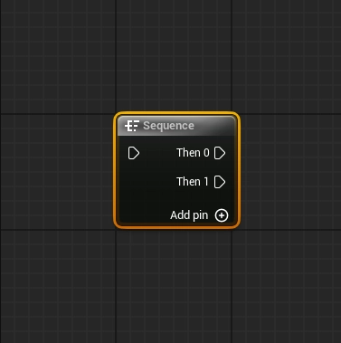

Sequence는 실행 흐름을 순차적으로 실행시켜주는 노드.
노드를 연결하다보면 우측으로 너무 길게 늘어지게 될때가 많음.
Sequence 노드를 이용해서 길게 늘어진 노드들을 정리할 수 있음

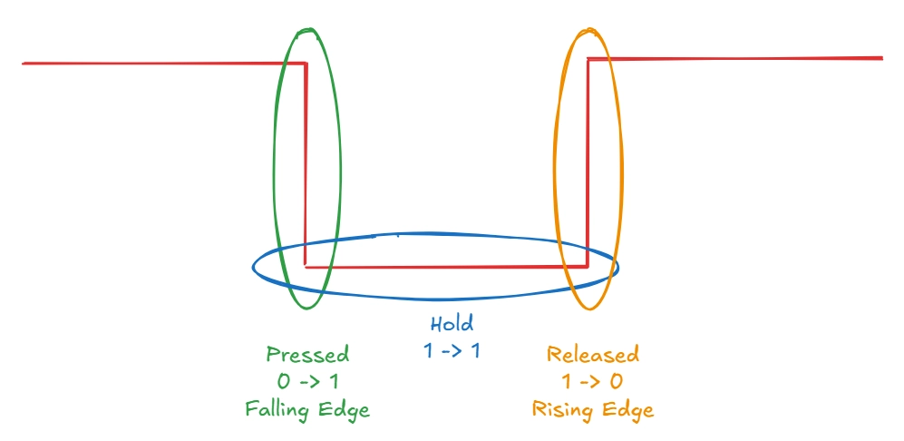

##  함수
거의 유사한 온도 관련 블루프린트 코드가 두 곳에 존재

이런 경우에 보통 함수로 만들어서 묶어둔다

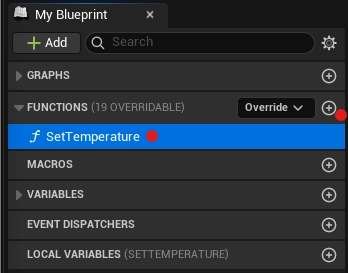

MyBlueprint > FUNCTIONS 추가 > “SetTemperature”
언리얼에서 함수를 정의할 때 보통 동사로 시작함.

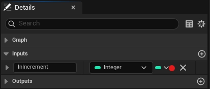

MyBlueprint > FUNCTIONS > SetTemperature 클릭 > Details
”InIncrement” 매개변수 추가.
언리얼에서 매개변수를 정의할 때 보통 In- 혹은 Out- 접두사를 붙힘.

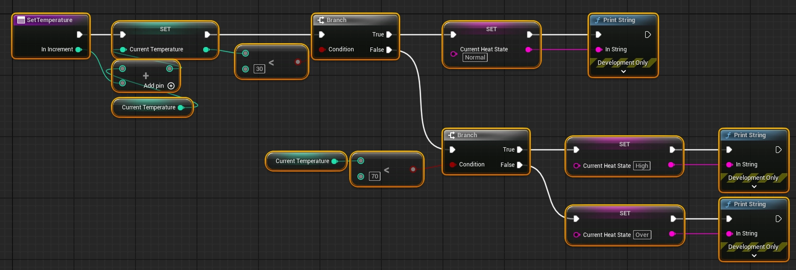

SetTemperature > EventGraph

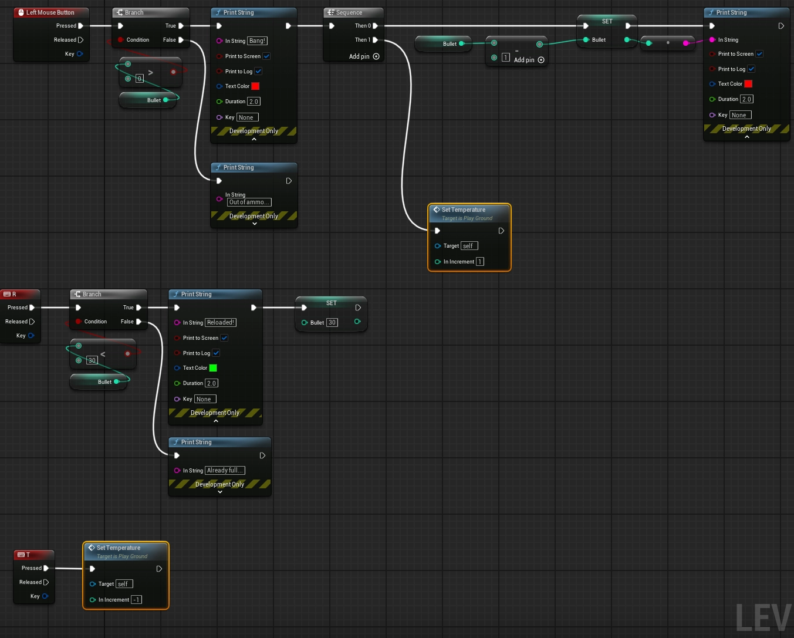

PlayGround > Level Blueprint > Event Graph. 함수를 이용하여 코드 재사용성을 높힐 수 있음.

## 흐름 제어 - 2

### While Loop와 For Loop
많은 프로그래밍 언어에서 반복문이라는 문법이 존재
블루프린트에서 반복문을 연습해보도록 하자.
반복문을 구현하는 노드는 다양하지만, 
여기서는 While Loop와 For Loop 노드를 사용해보고자 함.

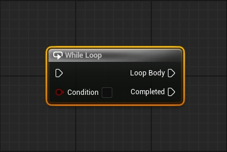

While Loop 노드는 매개변수 Condition의 값이 true이면
Loop Body가 계속해서 실행되는 노드임.

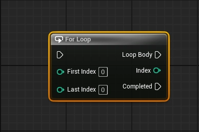

For Loop 노드는 매개변수 For Index의 값부터 Last Index까지
Loop Body가 계속해서 실행되는 노드임.

### Array와 ForEach Loop

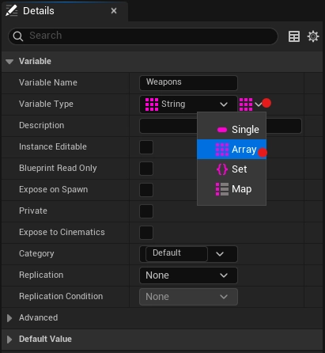

My Blueprint > VARIABLES > Weapons 클릭 > Details
Variable Type에서 Array 자료형으로 만들 수 있음.

자료구조에 담긴 요소들을 순회할 때 사용하는 반복문.

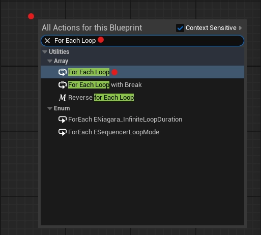

### 열거형과 구조체 그리고 Switch
- 열거형(Enum)
정수형 상수에 이름을 부여해서 모아둔 것을 열거형이라고 함.
    
    ```cpp
    const int Zero = 0;
    const int One = 1;
    const int Two = 2;
    const int Three = 3; 
    const float PI = 3.141592f;
    // … 일일이 선언하기 힘듦.
    
    enum class ECardinalNumber
    {
    	Zero,
    	One,
    	Two,
    	Three,
    	// 자동으로 0부터 3까지의 값을 가짐. 심지어 메모리도 안먹음.
    }
    ```

    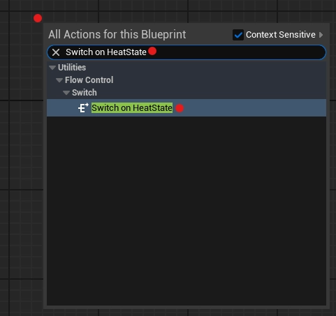

    Event Graph > 빈공간 우클릭 > “Switch on HeatState” 검색.
Switch 노드를 가져오려면, Switch on + Enum 자료형이름을 검색해야함.

- 구조체(Structure)
언어 스팩 상에 미리 구현되어 있는 Native type(int, float, double, …)이 아니라
프로그래머가 필요에 따라 자료형을 만들 수도 있음. 이것이 구조체.
    
    ```cpp
    // 라이플, 샷건, 피스톨 3개의 총이 있다고 가정해보자.
    // 지금껏 우리가 만든 총 관련 변수들은 Bullet, CurrentTemperature, CurrentHeatState가 있음.
    // 그럼 3개의 총마다 3개의 변수가 있어서 총 9개의 변수를 아래와 같이 정의해야하나?
    // 기획서에 갑자기 SMG, SR 등등의 총이 더 추가되었다면?..
    
    int RifleBullet;
    int RifleCurrentTemperature;
    EHeatState RifleCurrentHeatState;
    
    int ShotgunBullet;
    int ShotgunCurrentTemperature;
    EHeatState ShotgunCurrentHeatState;
    
    int PistolBullet;
    int PistolCurrentTemperature;
    EHeatState PistolCurrentHeatState;
    // … 일일이 선언하기 힘듦.
    
    struct FWeapon
    {
    	int Bullet;
    	int CurrentTemperature;
    	EHeatState CurrentHeatState;
    	FString WeaponName;
    }
    
    FWeapon Rifle;
    FWeapon Shotgun;
    FWeapon Pistol;
    FWeapon SMG;
    FWeapon SR;
    // 한 번 변수들을 묶어두면(구조체 만들면) 훨씬 간편함.
    ```


# <strong style="font-size: 48px; color: rgb(255, 255, 255);"> END</strong>