# <strong style="font-size: 48px; color: rgb(255, 255, 255);"> [Unreal 8기] DAY 5 블렌더 스페이스와 움직이는 액터</strong>
## 캐릭터 애니메이션
    움직이기만 하는 캐릭터에게 생동감을 불어넣어준다

## 애니메이션 블루프린트
     애니메이션을 추가해주기 위해서 애니메이션 블루프린트를 생성
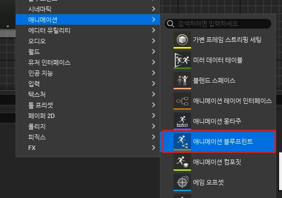

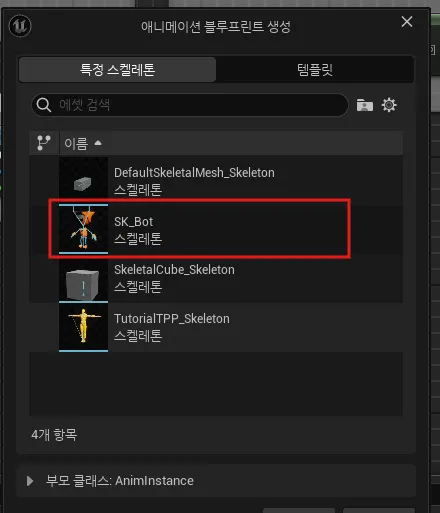

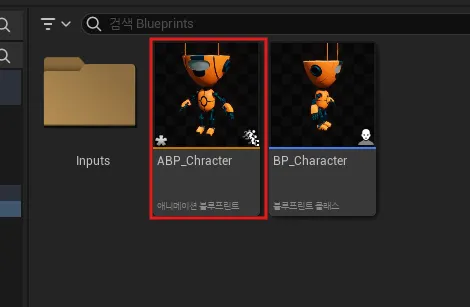

    ABP_Character 를 클릭해서 들어가면 오른쪽 아랫쪽의 에셋 브라우저에서 ‘A_Bot_Idle’을 찾습니다. 기본적으로 아무것도 하지 않을 때의 애니메이션입니다. 애님 그래프로 드래그
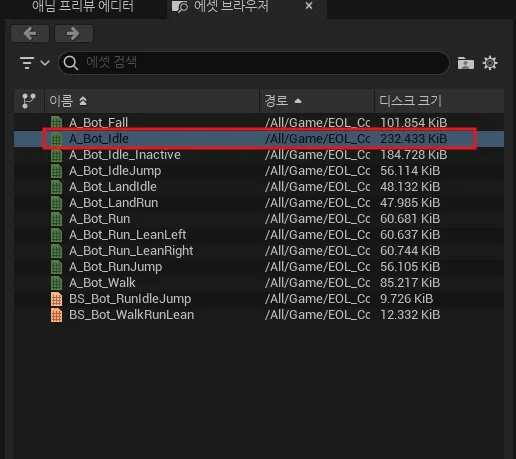

    블루프린트 노드를 연결하는 것처럼 애니메이션을 아웃풋 포즈에 연결
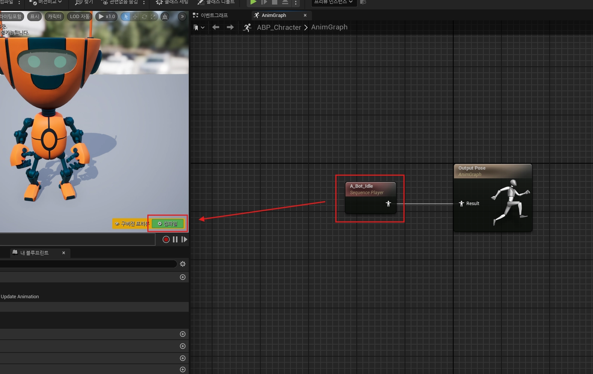

    ‘BP_Character’ 캐릭터 블루프린트에 가서 방금 만든 ‘ABP_Character’를 등록
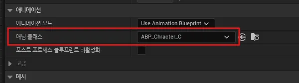

    애니메이션이 적용
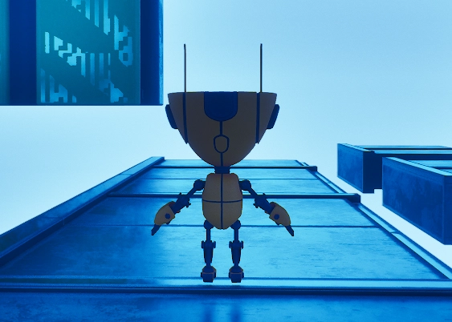

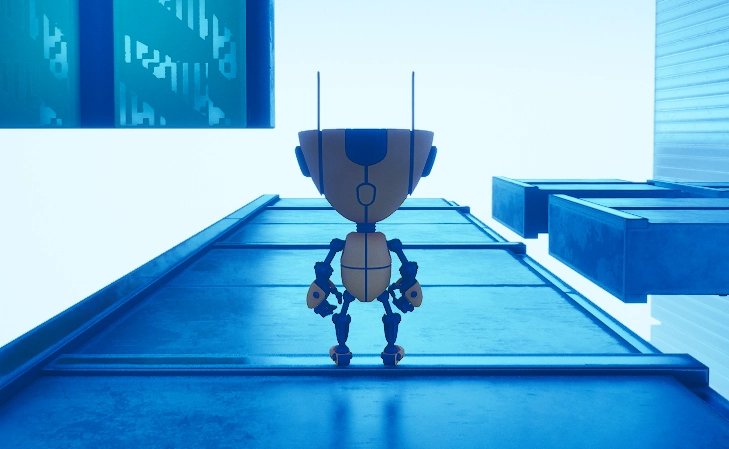

## 블렌더 스페이스
    Anim 폴더 생성 > 블렌드 스페이스 클릭
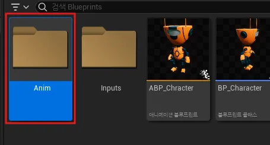

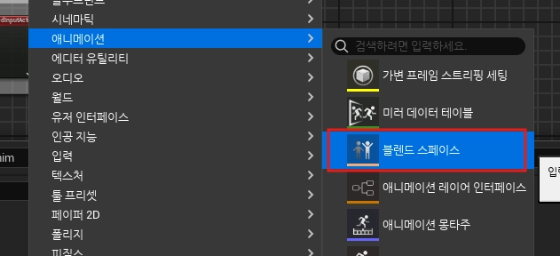

    ‘BS_NBC_IdleRun’ 으로 네이밍
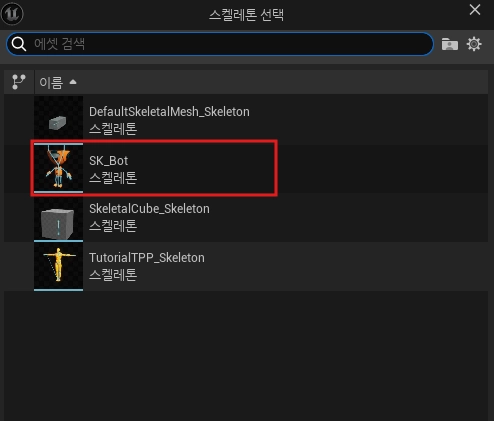

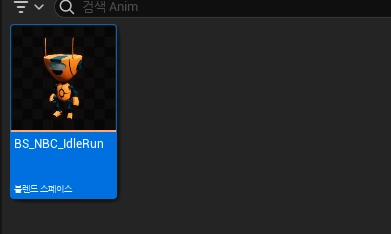

    왼쪽 디테일 패널의 ‘Axis Settings’ 의 가로 축, 세로 축을 세팅합니다. 
    우리는 세로 축만 ‘Speed’로 사용할 예정
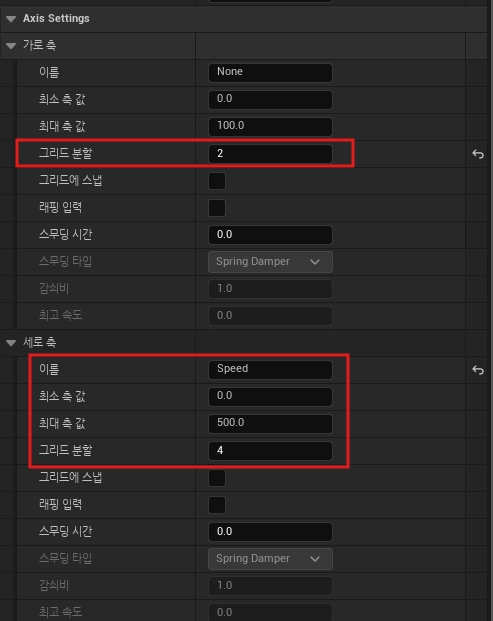

    아래쪽에 있는 것은 단순한 **x, y 그래프**이고 세로(y)축을 Speed 로 설정했습니다.
    아래쪽에 **A_Bot_Idle (Speed 가 0일 때)** 애니메이션을 배치
    위쪽에 **A_Bot_Run (Speed 가 Max일 때)** 애니메이션을 배치  
    각 애니메이션을 **Shift 를 누른 채 드래그**
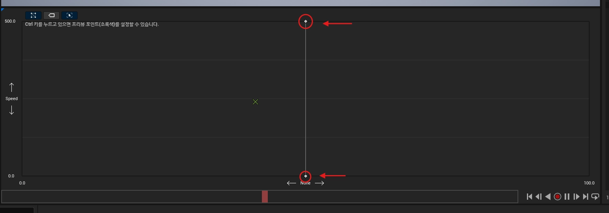

## 캐릭터 속도
    ‘ABP_Character’에 Speed 변수를 만들어주겠습니다. 이 Speed에 현재 캐릭터의 속도를 저장할 예정
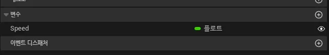

    ‘BS_NBC_IdleRun’ 에 Speed를 연결하고 아웃풋 포즈에 연결
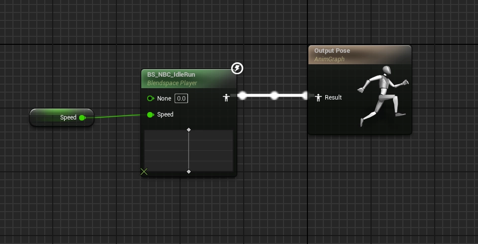

    **‘ABP_Character’** 블루프린트의 이벤트 그래프로 이동합니다.
    **Try Get Pawn Owner > Get Velocity** 를 통해 캐릭터의 벡터를 가져와 X, Y 축의 수치만을 사용한 벡터를 다시 생성합니다. 
    간단한 게임수학 ⇒ **벡터의 길이는 스칼라 값으로 속력**
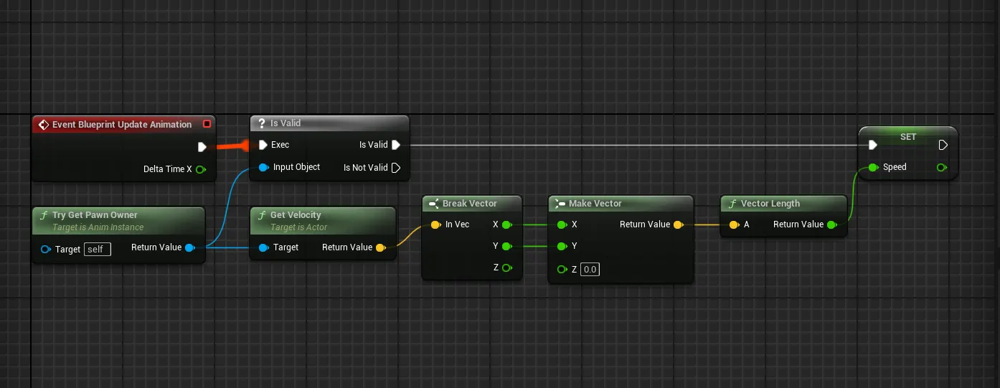

    컴파일 이후 플레이 ->뜁니다.
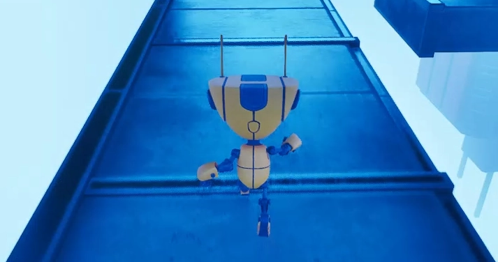

## 액터 이동
    **EventTick**을 활용한 ****액터의 이동과 회전을 블루프린트로 구현합니다.
    **Trigger Volume**을 활용해 간단한 overlap 이벤트를 구현

## 회전하는 액터
    회전하는 액터를 만들기 위해서 블루프린트 클래스를 만들어보겠습니다. 
    콘텐츠 드로어에서 블루프린트 클래스를 생성해주세요. 이름은 RotationPlatform

    **‘Event Tick’** 과 **‘Add Actor Local Rotation’** 노드를 사용하면 금방입니다.
    **‘Platform Velocity’** 변수에는 회전 속도가 있습니다. Delta Seconds와 곱하여서 일정한 속도로 회전할 수 있도록 합니다.
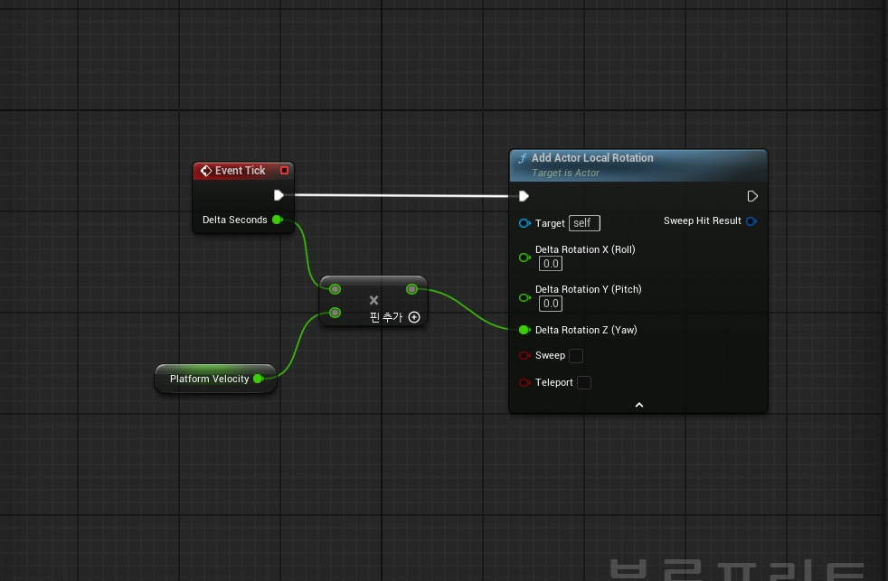

    기본 방향은 Z축의 양수(+) 방향입니다. 가끔씩은 반대로 돌리고 싶을 때도 있으니 반대로 돌도록 해봅시다. 
    MoveDirection’ 는 Boolean 값을 가진 변수입니다.
    ‘BeginPlay’ 이벤트에서 게임이 시작할때 true / false 를 받아서 액터의 회전 방향을 결정
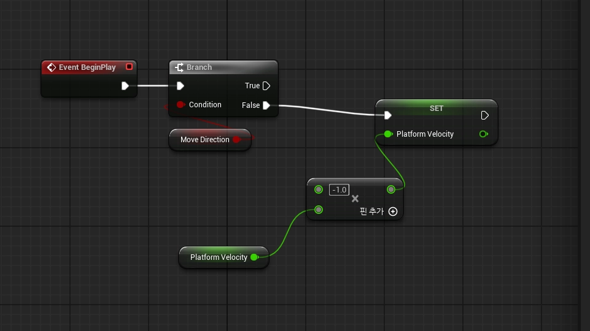

## 이동하는 액터
    이동하는 액터를 구현하기 위해 블루프린트 클래스를 만들어주겠습니다. 
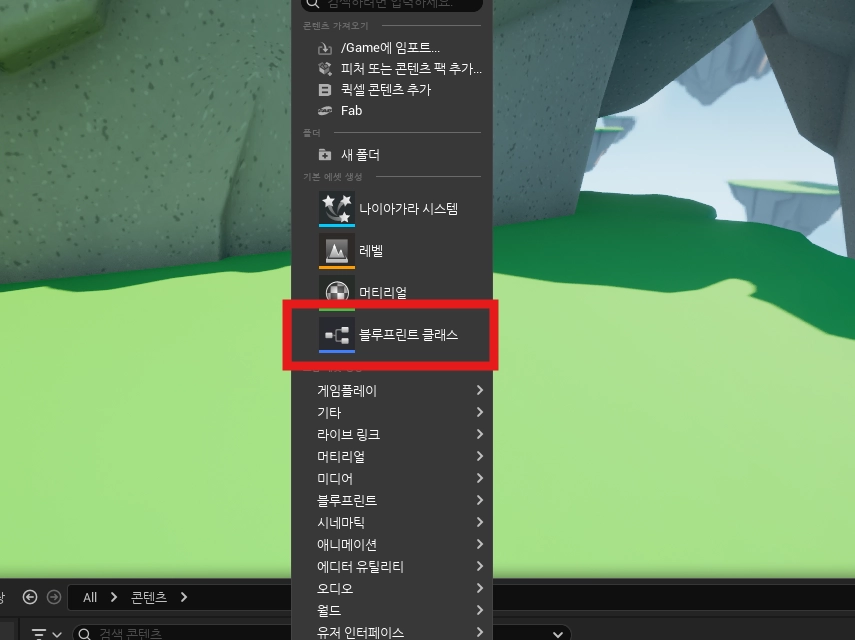

    사용할 변수는 3개입니다.
    **‘StartLocation’** :  액터가 배치된 기본 위치
    **‘PlatformVelocity’** : 액터가 움직일 방향과 속도
    **‘MoveDistance**’ :  액터가 움직일 거리
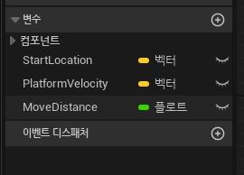

    BeginPlay 이벤트에 액터의 기본 위치를 StartLocation 변수에 초기화
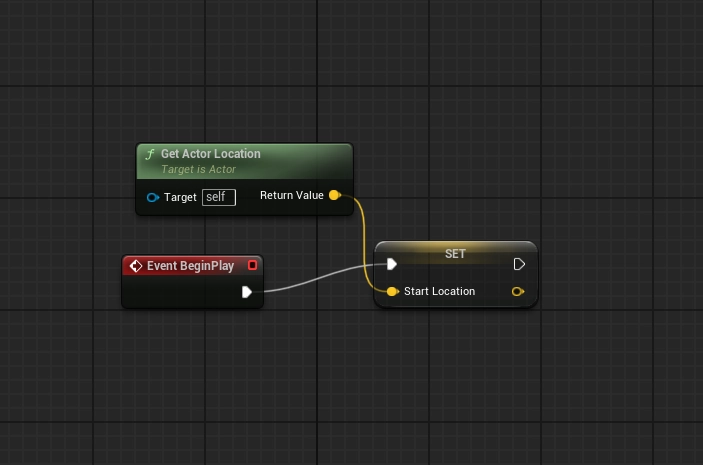

    이동은 회전에서 했던것과 거의 같습니다. DeltaSeconds 에 속도를 곱해준 값을 현재 위치에 더해서 ‘Set Actor Location’ 노드에 입력해줍니다.
    이 노드들로 한쪽방향으로 움직이는 것은 구현이 되었습니다.
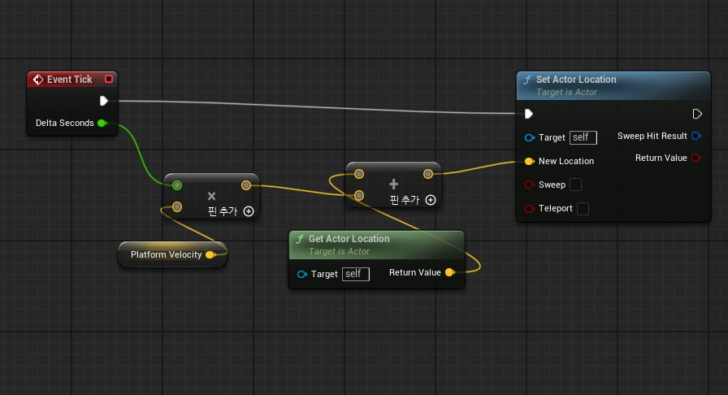

    ‘Greater Equal’ 연산자를 사용해서 현재 액터의 위치가 이동할 거리(MoveDistance) 보다 크다면
     방향을 반대로 (Negate Vecotr) 바꿔주는 노드들을 추가
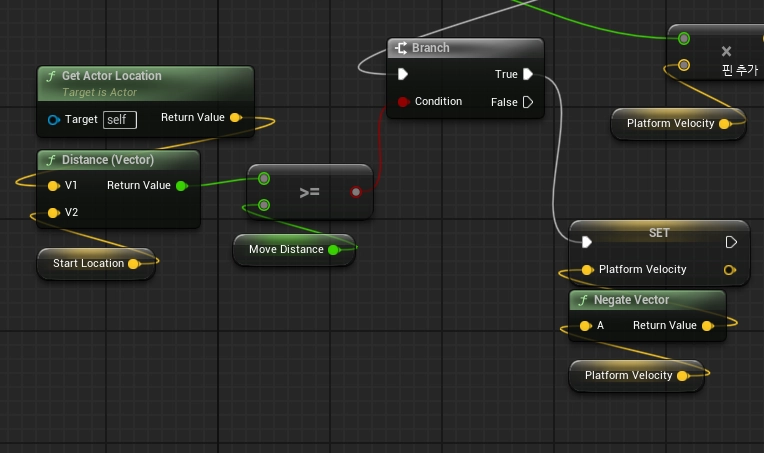

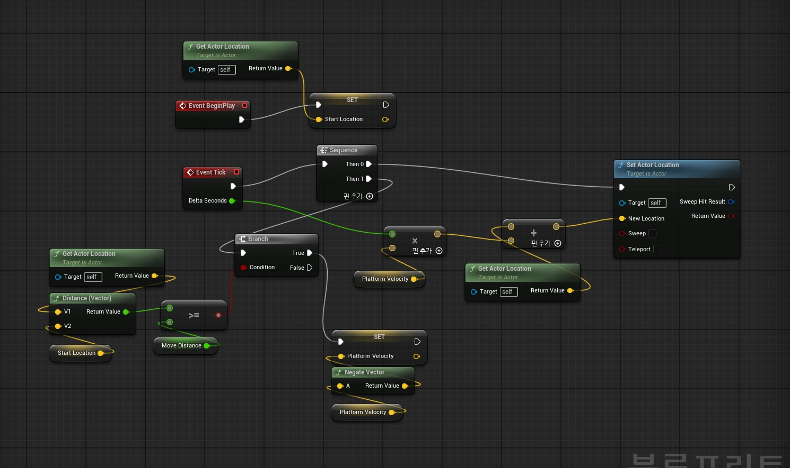

## 이동하는 액터 2
    ‘BP_Floor’ 블루프린트 클래스(액터)를 생성합니다. Static Mesh 로는 ‘SM_Wall01_L0’ 을 사용했습니다. 그리고 눕혀서 발판으로 만들었습니다. 
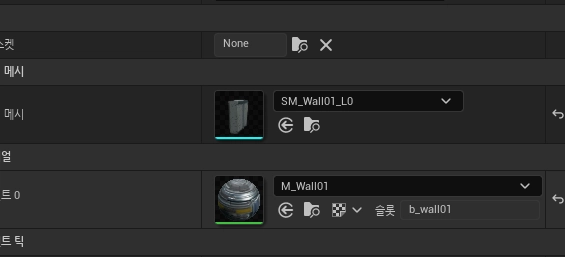

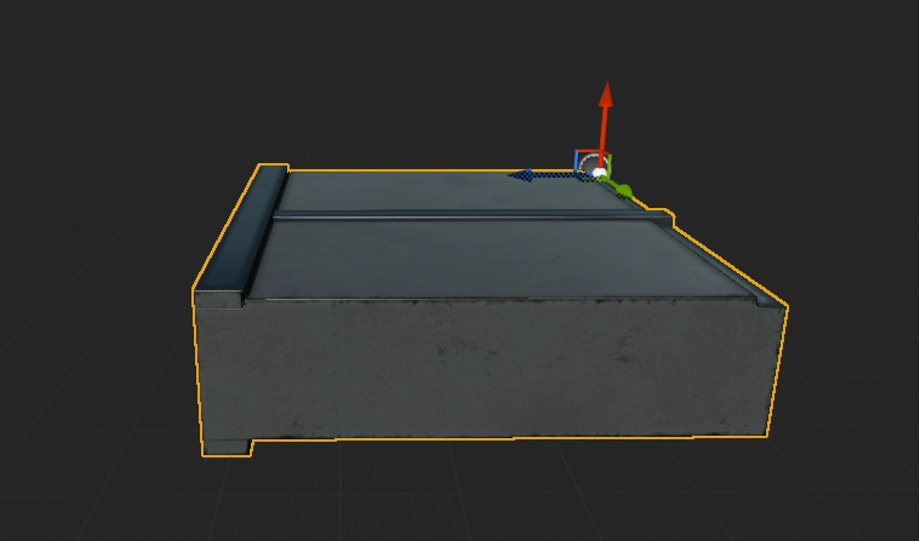

    ‘무브먼트 컴포넌트에 보간’ 액터 컴포넌트를 추가
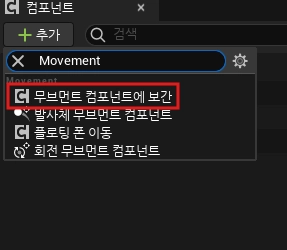

    컨트롤 > 컨트롤 포인트에서 X, Y, Z 를 세팅하면 간단하게 이동시킬 수 있습니다. 비헤이비어 타입을 Ping Pong 으로 변경해주면 무한루프로 동작
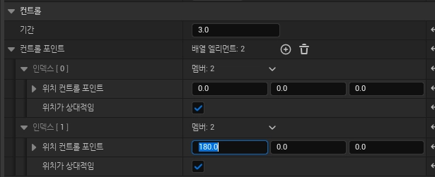

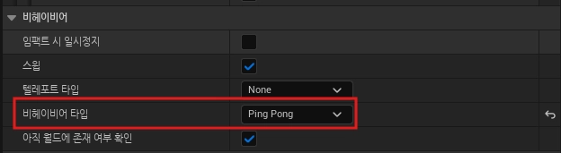

## Overlap - Ice
    ‘BP_Ice’ 이름의 블루프린트를 만들어줍니다. 사용한 스테틱 메시는 ‘SM_FloorBase’입니다.
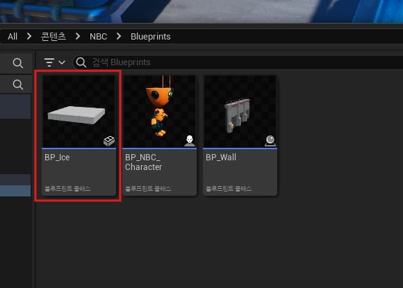

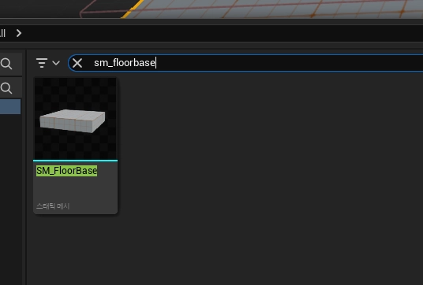

    추가한 컴포넌트는 **‘Box Collision’** 입니다. 적당히 넓게 깔아주시면 됩니다.
    이미지를 보셨다면 눈치채셨겠지만 주황색 콜리전 박스도 스테틱 메시 위로 얇게 펴서 깔아줬습니다.
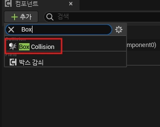

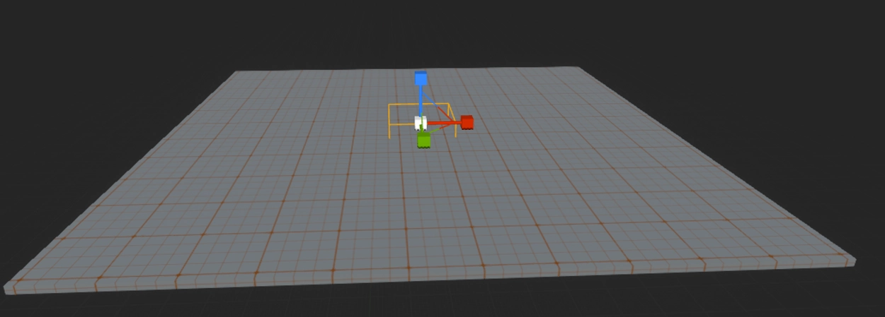

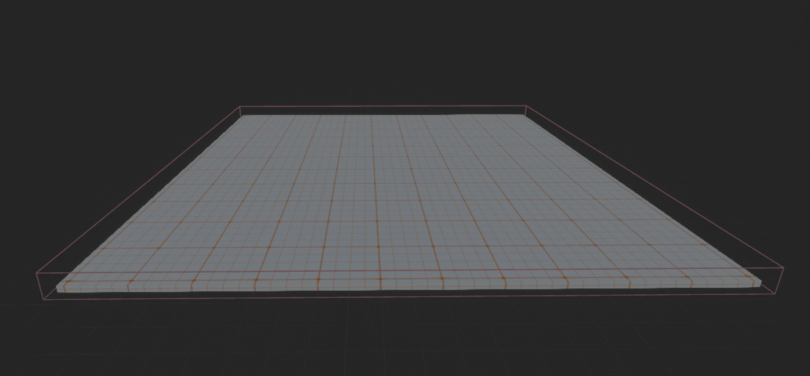

    첫번째로 작성할 그래프는 **Get Player Pawn > Cast To BP_NBC_Character > 변수로 승격** 입니다. 
    **BeginPlay** 이벤트에 연결 시켜주시면 됩니다.
    이 그래프는 오버랩이벤트에서 작동할 액터를 지정해주기 위해서 입니다.
    모든 액터가 이벤트를 발동시키면 안되겠죠?
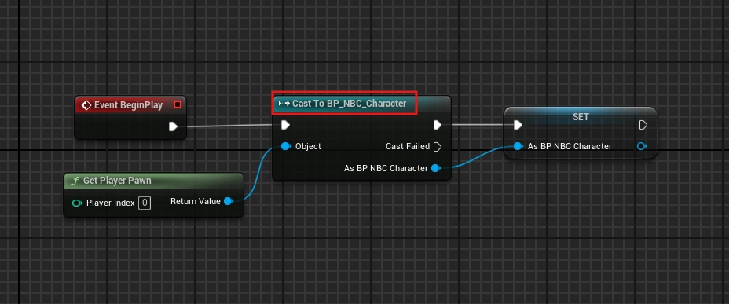

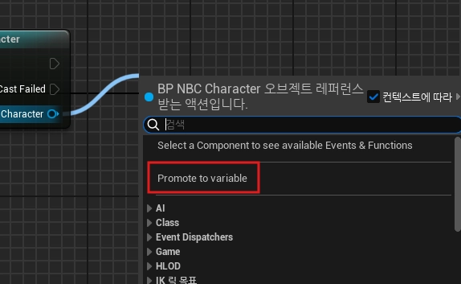

    왼쪽 위의 **‘Box Collision’** 컴포너트를 꼭 클릭하시고 **‘OnComponentBeginOverlap’** 이벤트를 만들어줘야합니다. 
    **Overlapped Component (빨강)** 는 오버랩 이벤트가 발동되는 자기 자신입니다.
    **Other Actor, Other Comp (파랑)** 는 오버랩 된 액터, 컴포넌트 입니다.
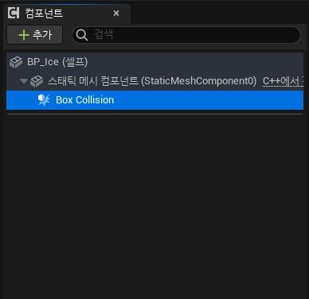

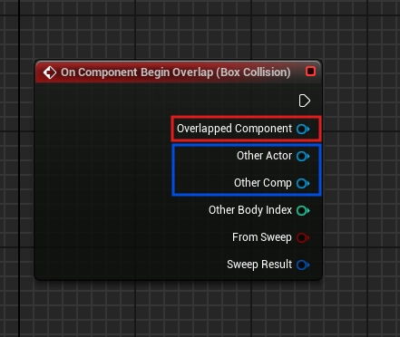

    첫번째는 ‘Branch’ 노드를 통해 오버랩된 액터를 검사
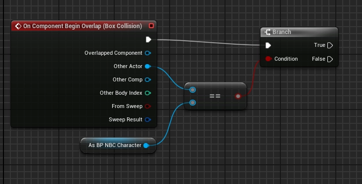

    저장된 변수에서 ‘Character Movement’ 를 호출하고 지면 마찰 (SetGroundFriction) 은 0, 
    감속 걷기 제동 (SetBrakingDecelerationWalking)은 100을 세팅
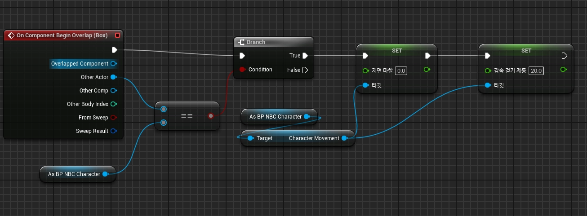

    미끄러집니다. 하지만 변경한 계수가 그대로 유지가 되어 빙판을 벗어나도 계속 미끄러집니다.
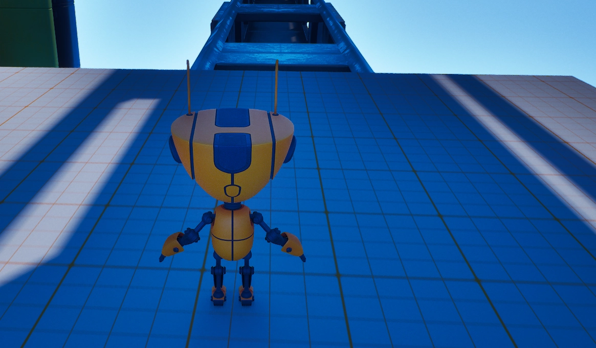
    
    ‘OnComponentEndOverlap (Box)’ 오버랩 엔드 이벤트로 계수를 원래대로 돌려야합니다. begin 이벤트에서 그대로 복-붙해오시면 됩니다. 
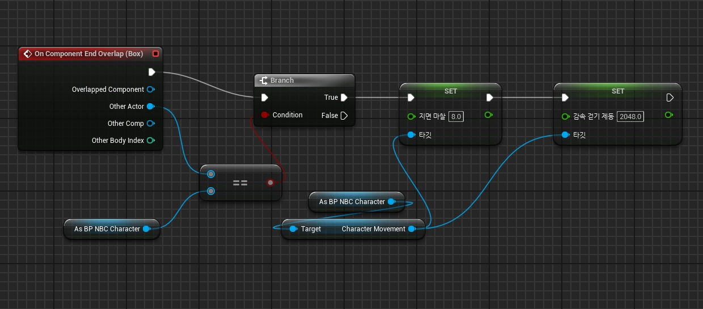

## Overlap Floor 
    ‘BP_OverlapFloor’ 를 생성
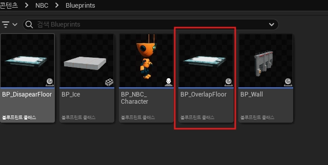

    ‘Box Collision’ 을 생성해서 BP_Ice 와 같이 넓게 깔아줍니다.
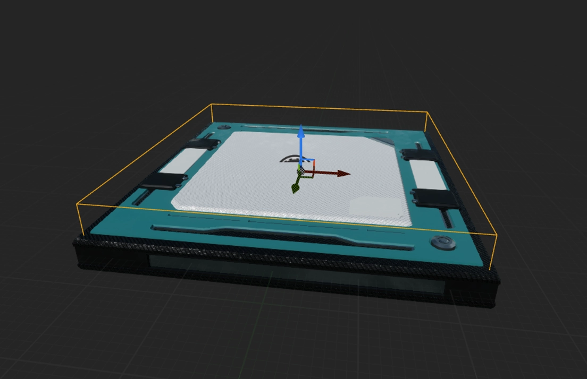

    이것도 Ice와 같습니다. 우리는 캐릭터가 아닌 다른 액터에 부딪쳐서 발판이 사라지는 것을 바라지 않아요. 
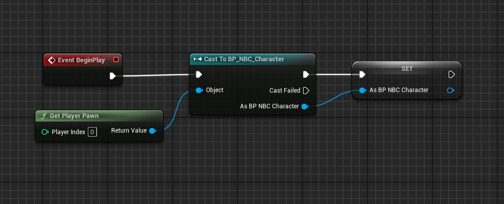

    이전에 한 오버랩과 사라지는 발판 2가지 기능을 합쳤습니다. 
    **‘Branch’ 캐릭터 확인 > Delay (Time) > 피직스 시뮬레이션 > 파괴** 순서
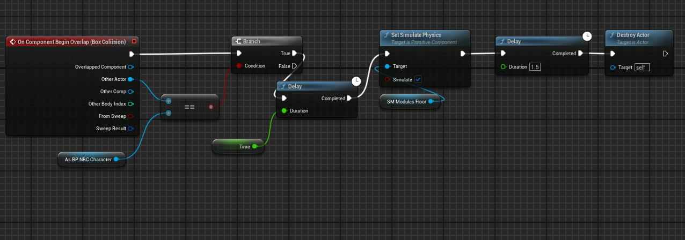

## Overlap 이벤트
    overlap 이벤트라는 것은 ‘겹쳐졌을 때 발생’하는 이벤트입니다. Overlap 이벤트를 위해서는 TriggerVolume 트리거볼륨이 필요
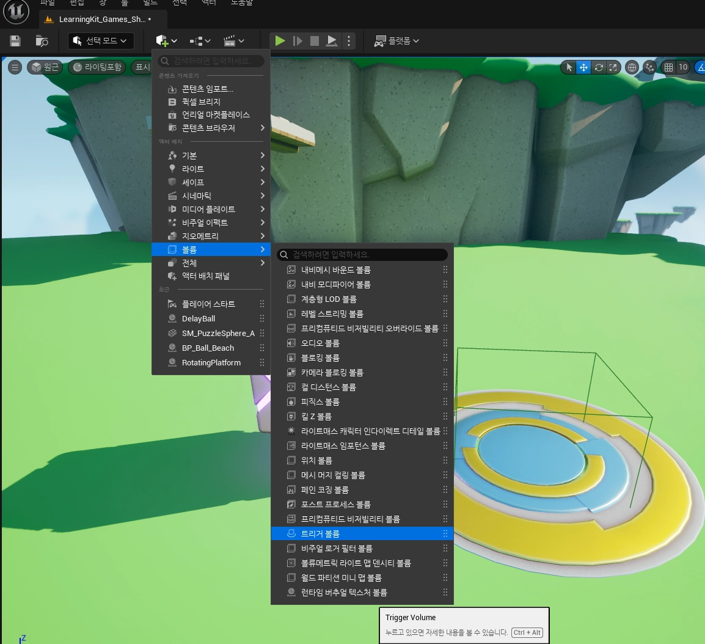

    노란색의 투명한 상자가 생성이 되었습니다. 
    이 상자의 내부 영역으로 들어오는 액터들을 감시하여 이벤트를 발생시키게 될 것
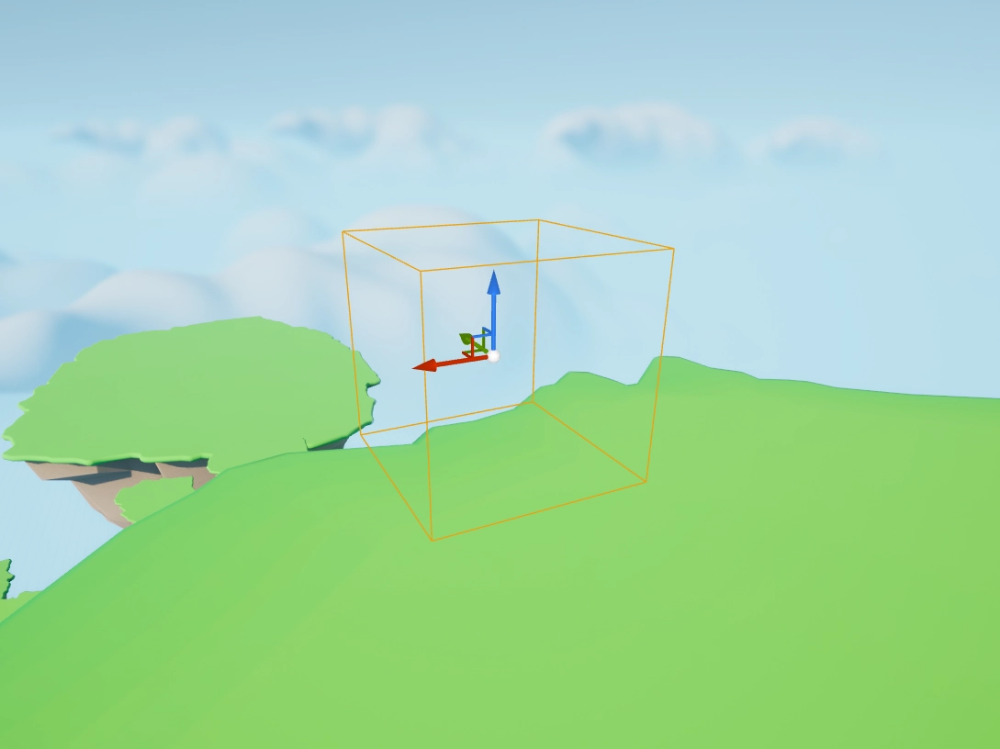

    트리거 볼륨을 선택한 채로 레벨블루프린트로 들어가 오른쪽 클릭, Add On Actor Begin Overlap 이라는 이벤트를 호출합니다.
     이는 방금 생성한 트리거볼륨에 대한 이벤트
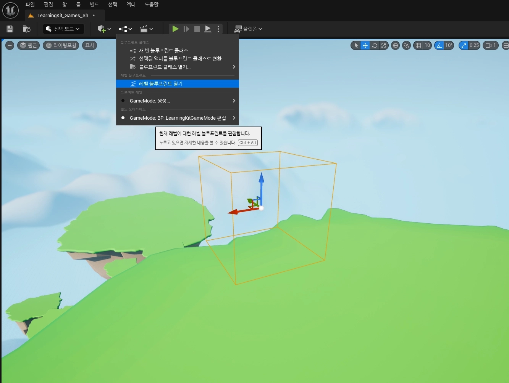

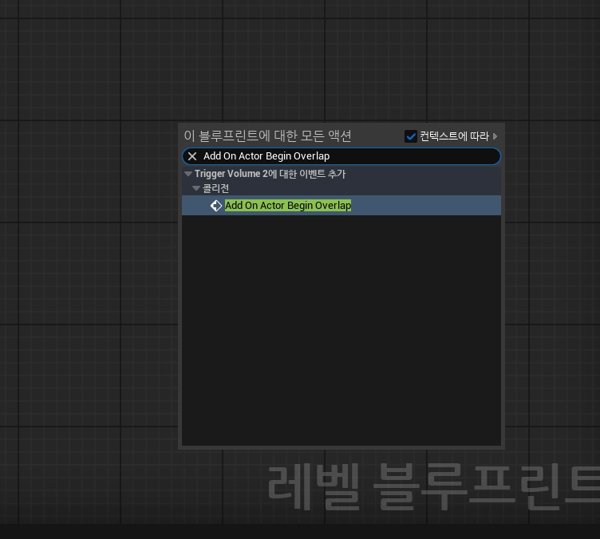

    뷰포트에서 큐브를 하나 생성해주고 마찬가지로 큐브를 선택한채로 레벨 블루프린트에서 생성한 큐브의 참조 노드를 생성
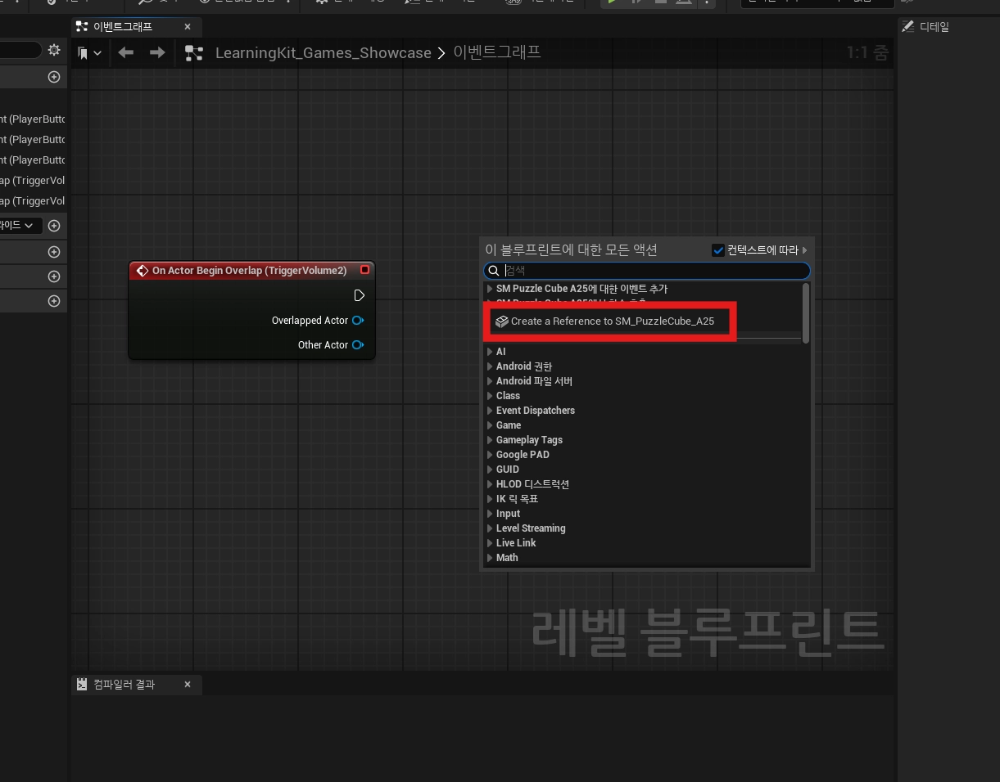

    ‘Equal’(=) 연산자를 사용해서 이벤트의 Other Actor 핀과 연결해줍니다.  Branch를 사용해 오버랩되는 액터와 큐브의 일치여부를 확인하기 위함
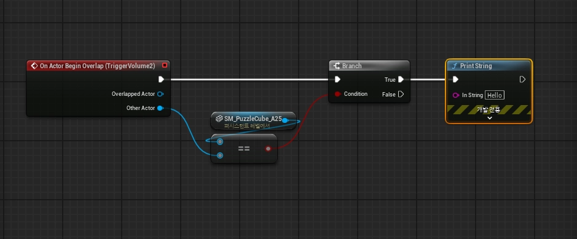

    만약 이벤트가 정상적으로 진행이 되지 않는다면 큐브의 디테일에서 ‘오버랩 이벤트 생성’ 이 true 로 되어 있는지 확인
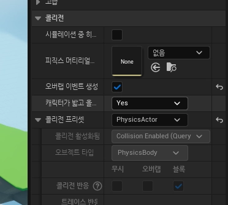

## Delay
    **‘BP_DisapearFloor’** 블루프린트 클래스(액터)를 만들어줍니다.
    사용한 스태틱 메시는 **‘SM_Modules_Floor’**
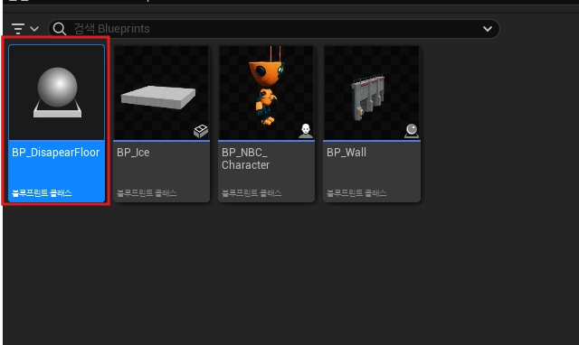

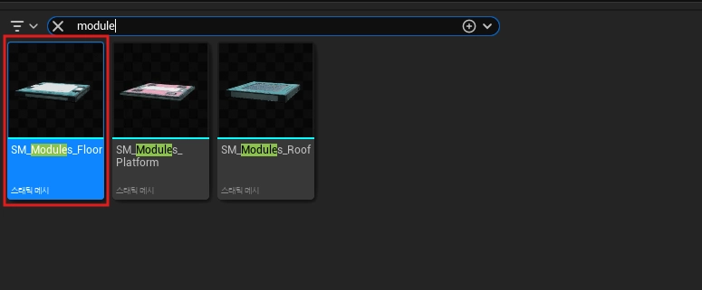

    **‘Time’** 변수를 하나 만들어 주고 오른쪽 눈을 클릭해주세요.
    블루프린트 클래스로 생성한 인스턴스에서 **‘Time’**변수를 변경할 수 있게 하기 위함
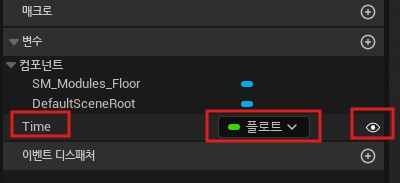

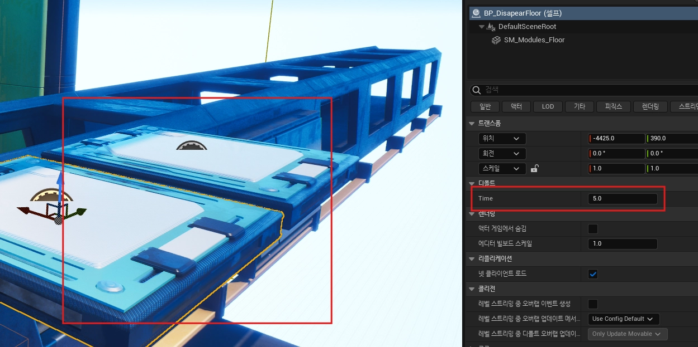

    이벤트 그래프는 아래와 같습니다.
    Time에서 Delta Seconds를 뺴주다가 0보다 작아지는 시점에 **‘Destroy Actor’**를 호출
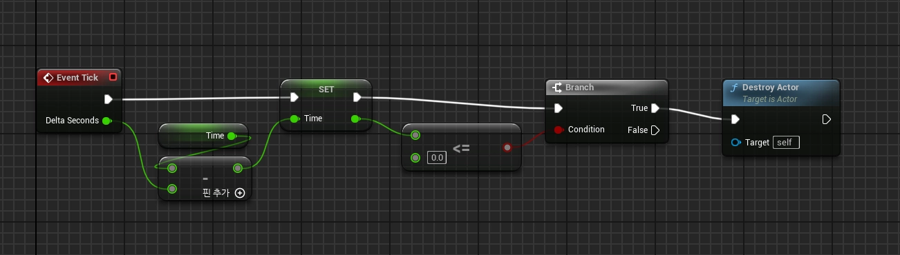

    아주 간단한 버전으로는 ‘Delay’ 가 있습니다.
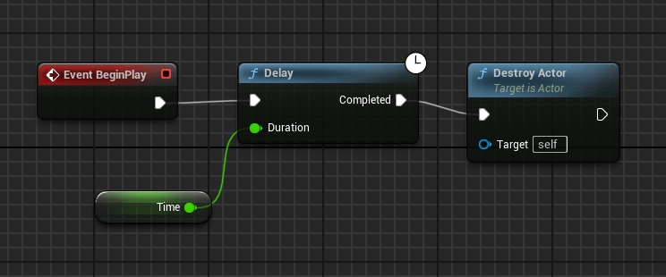

    ‘Set Simulate Physics’를 호출해서 피직스 시뮬레이션을 true 해주시면 발판이 자연스럽게 떨어지면서 1.5s Delay 뒤에 파괴되게됩니다.
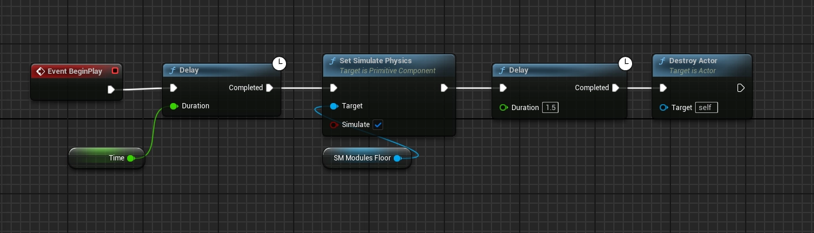

## 축을 중심으로 회전하는 액터 + 튕겨내기
    제자리에서 회전하는 액터가 아닌 거리를 두고 축을 중심으로 회전하도록 해보겠습니다. 또 한번, 블루프린트 클래스를 만들어주세요. ‘BP_RotateCar'
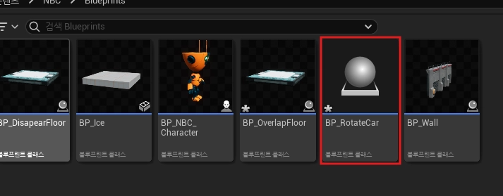

    사용한 메시는 **‘SM_PowerCar_02’** 입니다.
    **‘Radius’** : 가상 축까지의 거리 (반지름) - 기본값 700
    **‘Origin**’ : 원래 위치를 저장
    **‘Speed’** : 속도 - 기본값 100
    변수 3개
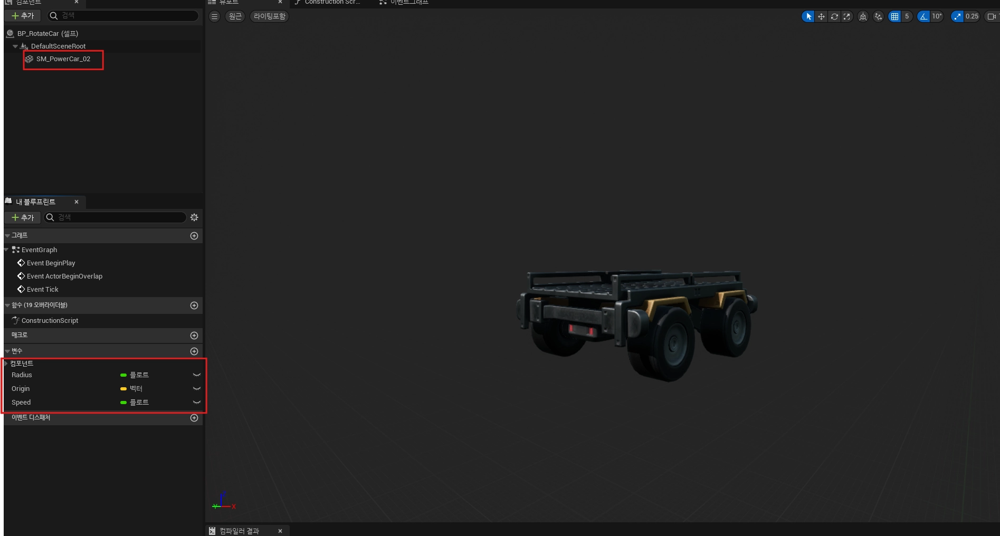

    첫번째로는 일단 제자리에서 돌려줍니다.
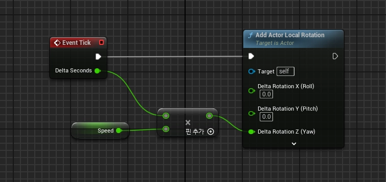

    두번째가 중요합니다. ‘BeginPlay’ 로 런타임이 시작되면 액터 내의 스태틱 메시만 Radius만큼바깥으로 보내줍니다. x축에 radius를 더하기합니다.
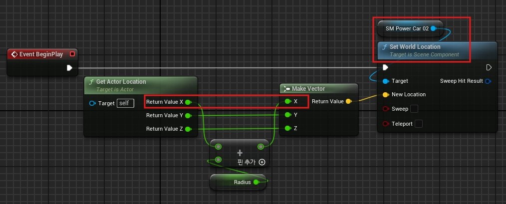

    자동차가 원하는대로 축을 기준으로 회전하긴 하는데 캐릭터와 부딪혔을때 제대로 밀어내지 못하는 것 같습니다.
    스태틱 메시에 Hit 이벤트를 활용해서 캐릭터를 강제로 날려보겠습니다.
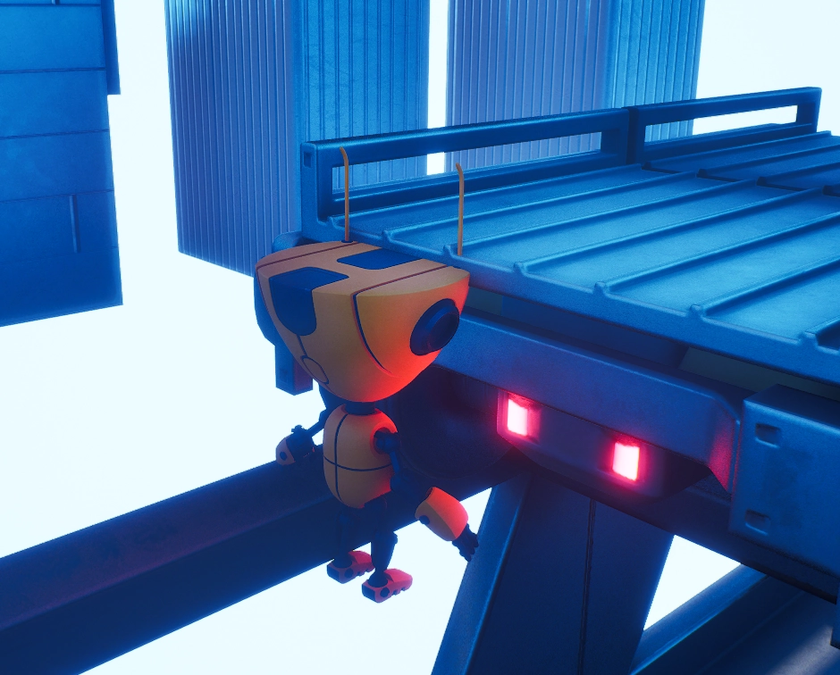

    스태틱 메시를 클릭한 상태에서 ‘OnComponentHit’ 이벤트 노드를 만들어줍니다.
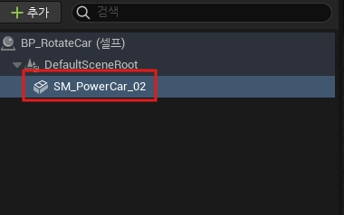

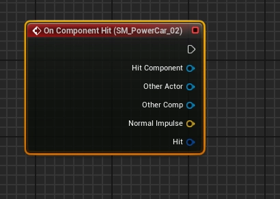

     Hit 충돌 이벤트도 오버랩이벤트와 캐릭터외에 다른 물체들과 충돌한 경우는 제외하고 싶습니다. 
     아래의 그래프를 BeginPlay의 이벤트에 오버랩이벤트와 똑같이 세팅
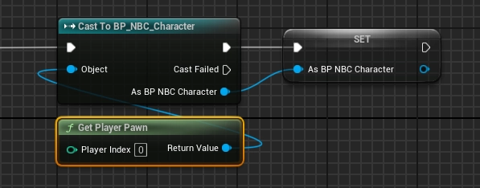

    Branch로 캐릭터가 맞는지 확인하고 맞다면, ‘Launch Character’ 노드를 통해 캐릭터를 충돌의 반대방향으로 밀어냅니다. 
    이 때 밀어내는 값은 ‘OnComponentHit’ 이벤트의 Hit 구조체를 핀 분할 한 Hit Normal (정규화된 충돌 벡터) 입니다.
     Hit Normal에 -550을 곱해서 반대방향 먼 곳으로 날려버릴 수 있게 되었습니다.
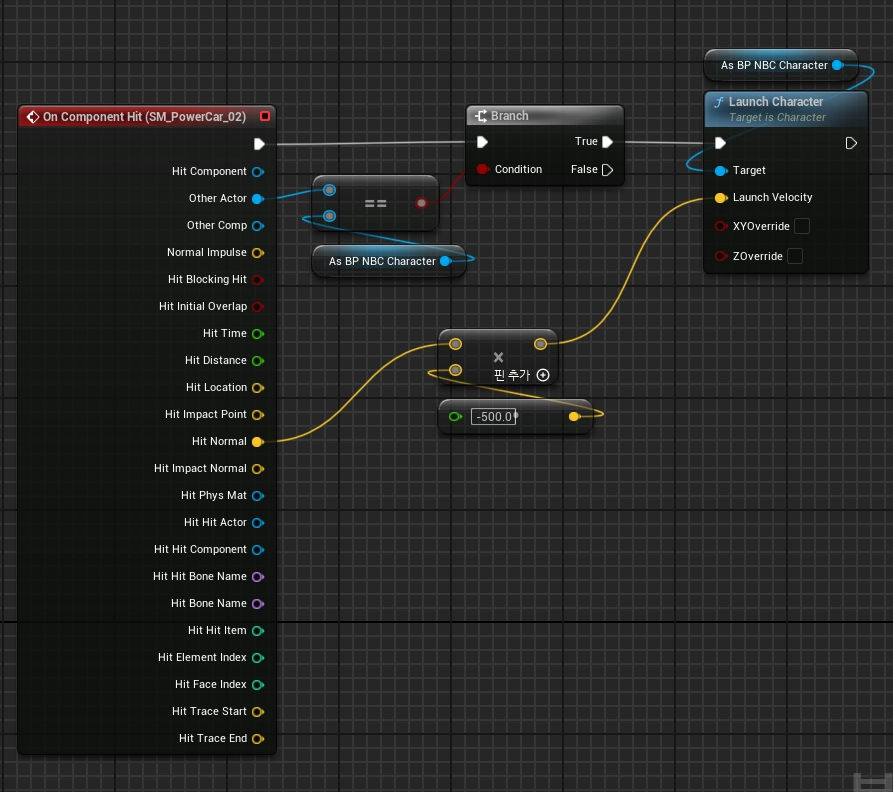

    Character Movement Component 의 기본 동작 방식때문에 이동 중이 아닌 경우에는 충돌이 제대로 처리되지 않습니다. 이를 해결하기 위해서는 여러가지 트릭을 사용하지만 아쉽게도 이번 섹션에서는 다루지 않습니다. 

# <strong style="font-size: 48px; color: rgb(255, 255, 255);"> END</strong>